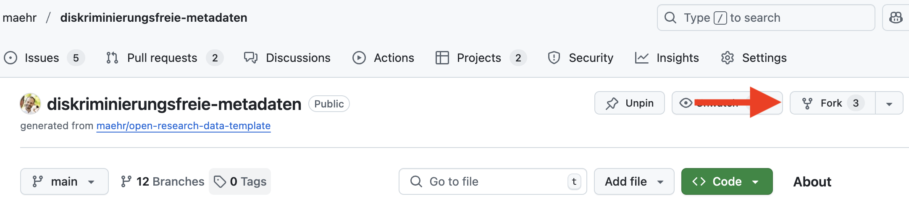
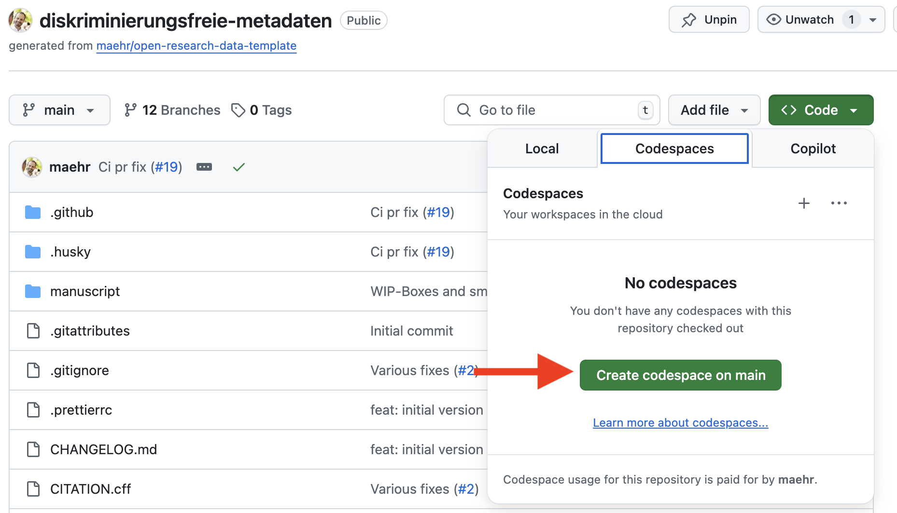
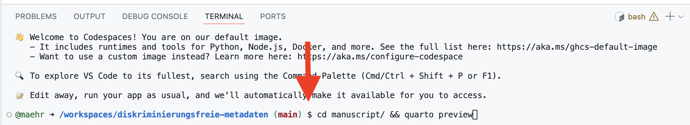

# Manual for the creation of non-discriminatory metadata for historical sources and research data

This repository contains the source of [Handbuch zur Erstellung diskriminierungsfreier Metadaten für historische Quellen und Forschungsdaten. Erfahrungen aus dem historischen Forschungsprojekt Stadt.Geschichte.Basel.](https://maehr.github.io/diskriminierungsfreie-metadaten/) The publication and the data in this repository is openly available to everyone and is intended to support reproducible research in the humanities.

[](https://github.com/maehr/diskriminierungsfreie-metadaten/issues)
[](https://github.com/maehr/diskriminierungsfreie-metadaten/network)
[](https://github.com/maehr/diskriminierungsfreie-metadaten/stargazers)
[](https://github.com/maehr/diskriminierungsfreie-metadaten/blob/main/LICENSE-AGPL.md)
[](https://github.com/maehr/diskriminierungsfreie-metadaten/blob/main/LICENSE-CCBYSA.md)
[](https://doi.org/10.5281/zenodo.11124719)

## What is the publication about?

This manual is a guide to creating non-discriminatory metadata for historical sources and research data, developed as part of the Stadt.Geschichte.Basel research project. It is aimed at professional historians, archivists, librarians and anyone involved in open research data in the field of history. The authors Moritz Mähr and Noëlle Schnegg guide readers through the practical aspects of creating metadata based on the FAIR principles to make research data discoverable, accessible, interoperable and reusable. Through practical instructions and illustrated case studies, the manual shows how machine-readable metadata can enrich research and teaching and influence the interpretation of historical sources. As a publicly accessible "living document", it is designed for continuous development by the community and is committed to an inclusive and non-discriminatory representation of historical content. The handbook is a fundamental resource for anyone interested in modern digital history and open research data. It is available in German.

Furthermore this repository contains a mapping of the [Schlagwortindex GenderOpen](https://opengenderplatform.de/schlagwortindex) to the [Gemeinsame Normdatei (GND)](https://gnd.network/). The mapping was created as part of the Stadt.Geschichte.Basel research project according to the [Rules for GND cross concordances (mapping methodology)](https://wiki.dnb.de/pages/viewpage.action?pageId=263851113).

## How to cite

See the [CITATION.cff](CITATION.cff) file for citation information.

## Repository Structure

This repository is organized as follows:

- `manuscript/`: the manuscript of the publication
- `manuscript/data/genderopen_gnd_mapping.csv`: the mapping of the Schlagwortindex GenderOpen to the GND
- `manuscript/media/`: images, logos, etc. used in the manuscript
- `manuscript/_quarto.yml`: the configuration file for the manuscript
- `manuscript/handbuch-diskriminierungsfreie-metadaten.qmd`: the main document, in markdown format
- `manuscript/custom-reference.docx`: a custom reference document for the manuscript
- `manuscript/custom.css`: a custom css style sheet for printing
- `manuscript/references.bib`: the bibliography file for the manuscript

## Getting Started

We recommend using **GitHub Codespaces** for the easiest and fastest setup. It gives you a pre-configured, cloud-based development environment with everything ready to go — directly in your browser.

### 🚀 Quick Start with GitHub Codespaces

1. **Fork this repository** to your GitHub account (if needed).

<div align="center">
  
</div>

2. Click the green **`<> Code`** button at the top right of this repository.

3. Select the **“Codespaces”** tab and click **“Create codespace on `main`”**.

<div align="center">
  
</div>

4. GitHub will now build a container that includes:
   - ✅ Node.js (via `pnpm`)
   - ✅ Quarto

5. Once the Codespace is ready, you can preview the documentation locally inside the Codespace with:
   - **Open a terminal** in the Codespace (Terminal > New Terminal).
   - **Run the following command** to install all dependencies:

```bash
cd manuscript && quarto preview
```

<div align="center">
  
</div>

<details>
<summary>👩‍💻 Setup locally (Advanced users)</summary>

### Prerequisites

Make sure the following tools are installed locally:

- [Node.js](https://nodejs.org/en/download/)
- [Quarto](https://quarto.org/docs/get-started/)

### Local setup steps

```bash
# 1. Install Node.js dependencies
pnpm install

# 2. Preview documentation
cd manuscript && quarto preview
```

</details>

## Use

Check that all files are properly formatted.

```bash
pnpm run check
```

Format all files.

```bash
pnpm run format
```

Run the wizard to write meaningful commit messages.

```bash
pnpm run commit
```

Run the wizard to create a CHANGELOG.md.

```bash
pnpm run changelog
```

Preview the documentation.

```bash
cd manuscript && quarto preview
```

Render the documentation.

```bash
cd manuscript && quarto render
```

Publish the documentation to GitHub Pages.

```bash
cd manuscript && quarto publish gh-pages
```

## Support

This project is maintained by [@maehr](https://github.com/maehr). Please understand that we can't provide individual support via email. We also believe that help is much more valuable when it's shared publicly, so more people can benefit from it.

| Type                                   | Platforms                                                                                  |
| -------------------------------------- | ------------------------------------------------------------------------------------------ |
| 🚨 **Bug Reports**                     | [GitHub Issue Tracker](https://github.com/maehr/diskriminierungsfreie-metadaten/issues)    |
| 📊 **Report bad data**                 | [GitHub Issue Tracker](https://github.com/maehr/diskriminierungsfreie-metadaten/issues)    |
| 📚 **Docs Issue**                      | [GitHub Issue Tracker](https://github.com/maehr/diskriminierungsfreie-metadaten/issues)    |
| 🎁 **Feature Requests**                | [GitHub Issue Tracker](https://github.com/maehr/diskriminierungsfreie-metadaten/issues)    |
| 🛡 **Report a security vulnerability** | See [SECURITY.md](SECURITY.md)                                                             |
| 💬 **General Questions**               | [GitHub Discussions](https://github.com/maehr/diskriminierungsfreie-metadaten/discussions) |

## Roadmap

This handbook is a living document and will be updated regularly. The discussion of the handbook is open to everyone and we welcome feedback and suggestions for improvement on [GitHub Discussions](https://github.com/maehr/diskriminierungsfreie-metadaten/discussions).

## Contributing

All contributions to this repository are welcome! If you find errors or problems with the data, or if you want to add new data or features, please open an issue or pull request. Please read [CONTRIBUTING.md](CONTRIBUTING.md) for details on our code of conduct and the process for submitting pull requests.

## Versioning

We use [SemVer](http://semver.org/) for versioning. The available versions are listed in the [tags on this repository](https://github.com/maehr/diskriminierungsfreie-metadaten/tags).

## Authors and acknowledgment

- **Moritz Mähr** - _Initial work_ - [maehr](https://github.com/maehr)
- **Noëlle Schnegg** - _Initial work_ - [noelleschnegg](https://github.com/noelleschnegg)

See also the list of [contributors](https://github.com/maehr/diskriminierungsfreie-metadaten/graphs/contributors) who contributed to this project.

## License

The data in this repository is released under the Creative Commons Attribution 4.0 International (CC BY 4.0) License - see the [LICENSE-CCBYSA](LICENSE-CCBYSA.md) file for details. By using this data, you agree to give appropriate credit to the original author(s) and to indicate if any modifications have been made.

The code in this repository is released under the GNU Affero General Public License v3.0 - see the [LICENSE-AGPL](LICENSE-AGPL.md) file for details. By using this code, you agree to make any modifications available under the same license.
