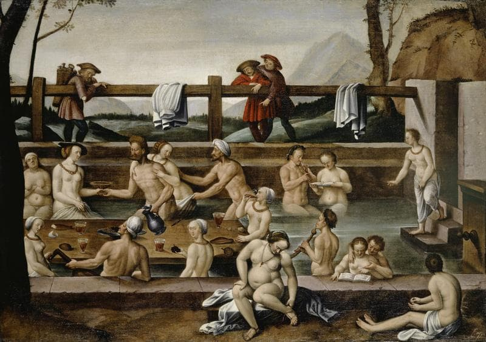
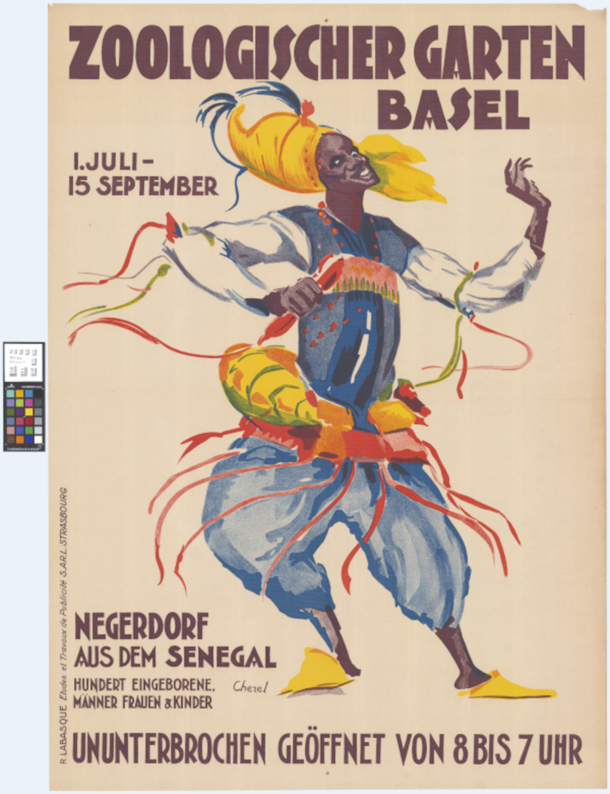
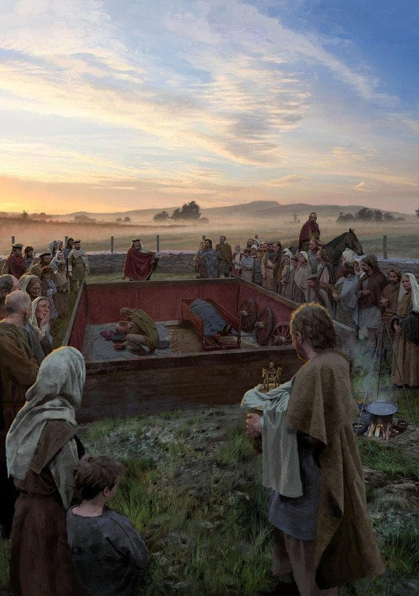
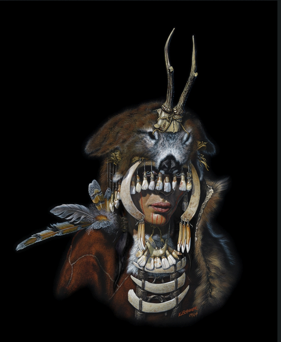
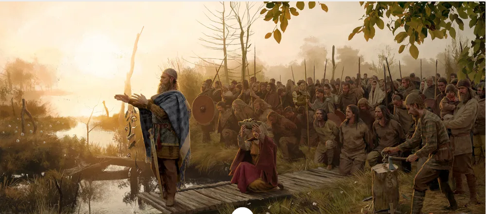
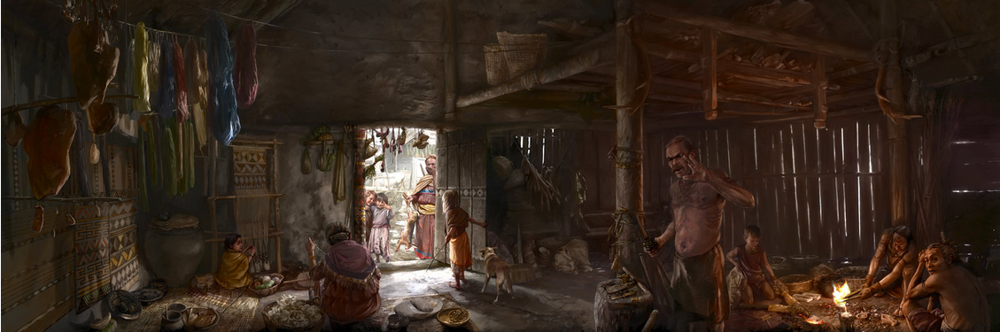

> **Warning**
>
> Dieses Dokument enthält Abbildungen von historischen Quellen, die
> diskriminierende Sprache, Bilder oder Darstellungen enthalten. Sie
> sind Ausdruck von Vorurteilen, Stereotypen oder Gewalt gegen bestimmte
> Gruppen in der Vergangenheit.

# Einleitung {#einleitung number="1"}

Dieses Handbuch ist eine Anleitung für die diskriminierungsfreie
Auszeichnung von Metadaten für historische Quellen und Forschungsdaten.
Es richtet sich an professionelle Historiker\*innen, Archivar\*innen,
Bibliothekar\*innen und andere Personen, die mit historischen Quellen
und Forschungsdaten arbeiten und sich für die Erstellung und Verwendung
von Metadaten interessieren. Die Auszeichnung von Metadaten ist ein
wesentlicher Aspekt der Archivierung, Präsentation und Analyse von
historischen Quellen und Forschungsdaten. Metadaten liefern nicht nur
wichtige Informationen über den Kontext und den Inhalt dieser
Ressourcen, sondern sind insbesondere dann von grosser Bedeutung, wenn
historische Ressourcen gemäss den FAIR-Prinzipien (Findable Accessible
Interoperable Reusable) auffindbar, zugänglich, interoperabel und
nachnutzbar gemacht werden sollen. Frei zugängliche, maschinenlesbare
Metadaten ermöglichen nicht nur die Integration in Suchmaschinen und
andere Findmittel, sondern verändern auch die Art und Weise, wie
historische Quellen und Forschungsdaten erforscht, interpretiert und
verstanden werden.

Das Handbuch entstand im Rahmen des historischen Forschungsprojekts
Stadt.Geschichte.Basel und wurde von Moritz Mähr (promovierter
Technikhistoriker und Leiter des Forschungsdatenmanagements) und Noëlle
Schnegg (angehende Historikerin und wissenschaftliche Hilfsassistentin,
u.a. zuständig für die Auszeichnung der Metadaten) verfasst.[^1] Die
Initiative für eine neue Basler Kantonsgeschichte wurde 2011 vom Verein
Basler Geschichte lanciert. Das Forschungsprojekt wurde 2016 vom Grossen
Rat bewilligt und wird von 2017 bis 2025 an der Universität Basel
durchgeführt. Die Finanzierung von über CHF 9 Millionen wird zu zwei
Dritteln durch die öffentliche Hand getragen, der Rest stammt von
privaten Spender\*innen.

Das Projekt Stadt.Geschichte.Basel erzählt die lange Geschichte Basels
von den Anfängen bis zur Gegenwart in neun Einzelbänden und einem
Überblicksband. Dabei werden langfristige Entwicklungen über die Bände
hinweg verfolgt. Drei Forschungsperspektiven stehen im Fokus:
Verflechtung und Multilokalität, Mensch und Nichtmensch sowie
Kontinuitäten und Diskontinuitäten. Diese Perspektiven helfen, die
Stadtgeschichte in regionalen, überregionalen und globalen Kontexten zu
verstehen und den Einfluss von Menschen, Tieren und Dingen zu
erforschen, ohne strikte Zeiteinteilungen vorzunehmen.

Für die am Forschungsprojekt beteiligten Forschende sind neben
schriftlichen Quellen insbesondere Bilder, Karten und Tabellen sowie
bibliographische Daten relevant. Die Datentypen variieren je nach Thema,
Autor\*in und Herkunft -- so etwa historische Gemälde und Fotografien,
Fotografien von Ausgrabungsstätten, Grafiken, die bereits in der
universitären Lehre verwendet wurden, quantitative Daten, die in
statistischen Jahrbüchern veröffentlicht wurden, oder Kombinationen
derartiger Datensätze aus verschieden Zeiträumen oder Territorien. Die
Vielfalt der Themen und Autor\*innen spiegelt sich in der Heterogenität
der bereitgestellten Formate wider: von gescannten Druckwerken, selbst
angefertigten Schemata mit gängiger Office-Softwares erstellte
Balkendiagramme bis hin zu georeferenzierten historischen Stadtplänen.
Für die Sammlung, Aufbereitung und langfristige Sicherung der
historischen Quellen und Forschungsdaten wurde ein Data Management Plan
ausgearbeitet. Er sieht unter anderem die Auszeichnung aller in den
Bänden verwendeten historischen Quellen und Forschungsdaten mit
Metadaten und deren Veröffentlichung auf der
[Forschungsdatenplattform](https://forschung.stadtgeschichtebasel.ch/)
und im [digitalen
Langzeitarchiv](https://zenodo.org/communities/stadt-geschichte-basel/)
vor. Zur Erfüllung dieser Aufgabe wurde das vorliegende Handbuch
erstellt. Es ist als kostenloses und öffentlich zugängliches Living
Document konzipiert und soll von der Community auf dem [öffentlichen
Code-Repositorium](https://github.com/maehr/diskriminierungsfreie-metadaten)
weiterentwickelt werden.

Stadt.Geschichte.Basel verpflichtet sich mit dem [Contributor Covenant
Code of
Conduct](https://www.contributor-covenant.org/version/2/1/code_of_conduct/)
dazu, "allen Teilnehmenden an dem Projekt und unserer Gemeinschaft eine
belästigungsfreie Beteiligung, unabhängig von Alter, Körpergröße,
Behinderung, ethnischer Zuordnung, Geschlechtermerkmalen, -identität und
-ausdruck, Grad der Erfahrung, Bildung, sozialem Status, Nationalität,
persönlicher Erscheinung, Rasse, Kaste, Hautfarbe, Religion oder
sexueller Identität und Orientierung zu ermöglichen." Historische
Quellen und Forschungsdaten, die diskriminierende Inhalte enthalten,
werden daher entsprechend gekennzeichnet. Dies wirft jedoch verschiedene
Probleme auf. Diskriminierung kann viele Formen annehmen, darunter
Rassismus, Antisemitismus, Sexismus, Ableismus, Transphobie und viele
andere, und sie kann mehrere Diskriminierungsformen gleichzeitig
enthalten. Sie kann explizit oder implizit sein und ist oft tief in den
Kontext und die Interpretation dieser Ressourcen eingebettet. Implizite
oder strukturelle Formen von Diskriminierung finden sich in vielen
bestehenden Thesauri und Schlagwortverzeichnissen wie der Gemeinsamen
Normdatei (GND), der am weitesten verbreiteten Normdatei im
deutschsprachigen Raum. Viele Begriffe in Thesauri enthalten z.B. nur
die männliche Form und oft werden nur zwei Geschlechter oder eine
Kategorie für "unbekannt" oder "anders" verwendet. Für die historischen
Quellen und Forschungsdaten von Stadt.Geschichte.Basel wird deshalb der
[Schlagwortindex
GenderOpen](https://opengenderplatform.de/schlagwortindex) verwendet,
der eine geschlechtersensible und inklusive Sprache ermöglicht.

Das Handbuch ist wie folgt aufgebaut: In einem ersten Kapitel werden die
Grundlagen von Metadaten für historische Quellen und Forschungsdaten
geklärt. Dabei ist zu betonen, dass es sich bei den Metadaten von
Stadt.Geschichte.Basel um Metadaten zu kulturhistorischen und
archäologischen Quellen handelt. Im ersten Kapitel werden Fragen wie
\"Was sind Forschungsdaten?\" und \"Was sind Metadaten?\" anhand
exemplarischer Ressourcen von Stadt.Geschichte.Basel beantwortet. Im
letzten Teil des ersten Kapitels wird das Metadatenschema Dublin Core
vorgestellt und seine Vorteile erläutert. Im zweiten Kapitel soll eine
Schritt-für-Schritt-Anleitung helfen, eigene Metadaten für historische
Quellen und Forschungsdaten zu erstellen. Auch hier wird bei den
einzelnen Schritten auf Erfahrungen aus dem Projekt
Stadt.Geschichte.Basel zurückgegriffen. Das dritte Kapitel widmet sich
konkreten Fallbeispielen, um die Ergebnisse und Erkenntnisse aus den
vorangegangenen Kapiteln zu veranschaulichen. Die Beispiele umfassen
Bilder, Objekte sowie Karten und Statistiken.

# Grundlagen zu Metadaten für historische Quellen und Forschungsdaten {#grundlagen-zu-metadaten-für-historische-quellen-und-forschungsdaten number="2"}

## Was sind Forschungsdaten? {#was-sind-forschungsdaten number="2.1"}

Forschungsdaten sind Ressourcen, die Forschende während ihrer Forschung
verwenden und produzieren. Dazu gehören Datensätze, Software, Quellcode,
Workflows, Modelle, Zeitreihen, Tabellen, Bilder, Videos, Interviews und
Artikel etc.

Bei der Stadt.Geschichte.Basel und den meisten anderen historischen
Forschungsprojekten handelt es sich vor allem um Textdaten, Bilddaten,
Tabellen (statistische Zeitreihen etc.), georeferenziertes
Kartenmaterial und bibliographische Angaben (Verweise auf
Sekundärliteratur). Ein grosser Teil dieser Forschungsdaten stammt aus
den Beständen von Gedächtnisinstitutionen wie Archiven, Bibliotheken und
Museen oder steht in Form publizierter Ergebnisse (Bücher, Artikel etc.)
zur Verfügung. In vielen Fällen sorgen diese Einrichtungen für die
Langzeitarchivierung der Ressourcen. Dann kann über die DOI oder die
Signatur direkt auf die Ressourcen verwiesen werden. In diesen Fällen
sollten alle Informationen erfasst werden, die über die bereits in den
Gedächtnisinstitutionen vorhandenen Metadaten hinausgehen. Dabei kann es
sich um Quellenannotationen, erweiterte Beschreibungen, korrigierte
Angaben etc. handeln. Es empfiehlt sich jedoch auch in diesen Fällen,
einen möglichst kompletten Metadatensatz zu erstellen. Redundanz ist bei
Forschungsdaten wünschenswert. Es erhöht die Verfügbarkeit und die
Auffindbarkeit.

Es gibt aber auch Daten, die im Rahmen der Forschung erzeugt werden.
Dazu gehören neben Textdaten (Forschungsprotokollen), statistische
Zeitreihen, die aus historischen Quellen zusammengestellt und als
Diagramm dargestellt werden, auch Karten und Netzwerkdarstellungen, die
aus Grabungsdaten oder anderen raumbezogenen Daten erstellt werden.
Diese Daten müssen so gesichert werden, dass sie reproduzierbar sind.
Viele textuelle Forschungsdaten liegen nur auf Papier oder in
unstrukturierter Form digital vor. Die Extraktion strukturierter Daten
aus diesen Materialien erfordert einen hohen Aufwand - Scannen,
Bereinigen, Annotieren usw.

Neben den Forschungsdaten müssen auch die dazugehörigen
Prozessinformationen und unterstützenden Daten, wie Software,
Algorithmen und Protokolle, archiviert und zugänglich gemacht werden.
Diese Informationen sind unerlässlich, um die Nachvollziehbarkeit und
Reproduzierbarkeit der Forschungsergebnisse zu gewährleisten.

## Open and [FAIR](https://www.go-fair.org/fair-principles/) Data {#open-and-fair-data number="2.2"}

Open and FAIR Data bezieht sich auf den Ansatz, Forschungsdaten offen,
auffindbar, zugänglich, interoperabel und nachnutzbar zu machen.

\"Open Data\" bedeutet, dass Forschungsdaten offen für alle zur
Verfügung gestellt werden, sofern es keine gesetzlichen oder ethischen
Gründe gibt, die dies verhindern. Dies geschieht meistens über eine
entsprechende
[Free-Culture-Lizenz](https://creativecommons.org/share-your-work/public-domain/freeworks/)
(PD, CC0, CC-BY, CC-BY-SA). Dies kann die Zusammenarbeit zwischen
Forschenden erleichtern, die Reproduzierbarkeit von
Forschungsergebnissen verbessern sowie eine Nachnutzbarkeit in anderen
Kontexten ermöglichen.[^2]

Die FAIR-Prinzipien (Findable, Accessible, Interoperable, Reusable)
gehen einen Schritt weiter und bieten spezifische Leitlinien, wie Daten
organisiert und bereitgestellt werden sollten:

-   Findable (Auffindbar): Daten und Metadaten sollten leicht auffindbar
    sein, sowohl für Menschen als auch für Computer. Dies beinhaltet die
    Verwendung eindeutiger Kennungen und die Bereitstellung
    detaillierter Metadaten.

-   Accessible (Zugänglich): Daten sollten leicht zugänglich sein. Dies
    bedeutet, dass es klare und verständliche Informationen darüber
    geben sollte, wie man auf die Daten zugreifen kann, auch wenn die
    Daten selbst aus Gründen des Datenschutzes oder der Sicherheit nicht
    vollständig offen zugänglich sein können.

-   Interoperable (Interoperabel): Daten sollten mit anderen Daten
    kompatibel und integrierbar sein. Dies erfordert den Einsatz von
    standardisierten Formaten, Vokabularen und Ontologien. Ein
    kontrolliertes Vokabular ist eine sorgfältig ausgewählte Liste von
    Wörtern und Phrasen, die zur Kategorisierung, Indizierung und Abruf
    von Informationen in einem spezifischen Kontext oder in einem
    Informationssystem verwendet werden. Eine Ontologie ist ein formales
    Konzept, das zur Darstellung von Wissen in einem bestimmten Bereich
    verwendet wird, indem es die Definition von Typen, Eigenschaften und
    Beziehungen zwischen den Entitäten dieses Bereichs ermöglicht.

-   Reusable (Nachnutzbar): Daten sollten so bereitgestellt werden, dass
    sie in unterschiedlichen Kontexten nachgenutzt werden können. Dies
    beinhaltet die Bereitstellung von umfassenden Metadaten und klaren
    Lizenzinformationen.

Um die FAIR-Prinzipien einzuhalten, sollten die Forschenden ihre Daten
mit umfassenden Metadaten versehen und in einem geeigneten
Datenrepositorium zur Langzeitarchivierung speichern. Ein
Datenrepositorium für die Langzeitarchivierung ist ein zentraler
Speicherort, an dem Daten systematisch gespeichert, organisiert,
verwaltet und für die langfristige Erhaltung und Zugänglichkeit
gesichert werden, wie z. B. das [DaSCH](https://www.dasch.swiss/) in
Basel oder [Zenodo](https://zenodo.org/) des CERN in Genf. Dies
ermöglicht es anderen Forschenden, die Daten zu finden, zu verstehen und
weiter zu nutzen und zu analysieren.

Die Einhaltung der Prinzipien von Open and FAIR Data wird von vielen
Forschungsförderungsinstitutionen (wie z.B. dem SNF) gefordert, um u.a.
die Qualität, Transparenz und Integrität der Forschung zu verbessern.
Zudem fördert es die Zusammenarbeit und Interdisziplinarität, da Daten
leichter geteilt und wiederverwendet werden können.
Stadt.Geschichte.Basel verwendet das [Open Research Data
Template](https://github.com/maehr/open-research-data-template), um die
Einhaltung der Prinzipien von Open (Research) Data und FAIR Data zu
gewährleisten.

## Was sind Metadaten? {#was-sind-metadaten number="2.3"}

Eine gängige Definition von Metadaten lautet \"Daten über Daten\".
Konkreter sind Metadaten Daten, die Informationen über andere Daten
enthalten und einer festen Struktur folgen, also strukturiert sind. Sie
werden oft mit einem Bibliothekskatalog verglichen, in dem die einzelnen
Einträge die Bestände beschreiben. Metadaten dienen dazu, die
Eigenschaften, Struktur, Bedeutung und Inhalt der zugrunde liegenden
Daten zu erfassen. Ausserdem bieten sie einen Kontext und ermöglichen
die Identifikation, Organisation, Verwaltung und Nutzung von Daten.
Metadaten sollten so strukturiert sein, dass sie die wichtigsten
Attribute des beschriebenen Objekttyps modellieren.

Im Allgemeinen haben alle Informationsobjekte, unabhängig von ihrer
physischen oder virtuellen Form, drei Merkmal: Inhalt, Kontext und
Struktur. Sie alle sollten und können durch Metadaten wiedergegeben
werden:

-   *Inhalt* bezieht sich darauf, was das Objekt enthält oder worum es
    geht, und ist *inhärent* für ein Informationsobjekt.

-   Der *Kontext* gibt an, wer, was, warum, wo und wie mit der
    Erstellung und dem späteren Leben des Objekts verbunden ist und ist
    einem Informationsobjekt *extrinsisch*.

-   Die *Struktur* bezieht sich auf die formale Menge an Assoziationen
    innerhalb oder zwischen einzelnen Informationsobjekten und
    kann *intrinsisch*, *extrinsisch* oder beides sein.

Objekte haben Eigenschaften, die sich aus den Umständen ihrer
Erstellung, Verwaltung und Nutzung ergeben und als Metadaten beschrieben
werden können. Fachleute, die sich mit dem kulturellen Erbe in Archiven,
Bibliotheken, Museen und Sammlungen befassen, verwenden den
Begriff *Metadaten* jedoch häufig für die Mehrwertinformationen. Diese
erstellen sie, um Informationsobjekte und die physischen Objekte und
Sammlungen, die mit diesen Objekten in Verbindung stehen, zu ordnen, zu
beschreiben, zu finden und anderweitig den Zugriff darauf zu verbessern.
Solche Metadaten werden häufig durch von einer Fachcommunity entwickelte
und geförderte Standards und bewährte Verfahren geregelt. Sie
gewährleisten Qualität, Konsistenz und Interoperabilität.[Solche
Communities werden auch mit Gatekeeping und anderen
Exklusionsmechanismen (implizite Bildungs- oder Opportunitätskosten, die
nur von professionell arbeitenden Geisteswissenschaftler\*innen getragen
werden können) in Verbindung gebracht. @staunton2021] Es wird
unterschieden zwischen dem Metadatenschema, das die zu erfassenden
Datenfelder für jedes Informationsobjekt festlegt, dem Inhaltsstandard,
der angibt, woher die Informationen für die Datenfelder stammen, dem
Datenwertstandard, der die genauen Werte der Datenfelder beschreibt, und
dem Datenstrukturstandard, der das technische Format der Datenfelder
vorschreibt. Das Projekt Stadt.Geschichte.Basel verwendet [Dublin
Core](https://www.dublincore.org) als Schema und Inhaltsstandard,
weshalb im Folgenden besonders darauf eingegangen wird.[Für weitere
wichtige Standards und ihre potenziell diskriminierenden oder
machtvollen Wirkungen siehe @sgg2023]

### Schema: [Dublin Core Metadata Element Set](https://www.dublincore.org/specifications/dublin-core/dces/) {#schema-dublin-core-metadata-element-set number="2.3.1"}

Eines der bekanntesten und am weitesten verbreiteten Metadatenschemas
ist das Dublin Core Schema. Es ist ein einfacher und flexibler Standard,
der zur Beschreibung einer Vielzahl von Informationsressourcen verwendet
werden kann. Dublin Core besteht aus 15 Basisfeldern (Elementen),
darunter Titel, Ersteller\*in, Thema, Beschreibung, Herausgeber\*in,
Mitwirkende, Datum, Typ, Format, Identifikator, Quelle, Sprache,
Relation, räumliche oder zeitliche Angaben und Rechte. Dieser Standard
kann als Grundlage für die Erstellung von Metadaten für historische
Forschungsdaten dienen. Es ist wichtig zu beachten, dass die Dublin Core
Elemente sowohl einzeln als auch in Kombination mit anderen Datenfeldern
verwendet werden können, um komplexere Beschreibungen zu ermöglichen.
Bei Stadt.Geschichte.Basel sind dies die Aufnahme von spezifischen
Feldern wie zum Beispiel "temporal" zur zeitlichen Verortung und
"extent" zur Beschreibung der Bildauflösung (Siehe weiter unten,
Metadaten der Stadt.Geschichte.Basel).

Bei historischen Quellen ist das Feld
[dcterms:provenance](https://www.dublincore.org/specifications/dublin-core/dcmi-terms/terms/provenance/)
wünschenswert, um die früheren Besitzverhältnisse transparent und
nachvollziehbar zu machen. Die genauen Angaben der Provenienz können
allerdings schwierig zu identifizieren sein. Oftmals sind sie auch nicht
im Originalkatalog der Institutionen zu finden. Stadt.Geschichte.Basel
verzichtete aufgrund fehlender Angaben und beschränkter
Recherche-Kapazität auf dieses Feld.

### Inhaltsstandard: Dublin Core {#inhaltsstandard-dublin-core number="2.3.2"}

Inhaltsstandards beschreiben die Verwendung der einzelnen Elemente oder
welche Arten von Informationen wohin gehören. Sie geben auch Hinweise
darauf, wie diese Informationen am besten aufgezeichnet oder
umgeschrieben werden können: Woher sollten die Informationen stammen?
Was ist die beste Quelle für Informationen? Für welche Elemente sollten
Datenwertstandards verwendet werden und wenn ja, welche
Datenwertstandards sollten verwendet werden?

Der Dublin Core-Standard enthält Definitionen für jedes
Metadatenelement, die angeben, welche Arten von Informationen wo und wie
aufgezeichnet werden sollten. Mit vielen der Datenelemente sind
Datenwertstandards wie das [DCMI Type
Vocabulary](https://www.dublincore.org/specifications/dublin-core/dcmi-type-vocabulary/)
und [ISO 639](https://www.iso.org/iso-639-language-codes.html)
Sprachcodes usw. verbunden.

### Datenwertstandards {#datenwertstandards number="2.3.3"}

Datenwertstandards sind Normvokabulare mit standardisierten Begriffen,
Namen usw. wie beispielsweise die [GND](https://gnd.network/), der
[Schlagwortindex
GenderOpen](https://opengenderplatform.de/schlagwortindex) oder auch
Kodierungs- oder Formatierungsstandards wie
[RightsStatements.org](http://rightsstatements.org) für die Angabe der
Lizenz und [Geonames.org](https://www.geonames.org/) für die Angabe des
Ortes.[^3]

### Datenstrukturstandards {#datenstrukturstandards number="2.3.4"}

Datenstrukturstandards legen fest, wie der Metadatensatz kodiert und
strukturiert werden soll, um eine maschinelle Lesbarkeit zu
gewährleisten. Metadaten müssen sowohl für Menschen als auch für
Maschinen verständlich sein. Beispiele sind XML, RDF etc.

# Metadaten der Stadt.Geschichte.Basel {#metadaten-der-stadt.geschichte.basel number="3"}

## Zwei Typen von Metadaten: Objekte und zugeordnete Ressourcen {#zwei-typen-von-metadaten-objekte-und-zugeordnete-ressourcen number="3.1"}

Stadt.Geschichte.Basel verwendet Dublin Core als Schema und als
Inhaltsstandard. Darüber hinaus wird zwischen Metadatenobjekten und den
damit verknüpften Ressourcen unterschieden. Ein paar fiktive Beispiele
erhellen die Überlegungen, die hinter dieser Zweiteilung stehen.

### 1. Ein Metadatenobjekt mit einer zugeordneten Ressource {#ein-metadatenobjekt-mit-einer-zugeordneten-ressource number="3.1.1"}

::: {.cell layout-align="default"}
::: cell-output-display

`<figure class=''>`{=html}

{width="2.85in"
height="0.8in"}

`</figure>`{=html}

:::
:::

Dieses Diagramm zeigt, dass ein Metadatenobjekt (Abbildung 13) eine
zugeordnete Ressource hat, nämlich ein Portrait.

### 2. Ein Metadatenobjekt mit drei zugeordneten Ressourcen (Triptychon) {#ein-metadatenobjekt-mit-drei-zugeordneten-ressourcen-triptychon number="3.1.2"}

::: {.cell layout-align="default"}
::: cell-output-display

`<figure class=''>`{=html}

{width="3.3in"
height="3.33in"}

`</figure>`{=html}

:::
:::

Dieses Diagramm stellt dar, dass ein Metadatenobjekt (Abbildung 7) drei
zugeordnete Ressourcen hat: die linke, mittlere und rechte Seite eines
Triptychons.

### 3. Ein Metadatenobjekt mit drei verschiedenen zugeordneten Ressourcen {#ein-metadatenobjekt-mit-drei-verschiedenen-zugeordneten-ressourcen number="3.1.3"}

::: {.cell layout-align="default"}
::: cell-output-display

`<figure class=''>`{=html}

{width="3in"
height="3.11in"}

`</figure>`{=html}

:::
:::

Hier sehen wir ein Metadatenobjekt (Abbildung 83) mit drei
unterschiedlichen zugeordneten Ressourcen: einer Karte, einer Legende
und Geodaten.

### 4. Zwei Metadatenobjekte mit derselben zugeordneten Ressource {#zwei-metadatenobjekte-mit-derselben-zugeordneten-ressource number="3.1.4"}

::: {.cell layout-align="default"}
::: cell-output-display

`<figure class=''>`{=html}

{width="3.13in"
height="1.79in"}

`</figure>`{=html}

:::
:::

Eine Abbildung wird zweimal verwendet. Folglich haben zwei
Metadatenobjekte (Abbildungen 73 und 11) dieselbe Ressource zugeordnet,
nämlich einen Kupferstich.

## Metadatenobjekte (Eltern) {#metadatenobjekte-eltern number="3.2"}

+---+---+---+----------------+------------------------------------------+
| * | * | * | **Verwendung** | **Datenwertstandard**                    |
| * | * | * |                |                                          |
| N | D | O |                |                                          |
| a | u | b |                |                                          |
| m | b | l |                |                                          |
| e | l | i |                |                                          |
| * | i | g |                |                                          |
| * | n | a |                |                                          |
|   | C | t |                |                                          |
|   | o | o |                |                                          |
|   | r | r |                |                                          |
|   | e | i |                |                                          |
|   | * | s |                |                                          |
|   | * | c |                |                                          |
|   |   | h |                |                                          |
|   |   | * |                |                                          |
|   |   | * |                |                                          |
+===+===+===+================+==========================================+
| O | d | J | Eine           | Zufällig generierte Nummern zwischen     |
| b | c | a | eindeutige     | sgb000000 und sgb999999.                 |
| j | t |   | Zeichenfolge   |                                          |
| e | e |   | ohne Leer-     |                                          |
| c | r |   | oder           |                                          |
| t | m |   | Sonderzeichen, |                                          |
| I | s |   | die auf der    |                                          |
| D | : |   | Website als ID |                                          |
|   | i |   | verwendet      |                                          |
|   | d |   | wird.          |                                          |
|   | e |   |                |                                          |
|   | n |   |                |                                          |
|   | t |   |                |                                          |
|   | i |   |                |                                          |
|   | f |   |                |                                          |
|   | i |   |                |                                          |
|   | e |   |                |                                          |
|   | r |   |                |                                          |
+---+---+---+----------------+------------------------------------------+
| T | d | J | Ein            | Keiner (Wenn möglich Übernahme aus       |
| i | c | a | au             | Originalkatalog)                         |
| t | t |   | ssagekräftiger |                                          |
| l | e |   | Name der       |                                          |
| e | r |   | Ressource.     |                                          |
|   | m |   |                |                                          |
|   | s |   |                |                                          |
|   | : |   |                |                                          |
|   | t |   |                |                                          |
|   | i |   |                |                                          |
|   | t |   |                |                                          |
|   | l |   |                |                                          |
|   | e |   |                |                                          |
+---+---+---+----------------+------------------------------------------+
| S | d | J | Die            | [Schlagwortindex                         |
| u | c | a | Schlagwörter   | GenderOpen](https:                       |
| b | t |   | der Ressource. | //opengenderplatform.de/schlagwortindex) |
| j | e |   |                | Ein oder besser mehrere Schlagwörter,    |
| e | r |   |                | kommagetrennt. Für Werte siehe Anhang    |
| c | m |   |                | [Kapitel 7](#sec-Sc                      |
| t | s |   |                | hlagwortindex-GenderOpen){.quarto-xref}. |
|   | : |   |                |                                          |
|   | s |   |                |                                          |
|   | u |   |                |                                          |
|   | b |   |                |                                          |
|   | j |   |                |                                          |
|   | e |   |                |                                          |
|   | c |   |                |                                          |
|   | t |   |                |                                          |
+---+---+---+----------------+------------------------------------------+
| D | d | J | Eine           | Siehe Schritt-für-Schritt-Anleitung      |
| e | c | a | Beschreibung   | [Kapitel 4](#sec-Schr                    |
| s | t |   | der Ressource. | itt-für-Schritt-Anleitung){.quarto-xref} |
| c | e |   |                |                                          |
| r | r |   |                |                                          |
| i | m |   |                |                                          |
| p | s |   |                |                                          |
| t | : |   |                |                                          |
| i | d |   |                |                                          |
| o | e |   |                |                                          |
| n | s |   |                |                                          |
|   | c |   |                |                                          |
|   | r |   |                |                                          |
|   | i |   |                |                                          |
|   | p |   |                |                                          |
|   | t |   |                |                                          |
|   | i |   |                |                                          |
|   | o |   |                |                                          |
|   | n |   |                |                                          |
+---+---+---+----------------+------------------------------------------+
| E | d | J | Epoche         | -   Ur- und Frühgeschichte               |
| r | c | a | (F             |                                          |
| a | t |   | rühgeschichte, | -   Römische Zeit und Spätantike         |
|   | e |   | Antike,        |                                          |
|   | r |   | Mittelalter,   | -   Mittelalter                          |
|   | m |   | Neuzeit,       |                                          |
|   | s |   | Z              | -   Neuzeit                              |
|   | : |   | eitgeschichte) |                                          |
|   | t |   |                | -   Zeitgeschichte                       |
|   | e |   |                |                                          |
|   | m |   |                | Auf eine Spezifikation der [Epochen nach |
|   | p |   |                | Dublin                                   |
|   | o |   |                | Core](https://www.dublincore.org/        |
|   | r |   |                | specifications/dublin-core/dcmi-period/) |
|   | a |   |                | wurde verzichtet, weil man sich zwischen |
|   | l |   |                | den verschiedenen Disziplinen nicht auf  |
|   |   |   |                | einheitliche Perioden einigen konnte.    |
+---+---+---+----------------+------------------------------------------+
| I | d | J | Eine verwandte | DOI oder bibliografische Angaben (nach   |
| s | c | a | Ressource, in  | Infoclio Zitierstandard), mehrere        |
| P | t |   | der die        | Verweise können angegeben werden         |
| a | e |   | beschriebene   |                                          |
| r | r |   | Ressource      |                                          |
| t | m |   | physisch oder  |                                          |
| O | s |   | logisch        |                                          |
| f | : |   | enthalten ist. |                                          |
|   | i |   |                |                                          |
|   | s |   |                |                                          |
|   | P |   |                |                                          |
|   | a |   |                |                                          |
|   | r |   |                |                                          |
|   | t |   |                |                                          |
|   | O |   |                |                                          |
|   | f |   |                |                                          |
+---+---+---+----------------+------------------------------------------+

## Zugeordnete Ressourcen (Kinder) {#zugeordnete-ressourcen-kinder number="3.3"}

+---+---+---+----------------+-----------------------------------------------+
| * | * | * | **Verwendung** | **Datenwertstandard**                         |
| * | * | * |                |                                               |
| N | D | O |                |                                               |
| a | u | b |                |                                               |
| m | b | l |                |                                               |
| e | l | i |                |                                               |
| * | i | g |                |                                               |
| * | n | a |                |                                               |
|   | C | t |                |                                               |
|   | o | o |                |                                               |
|   | r | r |                |                                               |
|   | e | i |                |                                               |
|   | * | s |                |                                               |
|   | * | c |                |                                               |
|   |   | h |                |                                               |
|   |   | * |                |                                               |
|   |   | * |                |                                               |
+===+===+===+================+===============================================+
| M | d | J | Eine           | Zufällig generierte Nummern zwischen m000000  |
| e | c | a | eindeutige     | und m999999.                                  |
| d | t |   | Zeichenfolge   |                                               |
| i | e |   | ohne Leer-     |                                               |
| a | r |   | oder           |                                               |
| I | m |   | Sonderzeichen, |                                               |
| D | s |   | die auf der    |                                               |
|   | : |   | Website als ID |                                               |
|   | i |   | verwendet      |                                               |
|   | d |   | wird.          |                                               |
|   | e |   |                |                                               |
|   | n |   |                |                                               |
|   | t |   |                |                                               |
|   | i |   |                |                                               |
|   | f |   |                |                                               |
|   | i |   |                |                                               |
|   | e |   |                |                                               |
|   | r |   |                |                                               |
+---+---+---+----------------+-----------------------------------------------+
| I | d | J | Eine verwandte | ObjectID (des Elternobjekts), DOI oder        |
| s | c | a | Ressource, in  | bibliografische Angaben (nach Infoclio        |
| P | t |   | der die        | Zitierstandard), mehrere Verweise können      |
| a | e |   | beschriebene   | angegeben werden                              |
| r | r |   | Ressource      |                                               |
| t | m |   | physisch oder  |                                               |
| O | s |   | logisch        |                                               |
| f | : |   | enthalten ist. |                                               |
|   | i |   |                |                                               |
|   | s |   |                |                                               |
|   | P |   |                |                                               |
|   | a |   |                |                                               |
|   | r |   |                |                                               |
|   | t |   |                |                                               |
|   | O |   |                |                                               |
|   | f |   |                |                                               |
+---+---+---+----------------+-----------------------------------------------+
| F |   | J | Der            | Keiner (Wenn möglich Übernahme der Pfade vom  |
| i |   | a | vollständige   | System zur Verwaltung der Metadaten und der   |
| l |   |   | Pfad/URL einer | Ressourcen, z.B. [Omeka](https://omeka.org/)) |
| e |   |   | (oder          |                                               |
| n |   |   | mehreren)      |                                               |
| a |   |   | Datei(en)      |                                               |
| m |   |   | inkl. der      |                                               |
| e |   |   | Dat            |                                               |
|   |   |   | eierweiterung. |                                               |
+---+---+---+----------------+-----------------------------------------------+
| T | d | J | Ein            | Keiner (Wenn möglich Übernahme aus            |
| i | c | a | au             | Originalkatalog)                              |
| t | t |   | ssagekräftiger |                                               |
| l | e |   | Name der       |                                               |
| e | r |   | Ressource.     |                                               |
|   | m |   |                |                                               |
|   | s |   |                |                                               |
|   | : |   |                |                                               |
|   | t |   |                |                                               |
|   | i |   |                |                                               |
|   | t |   |                |                                               |
|   | l |   |                |                                               |
|   | e |   |                |                                               |
+---+---+---+----------------+-----------------------------------------------+
| S | d | J | Die            | [Schlagwortindex                              |
| u | c | a | Schlagwörter   | GenderOpen](h                                 |
| b | t |   | der Ressource. | ttps://opengenderplatform.de/schlagwortindex) |
| j | e |   |                | Ein oder besser mehrere Schlagwörter,         |
| e | r |   |                | kommagetrennt. Für Werte siehe Anhang         |
| c | m |   |                | [Kapitel 7](#s                                |
| t | s |   |                | ec-Schlagwortindex-GenderOpen){.quarto-xref}. |
|   | : |   |                |                                               |
|   | s |   |                |                                               |
|   | u |   |                |                                               |
|   | b |   |                |                                               |
|   | j |   |                |                                               |
|   | e |   |                |                                               |
|   | c |   |                |                                               |
|   | t |   |                |                                               |
+---+---+---+----------------+-----------------------------------------------+
| D | d | J | Eine           | Siehe Schritt-für-Schritt-Anleitung           |
| e | c | a | Beschreibung   | [Kapitel 4](#sec                              |
| s | t |   | der Ressource. | -Schritt-für-Schritt-Anleitung){.quarto-xref} |
| c | e |   |                |                                               |
| r | r |   |                |                                               |
| i | m |   |                |                                               |
| p | s |   |                |                                               |
| t | : |   |                |                                               |
| i | d |   |                |                                               |
| o | e |   |                |                                               |
| n | s |   |                |                                               |
|   | c |   |                |                                               |
|   | r |   |                |                                               |
|   | i |   |                |                                               |
|   | p |   |                |                                               |
|   | t |   |                |                                               |
|   | i |   |                |                                               |
|   | o |   |                |                                               |
|   | n |   |                |                                               |
+---+---+---+----------------+-----------------------------------------------+
| C | d | N | Eine Entität   | Klarname und URL zu                           |
| r | c | e | (Autor\*in),   | [Wiki                                         |
| e | t | i | die in erster  | data.org](https://www.wikidata.org/) (Laufend |
| a | e | n | Linie für die  | Werte sammeln und wenn möglich dieselben      |
| t | r |   | Erstellung der | wiederverwenden)                              |
| o | m |   | Ressource      |                                               |
| r | s |   | verantwortlich |                                               |
|   | : |   | ist.           |                                               |
|   | c |   |                |                                               |
|   | r |   |                |                                               |
|   | e |   |                |                                               |
|   | a |   |                |                                               |
|   | t |   |                |                                               |
|   | o |   |                |                                               |
|   | r |   |                |                                               |
+---+---+---+----------------+-----------------------------------------------+
| P | d | J | Eine           | Klarname und URL zu                           |
| u | c | a | Einrichtung,   | [Wikidata.org](https://www.wikidata.org/)     |
| b | t |   | die für die    | (Laufend Werte sammeln und wenn möglich       |
| l | e |   | Bereitstellung | dieselben wiederverwenden)                    |
| i | r |   | der Ressource  |                                               |
| s | m |   | verantwortlich | -   [Liste der wichtigsten Institutionen in   |
| h | s |   | ist. (Bei      |     Basel](https://query.wikidata.org/        |
| e | : |   | Büchern und    | #SELECT%20%3Finstitution%20%3FinstitutionLabe |
| r | p |   | Bu             | l%20WHERE%20%7B%0A%20%20%3Finstitution%20wdt% |
|   | u |   | chausschnitten | 3AP31%2Fwdt%3AP279%2a%20%3Ftype%20.%0A%20%20V |
|   | b |   | ist eine       | ALUES%20%3Ftype%20%7B%20wd%3AQ1497649%20wd%3A |
|   | l |   | Bibliothek     | Q16735822%20wd%3AQ28564%20wd%3AQ7075%20wd%3AQ |
|   | i |   | anzugeben. Die | 166118%20%7D%20%23%20Museums%2C%20Libraries%2 |
|   | s |   | b              | C%20Archives%0A%20%20%3Finstitution%20wdt%3AP |
|   | h |   | ibliografische | 131%2a%20wd%3AQ78%20.%20%23%20Located%20in%20 |
|   | e |   | Referenz wird  | Basel%0A%20%20SERVICE%20wikibase%3Alabel%20%7 |
|   | r |   | unter Rights   | B%20bd%3AserviceParam%20wikibase%3Alanguage%2 |
|   |   |   | vermerkt.)     | 0%22%5BAUTO_LANGUAGE%5D%2Cen%22.%20%7D%0A%7D) |
|   |   |   |                |                                               |
|   |   |   |                |     -   Historisches Musem Basel              |
|   |   |   |                |         [Q38                                  |
|   |   |   |                | 6286](http://www.wikidata.org/entity/Q386286) |
|   |   |   |                |                                               |
|   |   |   |                |     -   Staatsarchiv des Kantons Basel-Stadt  |
|   |   |   |                |         [Q232                                 |
|   |   |   |                | 4698](https://www.wikidata.org/wiki/Q2324698) |
|   |   |   |                |                                               |
|   |   |   |                |     -   Universitätsbibliothek Basel          |
|   |   |   |                |         [Q811646                              |
|   |   |   |                | 49](http://www.wikidata.org/entity/Q81164649) |
|   |   |   |                |                                               |
|   |   |   |                |     -   Basler Mission                        |
|   |   |   |                |         [Q206142                              |
|   |   |   |                | 50](http://www.wikidata.org/entity/Q20614250) |
|   |   |   |                |                                               |
|   |   |   |                |     -   Jüdisches Museum                      |
|   |   |   |                |         [Q1551                                |
|   |   |   |                | 099](http://www.wikidata.org/entity/Q1551099) |
|   |   |   |                |                                               |
|   |   |   |                |     -   \...                                  |
+---+---+---+----------------+-----------------------------------------------+
| D | d | N | Der Zeitpunkt  | [Extended Date/Time Format                    |
| a | c | e | oder Zeitraum  | (ED                                           |
| t | t | i | der            | TF)](https://www.loc.gov/standards/datetime/) |
| e | e | n | (geschätzten)  |                                               |
|   | r |   | Erstellung der | -   2014-03-05                                |
|   | m |   | Ressource.     |                                               |
|   | s |   |                |     -   Typisches vollständiges Datum,        |
|   | : |   |                |         JJJJ-MM-TT, muss führende Nullen an   |
|   | d |   |                |         Monat und Tag enthalten               |
|   | a |   |                |                                               |
|   | t |   |                | -   2014-03                                   |
|   | e |   |                |                                               |
|   |   |   |                |     -   Nur für den Monat angegeben;          |
|   |   |   |                |         \"irgendwann im März 2014\".          |
|   |   |   |                |                                               |
|   |   |   |                | -   2014                                      |
|   |   |   |                |                                               |
|   |   |   |                |     -   Nur für das Jahr angegeben;           |
|   |   |   |                |         \"irgendwann im Jahr 2014\".          |
|   |   |   |                |                                               |
|   |   |   |                | -   2014-21                                   |
|   |   |   |                |                                               |
|   |   |   |                |     -   Jahreszeit (nördliche Hemisphäre):    |
|   |   |   |                |         21=Frühling, 22=Sommer, 23=Herbst,    |
|   |   |   |                |         24=Winter                             |
|   |   |   |                |                                               |
|   |   |   |                | -   2014\~                                    |
|   |   |   |                |                                               |
|   |   |   |                |     -   Ungefähres Datum: \"Ungefähr 2014\".  |
|   |   |   |                |         Die genaue Interpretation von         |
|   |   |   |                |         \"ungefähr\" ist nicht spezifiziert,  |
|   |   |   |                |         aber +/- 2 der genauesten angegebenen |
|   |   |   |                |         Einheiten (in diesem Beispiel Jahre)  |
|   |   |   |                |         ist eine vernünftige Erwartung.       |
|   |   |   |                |                                               |
|   |   |   |                | -   2014?                                     |
|   |   |   |                |                                               |
|   |   |   |                |     -   Ungewisses Datum: \"Vielleicht        |
|   |   |   |                |         2014.\" Die Alternative könnte alles  |
|   |   |   |                |         andere sein. Bitte gehe sparsam damit |
|   |   |   |                |         um, denn das \"alles andere\" ist     |
|   |   |   |                |         unerwünscht. Wenn eine Vorstellung    |
|   |   |   |                |         von einem Bereich möglicher Daten     |
|   |   |   |                |         besteht, kann die Bereichsform        |
|   |   |   |                |         verwendet werden.                     |
|   |   |   |                |                                               |
|   |   |   |                | -   \[2012,2014\]                             |
|   |   |   |                |                                               |
|   |   |   |                |     -   Eines der angegebenen Daten.          |
|   |   |   |                |                                               |
|   |   |   |                | -    2XXX                                     |
|   |   |   |                |                                               |
|   |   |   |                |     -   Unbestimmte Ziffer(n) von rechts: Das |
|   |   |   |                |         Zeichen \"X\" kann anstelle einer     |
|   |   |   |                |         oder mehrerer Ziffern ganz rechts     |
|   |   |   |                |         verwendet werden, um anzuzeigen, dass |
|   |   |   |                |         der Wert dieser Ziffer in den         |
|   |   |   |                |         folgenden Fällen nicht spezifiziert   |
|   |   |   |                |         ist: Eine Jahreszahl mit einer oder   |
|   |   |   |                |         zwei (ganz rechts) nicht              |
|   |   |   |                |         spezifizierten Ziffern in einem       |
|   |   |   |                |         reinen Jahresausdruck                 |
|   |   |   |                |         (Jahresgenauigkeit)                   |
|   |   |   |                |                                               |
|   |   |   |                | > Beispiel 1 \'201X\'\                        |
|   |   |   |                | > Beispiel 2 \'20XX\'\                        |
|   |   |   |                | > Jahr angegeben, Monat unspezifiziert in     |
|   |   |   |                | > einem Jahr-Monat-Ausdruck                   |
|   |   |   |                | > (Monatsgenauigkeit)\                        |
|   |   |   |                | > Beispiel 3 \'2004-XX\'\                     |
|   |   |   |                | > Jahr und Monat werden angegeben, der Tag    |
|   |   |   |                | > wird in einem Jahr-Monat-Tag-Ausdruck nicht |
|   |   |   |                | > angegeben (Tagesgenauigkeit)\               |
|   |   |   |                | > Beispiel 4 \'1985-04-XX\'               \   |
|   |   |   |                | > Jahr angegeben, Tag und Monat nicht         |
|   |   |   |                | > angegeben in einem Jahr-Monat-Tag-Ausdruck  |
|   |   |   |                | > (Tagesgenauigkeit)\                         |
|   |   |   |                | > Beispiel 5 \'1985-XX-XX\'                   |
|   |   |   |                |                                               |
|   |   |   |                | -   \[2014-01-03..2014-04-15\]                |
|   |   |   |                |                                               |
|   |   |   |                |     -   Bereich des ungewissen Datums:        |
|   |   |   |                |         \"Irgendwann zwischen dem 3. Januar   |
|   |   |   |                |         und dem 15. April 2014.\" Beachte,    |
|   |   |   |                |         dass genau zwei Zeiträume zwischen    |
|   |   |   |                |         den Daten liegen. Dies ist die        |
|   |   |   |                |         bevorzugte Form für unbestimmte       |
|   |   |   |                |         Daten, da sie für den Computer am     |
|   |   |   |                |         einfachsten zu verarbeiten ist. NICHT |
|   |   |   |                |         ein Intervall gültiger Daten (\"im    |
|   |   |   |                |         Zeitraum vom 3. Januar bis 15. April  |
|   |   |   |                |         2014\"); das wird als separates       |
|   |   |   |                |         Start- und Enddatum eingegeben.       |
|   |   |   |                |                                               |
|   |   |   |                | -   \[..2014-04-15\]                          |
|   |   |   |                |                                               |
|   |   |   |                |     -   Unbegrenzter Bereich mit ungewissem   |
|   |   |   |                |         Datum: \"Irgendwann vor dem 15. April |
|   |   |   |                |         2014\". Wenn du also eine Vorstellung |
|   |   |   |                |         vom Beginn des Zeitfensters hast, gib |
|   |   |   |                |         es bitte ein.                         |
|   |   |   |                |                                               |
|   |   |   |                | -   \[2014-04-15..\]                          |
|   |   |   |                |                                               |
|   |   |   |                |     -   Offener Bereich mit ungewissem Datum: |
|   |   |   |                |         \"Irgendwann nach dem 15. April       |
|   |   |   |                |         2014\". Das System interpretiert dies |
|   |   |   |                |         als einen Zeitpunkt zwischen diesem   |
|   |   |   |                |         Datum und heute. Wenn du also eine    |
|   |   |   |                |         Vorstellung vom Ende des Zeitfensters |
|   |   |   |                |         hast, gib es bitte ein.               |
|   |   |   |                |                                               |
|   |   |   |                | -   unknown                                   |
|   |   |   |                |                                               |
|   |   |   |                |     -   Das Datum ist völlig unbekannt, aber  |
|   |   |   |                |         es ist bekannt, dass das Ereignis an  |
|   |   |   |                |         einem bestimmten Datum stattfindet.   |
|   |   |   |                |         Wir wissen z.B., dass die             |
|   |   |   |                |         Organisation eines Zweigs an einem    |
|   |   |   |                |         bestimmten Tag stattgefunden haben    |
|   |   |   |                |         muss, aber wir haben keine Ahnung,    |
|   |   |   |                |         wann dieser Tag war. Bitte gehe       |
|   |   |   |                |         sparsam damit um, denn das System     |
|   |   |   |                |         kann daraus nichts abschätzen; wenn   |
|   |   |   |                |         du eine Vorstellung von einem         |
|   |   |   |                |         bestimmten Datum hast, verwende das   |
|   |   |   |                |         Formular für den Zeitraum.            |
+---+---+---+----------------+-----------------------------------------------+
| E | d | J | Epoche         | -   Ur- und Frühgeschichte                    |
| r | c | a | (F             |                                               |
| a | t |   | rühgeschichte, | -   Römische Zeit und Spätantike              |
|   | e |   | Antike,        |                                               |
|   | r |   | Mittelalter,   | -   Mittelalter                               |
|   | m |   | Neuzeit,       |                                               |
|   | s |   | Z              | -   Neuzeit                                   |
|   | : |   | eitgeschichte) |                                               |
|   | t |   |                | -   Zeitgeschichte                            |
|   | e |   |                |                                               |
|   | m |   |                | Auf eine Spezifikation der [Epochen nach      |
|   | p |   |                | Dublin                                        |
|   | o |   |                | Core](https://www.dublincore                  |
|   | r |   |                | .org/specifications/dublin-core/dcmi-period/) |
|   | a |   |                | wurde verzichtet, weil man sich zwischen den  |
|   | l |   |                | verschiedenen Disziplinen nicht auf           |
|   |   |   |                | einheitliche Perioden einigen konnte. \|      |
+---+---+---+----------------+-----------------------------------------------+
| T | d | J | Die Art oder   | [DCMI Type                                    |
| y | c | a | das Genre der  | Vocabulary](https://www.dublincore.org/spec   |
| p | t |   | referenzierten | ifications/dublin-core/dcmi-terms/#section-7) |
| e | e |   | Ressource im   |                                               |
|   | r |   | Arc            | -   Collection                                |
|   | m |   | hiv/Bibliothek |                                               |
|   | s |   | etc.           |     -   Eine Sammlung von Ressourcen.         |
|   | : |   |                |                                               |
|   | t |   | Bei Grafiken   | -   Dataset                                   |
|   | y |   | wird zu        |                                               |
|   | p |   | Zwecken einer  |     -   Eine Sammlung von Daten, die für die  |
|   | e |   | semantischen   |         Verarbeitung durch ein                |
|   |   |   | Klarheit       |         Computerprogramm strukturiert ist.    |
|   |   |   | anstatt        |                                               |
|   |   |   | \"Dataset\"    | -   Event                                     |
|   |   |   | den Type       |                                               |
|   |   |   | \"Image\"      |     -   Eine zeitliche Entität, die durch     |
|   |   |   | verwendet.     |         einen festen Zeitpunkt oder ein       |
|   |   |   |                |         Intervall im Zeitverlauf              |
|   |   |   |                |         gekennzeichnet ist.                   |
|   |   |   |                |                                               |
|   |   |   |                | -   Image                                     |
|   |   |   |                |                                               |
|   |   |   |                |     -   Eine visuelle Darstellung, die nicht  |
|   |   |   |                |         primär für Kommunikation über Text    |
|   |   |   |                |         hinausgeht.                           |
|   |   |   |                |                                               |
|   |   |   |                | -   Interactive Resource                      |
|   |   |   |                |                                               |
|   |   |   |                |     -   Eine Ressource, die eine Interaktion  |
|   |   |   |                |         mit dem Benutzer erfordert, um ihren  |
|   |   |   |                |         Zweck zu erfüllen.                    |
|   |   |   |                |                                               |
|   |   |   |                | -   Moving Image                              |
|   |   |   |                |                                               |
|   |   |   |                |     -   Eine Serie von visuellen              |
|   |   |   |                |         Darstellungen, die eine Illusion von  |
|   |   |   |                |         Bewegung erzeugen, wenn sie in        |
|   |   |   |                |         schneller Abfolge gezeigt werden.     |
|   |   |   |                |                                               |
|   |   |   |                | -   Physical Object                           |
|   |   |   |                |                                               |
|   |   |   |                |     -   Ein physisches Objekt (z.B. ein Buch, |
|   |   |   |                |         ein Gemälde oder eine Statue).        |
|   |   |   |                |                                               |
|   |   |   |                | -   Service                                   |
|   |   |   |                |                                               |
|   |   |   |                |     -   Ein System, das anderen Systemen      |
|   |   |   |                |         Ressourcen zur Verfügung stellt.      |
|   |   |   |                |                                               |
|   |   |   |                | -   Software                                  |
|   |   |   |                |                                               |
|   |   |   |                |     -   Ein Computerprogramm in ausführbarer  |
|   |   |   |                |         Form.                                 |
|   |   |   |                |                                               |
|   |   |   |                | -   Sound                                     |
|   |   |   |                |                                               |
|   |   |   |                |     -   Eine Ressource, die primär für die    |
|   |   |   |                |         Wahrnehmung durch das Ohr bestimmt    |
|   |   |   |                |         ist.                                  |
|   |   |   |                |                                               |
|   |   |   |                | -   Still Image                               |
|   |   |   |                |                                               |
|   |   |   |                |     -   Eine statische visuelle Darstellung.  |
|   |   |   |                |                                               |
|   |   |   |                | -   Text                                      |
|   |   |   |                |                                               |
|   |   |   |                |     -   Eine Ressource, die primär für die    |
|   |   |   |                |         Kommunikation durch Text bestimmt     |
|   |   |   |                |         ist.                                  |
+---+---+---+----------------+-----------------------------------------------+
| F | d | J | Das            | [Internet Media Types                         |
| o | c | a | Dateiformat    | (MIME)](                                      |
| r | t |   | der Ressource. | http://www.iana.org/assignments/media-types/) |
| m | e |   |                |                                               |
| a | r |   | 21535_Plot     | -   application/pdf                           |
| t | m |   | _OutputR-2.pdf |                                               |
|   | s |   |                |     -   Portable Document Format (PDF).       |
|   | : |   |                |                                               |
|   | f |   |                | -   image/jpeg                                |
|   | o |   |                |                                               |
|   | r |   |                |     -   JPEG-Bilddateien.                     |
|   | m |   |                |                                               |
|   | a |   |                | -   image/png                                 |
|   | t |   |                |                                               |
|   |   |   |                |     -   PNG-Bilddateien.                      |
|   |   |   |                |                                               |
|   |   |   |                | -   image/gif                                 |
|   |   |   |                |                                               |
|   |   |   |                |     -   GIF-Bilddateien.                      |
|   |   |   |                |                                               |
|   |   |   |                | -   image/svg+xml                             |
|   |   |   |                |                                               |
|   |   |   |                |     -   SVG (Scalable Vector Graphics)        |
|   |   |   |                |         Dateien.                              |
|   |   |   |                |                                               |
|   |   |   |                | -   audio/mpeg                                |
|   |   |   |                |                                               |
|   |   |   |                |     -   MP3-Audiodateien.                     |
|   |   |   |                |                                               |
|   |   |   |                | -   audio/wav                                 |
|   |   |   |                |                                               |
|   |   |   |                |     -   WAV-Audiodateien.                     |
|   |   |   |                |                                               |
|   |   |   |                | -   video/mp4                                 |
|   |   |   |                |                                               |
|   |   |   |                |     -   MP4-Videodateien.                     |
+---+---+---+----------------+-----------------------------------------------+
| E | d | N | Das physische  | Breite und Höhe in Pixel (kann automatisiert  |
| x | c | e | Medium oder    | aus der Bilddatei ausgelesen werden)          |
| t | t | i | die            |                                               |
| e | e | n | Abmessungen    |                                               |
| n | r |   | der Ressource. |                                               |
| t | m |   |                |                                               |
|   | s |   |                |                                               |
|   | : |   |                |                                               |
|   | e |   |                |                                               |
|   | x |   |                |                                               |
|   | t |   |                |                                               |
|   | e |   |                |                                               |
|   | n |   |                |                                               |
|   | t |   |                |                                               |
+---+---+---+----------------+-----------------------------------------------+
| S | d | J | Ein            | Institutionenspezifisch (Wenn möglich         |
| o | c | a | eindeutiger    | Übernahme aus Originalkatalog)                |
| u | t | ( | Verweis auf    |                                               |
| r | e | a | die Ressource  |                                               |
| c | r | u | innerhalb      |                                               |
| e | m | s | eines          |                                               |
|   | s | s | bestimmten     |                                               |
|   | : | e | Kontexts.      |                                               |
|   | s | r |                |                                               |
|   | o | A |                |                                               |
|   | u | b |                |                                               |
|   | r | b |                |                                               |
|   | c | i |                |                                               |
|   | e | l |                |                                               |
|   |   | d |                |                                               |
|   |   | u |                |                                               |
|   |   | n |                |                                               |
|   |   | g |                |                                               |
|   |   | e |                |                                               |
|   |   | n |                |                                               |
|   |   | ) |                |                                               |
+---+---+---+----------------+-----------------------------------------------+
| L | d | N | Eine Sprache   | [ISO                                          |
| a | c | e | der Ressource. | 639-2](https://www.                           |
| n | t | i |                | loc.gov/standards/iso639-2/php/code_list.php) |
| g | e | n |                |                                               |
| u | r |   |                |                                               |
| a | m |   |                |                                               |
| g | s |   |                |                                               |
| e | : |   |                |                                               |
|   | l |   |                |                                               |
|   | a |   |                |                                               |
|   | n |   |                |                                               |
|   | g |   |                |                                               |
|   | u |   |                |                                               |
|   | a |   |                |                                               |
|   | g |   |                |                                               |
|   | e |   |                |                                               |
+---+---+---+----------------+-----------------------------------------------+
| R | d | J | Eine verwandte | URL zum Originalkatalog                       |
| e | c | a | Ressource.     |                                               |
| l | t | ( |                |                                               |
| a | e | a |                |                                               |
| t | r | u |                |                                               |
| i | m | s |                |                                               |
| o | s | s |                |                                               |
| n | : | e |                |                                               |
|   | r | r |                |                                               |
|   | e | P |                |                                               |
|   | l | r |                |                                               |
|   | a | i |                |                                               |
|   | t | v |                |                                               |
|   | i | a |                |                                               |
|   | o | t |                |                                               |
|   | n | s |                |                                               |
|   |   | a |                |                                               |
|   |   | m |                |                                               |
|   |   | m |                |                                               |
|   |   | l |                |                                               |
|   |   | u |                |                                               |
|   |   | n |                |                                               |
|   |   | g |                |                                               |
|   |   | ) |                |                                               |
+---+---+---+----------------+-----------------------------------------------+
| R | d | J | Informationen  | Keiner (Wenn möglich Übernahme aus            |
| i | c | a | über die       | Originalkatalog)                              |
| g | t |   | Rechte an der  |                                               |
| h | e |   | Ressource.     |                                               |
| t | r |   | Achtung: Bei   |                                               |
| s | m |   | Fotografien    |                                               |
|   | s |   | ist die        |                                               |
|   | : |   | Fotograf:in    |                                               |
|   | r |   | ebenfalls hier |                                               |
|   | i |   | anzugeben.     |                                               |
|   | g |   |                |                                               |
|   | h |   |                |                                               |
|   | t |   |                |                                               |
|   | s |   |                |                                               |
+---+---+---+----------------+-----------------------------------------------+
| L |   | J | URL zur Lizenz | [Creat                                        |
| i |   | a |                | iveCommons.org](https://creativecommons.org/) |
| c |   |   |                | oder                                          |
| e |   |   |                | [RightsStat                                   |
| n |   |   |                | ements.org](https://rightsstatements.org/en/) |
| s |   |   |                |                                               |
| e |   |   |                | -   <https:                                   |
|   |   |   |                | //creativecommons.org/publicdomain/mark/1.0/> |
|   |   |   |                |                                               |
|   |   |   |                |     -   Public Domain Mark (PDM) [*[Free      |
|   |   |   |                |         Culture]{.underline}*](https://       |
|   |   |   |                | creativecommons.org/public-domain/freeworks/) |
|   |   |   |                |                                               |
|   |   |   |                | -   <https:                                   |
|   |   |   |                | //creativecommons.org/publicdomain/zero/1.0/> |
|   |   |   |                |                                               |
|   |   |   |                |     -   CC0 [*[Free                           |
|   |   |   |                |         Culture]{.underline}*](https://       |
|   |   |   |                | creativecommons.org/public-domain/freeworks/) |
|   |   |   |                |                                               |
|   |   |   |                | -   <                                         |
|   |   |   |                | https://creativecommons.org/licenses/by/4.0/> |
|   |   |   |                |                                               |
|   |   |   |                |     -   CC BY (Attribution) [*[Free           |
|   |   |   |                |         Culture]{.underline}*](https://       |
|   |   |   |                | creativecommons.org/public-domain/freeworks/) |
|   |   |   |                |                                               |
|   |   |   |                |     -   Erlaubt anderen, das Werk zu          |
|   |   |   |                |         verbreiten, zu remixen, zu verändern  |
|   |   |   |                |         und darauf aufzubauen, auch           |
|   |   |   |                |         kommerziell, solange der Urheber      |
|   |   |   |                |         genannt wird.                         |
|   |   |   |                |                                               |
|   |   |   |                | -   <htt                                      |
|   |   |   |                | ps://creativecommons.org/licenses/by-sa/4.0/> |
|   |   |   |                |                                               |
|   |   |   |                |     -   CC BY-SA (Attribution-ShareAlike)     |
|   |   |   |                |         [*[Free                               |
|   |   |   |                |         Culture]{.underline}*](https://       |
|   |   |   |                | creativecommons.org/public-domain/freeworks/) |
|   |   |   |                |                                               |
|   |   |   |                |     -   Erlaubt anderen, das Werk zu remixen, |
|   |   |   |                |         zu verändern und darauf aufzubauen,   |
|   |   |   |                |         auch kommerziell, solange das neue    |
|   |   |   |                |         Werk unter der gleichen Lizenz        |
|   |   |   |                |         veröffentlicht wird.                  |
|   |   |   |                |                                               |
|   |   |   |                | -   <https:                                   |
|   |   |   |                | //creativecommons.org/licenses/by-nc-sa/4.0/> |
|   |   |   |                |                                               |
|   |   |   |                |     -   CC BY-NC-SA                           |
|   |   |   |                |                                               |
|   |   |   |                |        (Attribution-NonCommercial-ShareAlike) |
|   |   |   |                |                                               |
|   |   |   |                |     -   Erlaubt anderen, das Werk zu          |
|   |   |   |                |         bearbeiten, solange es nicht          |
|   |   |   |                |         kommerziell genutzt wird und unter    |
|   |   |   |                |         denselben Bedingungen weitergegeben   |
|   |   |   |                |         wird.                                 |
|   |   |   |                |                                               |
|   |   |   |                | -                                             |
|   |   |   |                |  <http://rightsstatements.org/vocab/InC/1.0/> |
|   |   |   |                |                                               |
|   |   |   |                |     -   In Copyright. Das Werk ist            |
|   |   |   |                |         urheberrechtlich geschützt.           |
|   |   |   |                |                                               |
|   |   |   |                | `{=html}  <!-- -->` \| -                      |
|   |   |   |                | <ht                                           |
|   |   |   |                | tp://rightsstatements.org/vocab/InC-RUU/1.0/> |
|   |   |   |                |                                               |
|   |   |   |                |      -   In Copyright - R                     |
|   |   |   |                | ights-holder(s) unlocatable or unidentifiable |
+---+---+---+----------------+-----------------------------------------------+

## Relation von Objekt und Media {#relation-von-objekt-und-media number="3.4"}

::: {.cell layout-align="default"}
::: cell-output-display

`<figure class=''>`{=html}

{width="6.62in"
height="7.23in"}

`</figure>`{=html}

:::
:::

# Schritt-für-Schritt-Anleitung zur Erstellung von Metadaten für historische Quellen und Forschungsdaten {#sec-Schritt-für-Schritt-Anleitung number="4"}

In diesem Kapitel wird eine detaillierte Anleitung zur Erstellung von
Metadaten für historische Ressourcen präsentiert, wobei ein besonderer
Fokus auf dem Umgang mit sensiblen Inhalten liegt. Die Anleitung
beinhaltet bewährte Praktiken aus der bestehenden Fachliteratur sowie
Erfahrungen, die im Rahmen von Stadt.Geschichte.Basel gesammelt wurden.
Dabei werden nicht nur allgemeine Tipps zum Umgang mit Metadaten
gegeben, sondern auch konkrete Schritte und Herausforderungen aus dem
Projekt Stadt.Geschichte.Basel illustriert. Die Erfahrungen sind jeweils
in den grauen Kästen vermerkt. Diese Schritt-für-Schritt-Anleitung dient
sowohl Personen, die sich neu mit Metadaten befassen, als auch
erfahrenen Fachpersonen als Ressource für die Gestaltung der Metadaten.

## Erster Schritt: Vorbereitung {#erster-schritt-vorbereitung number="4.1"}

Der erste Schritt besteht darin, zu klären, welche Metadaten zu welchem
Zweck und für welches Publikum gesammelt werden sollen. Die folgenden
Fragen über die Art der Ressource, die Zielgruppe oder den Kontext
helfen bei der Eingrenzung der relevanten Metadaten.

### Was beschreibe ich? {#was-beschreibe-ich number="4.1.1"}

Wird ein physisches Objekt, ein digitales Objekt oder eine digitale
Darstellung eines physischen Objekts beschrieben? Diese Frage ist
wichtig, da unterschiedliche Arten von Quellen unterschiedliche
Informationen erfordern und spezifische Metadatenkategorien relevant
sein können. Die grundlegenden Unterschiede sind:

-   Physische Objekte sind materielle Gegenstände wie Bücher, Gemälde,
    Dokumente oder Artefakte. Beim Erstellen von Metadaten für physische
    Objekte müssen Informationen erfasst werden, die direkt mit dem
    Objekt selbst in Verbindung stehen. Dazu gehören physische Merkmale
    wie Grösse, Material, Zustand, Herkunft und allenfalls spezielle
    Merkmale oder Besonderheiten des Objekts.

-   Digitale Objekte sind nicht-materielle Inhalte, die in digitaler
    Form vorliegen. Sie können unter anderem Texte, Bilder, Audio- oder
    Videodateien umfassen. Bei den Metadaten für digitale Objekte müssen
    technische Informationen wie Dateiformat und -typ, Dateigrösse oder
    Auflösung berücksichtigt werden. Ausserdem müssen Rechte und
    Lizenzen des digitalen Objektes geklärt und entsprechende
    Informationen zu Urheberrechten angegeben werden.

-   Digitale Darstellungen physischer Objekte sind digitale
    Repräsentationen von physischen Objekten. Bei der Erstellung von
    Metadaten für digitale Darstellungen physischer Objekte müssen
    sowohl Informationen über das ursprüngliche physische Objekt als
    auch über die digitalen Aspekte erfasst werden.

> **Erfahrungen der Stadt.Geschichte.Basel**
>
> Bei den Ressourcen der Stadt.Geschichte.Basel handelt es sich
> vorwiegend um digitale Darstellungen physischer Objekte sowie um
> digitale Objekte. Vor diesem Hintergrund muss der Fokus bezüglich der
> Metadaten von Anfang an breit gesetzt werden. Das hat dazu geführt,
> dass im Verlauf des Erstellens des Metadatenschemas einzelne Felder
> hinzugefügt und später wieder verworfen wurden.

### Wer ist meine Zielgruppe? {#wer-ist-meine-zielgruppe number="4.1.2"}

Es ist wichtig, die Zielgruppe für die zu erstellenden Metadaten zu
kennen, da sie die Relevanz, den Umfang und die Art der Metadaten
beeinflusst. Auch die Zielgruppe, die auf die Metadaten zugreift, kann
von Diskriminierungserfahrungen betroffen sein. Das muss berücksichtigt
werden. Durch die Kenntnis der Zielgruppe können die Metadaten
spezifisch auf die Bedürfnisse der Benutzer\*innen angepasst werden.

> **Erfahrungen der Stadt.Geschichte.Basel**
>
> Die Hauptzielgruppe umfasst Forschende und Studierende, die nebst
> technischen Informationen auch Metadaten benötigen, die ihnen dabei
> helfen, den Kontext der Forschungsdaten zu verstehen. Beispiele dafür
> sind etwa Informationen über den historischen Zeitraum, die
> kulturellen oder politischen Bedingungen sowie die Quellenbasis.

### Welche Informationen werden benötigt, um die Ressource zu identifizieren? {#welche-informationen-werden-benötigt-um-die-ressource-zu-identifizieren number="4.1.3"}

Dies kann je nach Informationsstand und Art der Objekte mehr oder
weniger Zeit in Anspruch nehmen. Es ist wichtig, mögliche
Schwierigkeiten bei der Identifizierung von Beginn weg zu
berücksichtigen. Beispielsweise können unvollständige oder beschädigte
Informationen, wie beispielsweise verblasste Beschriftungen, die
Identifizierung physischer Objekte erschweren.

> **Erfahrungen der Stadt.Geschichte.Basel**
>
> Stadt.Geschichte.Basel war bei der Identifikation der Informationen
> für die Ressourcen mit folgenden Schwierigkeiten konfrontiert:
> Insbesondere bei Archiven fehlten oftmals Beschreibungen zu einzelnen
> Ressourcen. Konkret fehlte etwa beim Plakat zu den sogenannten
> \"Völkerschauen\" (siehe Fallbeispiel 2) die Information, wer das
> Plakat herstellte. In solchen Fällen waren selbständige Recherchen
> oder eine Rücksprache mit den jeweiligen Gedächtnisinstitutionen
> erforderlich.

### Welche Informationen werden benötigt, um die Ressourcen in den richtigen Kontext zu setzen? {#welche-informationen-werden-benötigt-um-die-ressourcen-in-den-richtigen-kontext-zu-setzen number="4.1.4"}

Um eine Ressource kontextualisieren zu können, müssen grundlegende
Aspekte wie der historische Zeitraum, der geografische Kontext, der
kulturelle und soziale Hintergrund sowie die Quellenbasis berücksichtigt
werden. Mit der Kontextualisierung der historischen Ressource wird
sichergestellt, dass die Ressource nicht isoliert betrachtet, sondern in
einen grösseren historischen, sozialen und politischen Kontext gestellt
wird.

> **Erfahrungen der Stadt.Geschichte.Basel**
>
> Stadt.Geschichte.Basel legt besonderen Wert auf die
> Kontextualisierung, um nicht unkritisch Diskriminierung in einzelnen
> Ressourcen zu reproduzieren. Für die Recherche stützt sich
> Stadt.Geschichte.Basel unter anderem auf Informationen aus den Bänden
> des Projekts sowie auf historische Nachschlagewerke wie dem [Basler
> Stadtbuch](https://www.baslerstadtbuch.ch/home.html) oder dem
> [Historische Lexikon der Schweiz](https://hls-dhs-dss.ch/). Um eine
> weiterführende Recherche zu ermöglichen und zu erleichtern, sind die
> entsprechenden Nachschlagewerke im Fliesstext der Quellenbeschreibung
> direkt verlinkt.

Im untenstehenden Beispiel aus den Ressourcen der Stadt.Geschichte.Basel
werden die Schritte zur Kontextualisierung einer Quelle ausgeführt.

### Beispiel: Beschreibung der Reproduktion des Plakates \"Völkerschau in Basel 1926\" {#beispiel-beschreibung-der-reproduktion-des-plakates-völkerschau-in-basel-1926 number="4.1.5"}

Im Zeitraum zwischen 1879 und 1935 fanden im Basler Zoo 21 sogenannte
"[Völkerschauen" (Achtung Link führt zu diskriminierenden
Bildern)](https://www.baslerstadtbuch.ch/stadtbuch/1992/1992_2247.html) -
heute auch Menschenzoos genannt - statt, in denen Menschen aus
verschiedenen Kulturen ausgestellt wurden. Schweizweit fanden solche
Schauen bis ins Jahr 1964 statt. Bei diesen Veranstaltungen wurden
Menschen entweder in festen Einrichtungen, mobilen Zoos oder sogar in
Zirkusvorführungen zur Schau gestellt. Dahinter stand ein rassistisches,
imperialistisches und kolonialistisches Menschenbild. Die in den
Werbeplakaten verwendete Bildsprache bediente sich an kolonialen
Fantasien der europäischen Bevölkerung und stellte die Menschen als
vermeintlich"primitiv", "wild", "kriegerisch" und "exotisch" dar, was zu
einer Aufrechterhaltung von negativen Stereotypen führte. Die Schauen
waren in der Ideologie der "Rassentheorie" verwurzelt, die eine
Überlegenheit der europäischen Bevölkerung gegenüber anderen Kulturen
auf angeblich wissenschaftlicher Grundlage behauptete. Die Ideologie der
[Rassentheorie](https://hls-dhs-dss.ch/de/articles/060537/2024-04-08/)
wurde genutzt, um die Ausstellung dieser Menschen als akzeptabel
darzustellen, indem sie als blosse Objekte zur Unterhaltung des
Publikums behandelt wurden. Die tief verwurzelten Stereotypen und
Vorurteile wurden über Generationen hinweg in [Kultur und
Sprache](https://mirsindvoda.ch/voelkerschauen-in-der-schweiz/)
weitergegeben, sei es durch Bücher, Filme oder Erzählungen. Einige der
Bilder, die einst dazu gedient haben sollen, die Unterdrückung oder
vermeintliche \"Rettung\" und den \"Schutz vor sich selbst\" bestimmter
\"primitiver und unzivilisierter Völker\" zu rechtfertigen, bestehen
teilweise noch bis heute und manifestieren sich in unterschiedlichen
Formen von Diskriminierung

In die Beschreibung der Reproduktion des Plakates \"Völkerschau in Basel
1926\" (siehe Beispiel 2) sind folgende Überlegungen eingeflossen

#### Entstehungskontext der Ressource {#entstehungskontext-der-ressource number="4.1.5.1"}

Zunächst ist es wichtig, die Ressource in einen historischen Kontext zu
stellen. Rassistische Ideologien haben sich im Laufe der Geschichte
verändert, und auch das Verständnis von Rassismus hat sich gewandelt.
Daher ist es wichtig, die Ressource im Kontext ihrer Entstehungszeit zu
analysieren, um zu verstehen, wie rassistische Überzeugungen zu dieser
Zeit verbreitet waren.

##### Sozialer und politischer Kontext {#sozialer-und-politischer-kontext number="4.1.5.1.1"}

Diskriminierungsformen wie Rassismus sind eng mit sozialen, politischen,
wissenschaftlichen, ökonomischen und kulturellen Strukturen verbunden.
Die Auseinandersetzung mit dem gesellschaftlichen und politischen
Kontext ermöglicht es, Faktoren wie rechtliche und soziale
Diskriminierung, koloniale Herrschaftssysteme, diskriminierende
Rezeptions- und Reproduktionspraktiken sowie allgemeine institutionelle
Strukturen zu erkennen. Dieses Wissen hilft auch, die Motivation hinter
Darstellungen wie dem Plakat des Basler Zoos besser einzuschätzen und
kritisch zu hinterfragen.

##### Quellenbeschreibung {#quellenbeschreibung number="4.1.5.1.2"}

Zu jeder Kontextualisierung gehört eine inhaltliche Beschreibung der
Quelle, um die spezifischen Diskriminierungsformen zu benennen. Auch die
Intention der Quelle ist für das Verständnis des Kontextes notwendig. Im
Fall des oben beschriebenen Beispiels wurde das Plakat unter anderem
deshalb erstellt, um einem weissen Publikum die Sensation anzupreisen,
eine vermeintlich "primitive" und "exotischen" Bevölkerungsgruppe sehen
zu können.

##### Kontext der Autor\*innen {#kontext-der-autorinnen number="4.1.5.1.3"}

Informationen über die Verfasser\*innen der Quelle können ebenfalls dazu
beitragen, Aufschluss darüber zu geben, warum bestimmte
Diskriminierungsformen in der Quelle dargestellt werden. Fragen wie
\"Wer war die Person?\" \"Was war ihre Position?\" \"Welche
Überzeugungen könnten ihre Sichtweise beeinflusst haben?\" können
gestellt werden.

##### Interpretation und Rezeption {#interpretation-und-rezeption number="4.1.5.1.4"}

Bei der Kontextualisierung ist es wichtig, die historische
Interpretation und Rezeption zu berücksichtigen. Wie wurde die Quelle
zur Zeit ihrer Entstehung von der breiten Öffentlichkeit interpretiert?
Wie wird sie heute interpretiert? Welche Kontroversen oder Diskussionen
gab es um die Quelle? Es ist wichtig, immer die historische und die
gegenwärtige Seite gegenüber zu stellen sowie auf Kontinuitäten von
Diskriminierungsformen hinzuweisen, um die Quelle richtig bewerten zu
können und vor allem, um die Diskriminierung, die sie enthält, besser
aufzeigen zu können.

##### Begriffe {#begriffe number="4.1.5.1.5"}

In den letzten Jahren hat die öffentliche Debatte, wie mit
diskriminierenden Begriffen in Metadaten umgegangen werden soll,
zugenommen. Auch Museen, Archive und Bibliotheken stellen sich vermehrt
die Frage, welche Methoden angewendet werden sollen, damit
Diskriminierung nicht reproduziert wird. Im Folgenden werden drei
unterschiedliche Ansätze erläutert. Bei der "Titelkontextualisierung"
wird zwar der diskriminierende Begriff benannt, aber gleichzeitig
kritisch kontextualisiert, wobei der Umfang der Kontextualisierung stark
variieren kann. Ein anderer Ansatz ist die "Titelverfremdung". Dabei
können die Titel auf den Kopf gestellt, durchgestrichen oder gespiegelt
werden. Ausserdem ist die Einbindung von Sternchen möglich, bei der die
einzelnen Buchstaben durch Asterisken ersetzt werden. Als dritte Methode
kann der Titel geändert werden. Wichtig ist dabei, diesen Prozess der
Titeländerung zu dokumentieren. Warum wurde der Begriff geändert und wer
hat dem Objekt seinen Titel gegeben? Zudem ist es für die
Objektgeschichte oder Sammlungsgeschichte nicht unwichtig, aus welcher
Perspektive das Objekt rezipiert wurde und aus welcher Motivation das
Objekt gesammelt wurde.

> **Erfahrungen der Stadt.Geschichte.Basel**
>
> Das Projekt hat sich für die Methode der "Titelkontextualisierung"
> entschieden - unter anderem wegen der besseren Durchsuchbarkeit auf
> der Forschungsdatenplattform. Weil der Schlagwortindex-GenderOpen
> gezielt sensible Schlagworte enthält, lassen sich Diskriminierungen in
> historischen Quellen einfacher finden. Die diskriminierenden Inhalte
> werden auf der Webseite jeweils mit einer Triggerwarnung angezeigt.

### Wie werden die Metadaten der Zielgruppe zugänglich gemacht? {#wie-werden-die-metadaten-der-zielgruppe-zugänglich-gemacht number="4.1.6"}

Es gibt eine Vielzahl von Möglichkeiten, Metadaten der Zielgruppe
zugänglich zu machen. So können Metadaten etwa in öffentlichen
Bibliotheken, Archiven oder Online-Archiven - sogenannten Repositorien -
veröffentlicht werden. Wichtig ist hierbei zu beachten, dass bei Open
Data Plattformen nicht immer kontrolliert werden kann, wer und wie die
Metadaten verwendet werden.

> **Erfahrungen der Stadt.Geschichte.Basel**
>
> Stadt.Geschichte.Basel betreibt eine Forschungsdatenplattform. Diese
> wird als zentrales Repositorium dienen, in dem alle
> Forschungsressourcen gesammelt und für die Öffentlichkeit nach den
> FAIR-Prinzipien zugänglich gemacht werden. Nutzer\*innen können
> einfach auf die Plattform zugreifen, die umfangreiche Datenbank
> durchsuchen und relevante Ressourcen für ihre spezifischen Bedürfnisse
> finden. Daher ist es wichtig, klare und präzise Informationen darüber
> zu liefern, wem diese Ressourcen gehören und wer sie nutzen kann. Die
> Details zu Eigentum und Nutzungsrechten werden deutlich in den
> Metadaten jeder Ressource angegeben.

## Schritt Zwei: Metadatenfelder festlegen {#schritt-zwei-metadatenfelder-festlegen number="4.2"}

Für die Festlegung der Metadatenfelder empfiehlt es sich, von einem
Standard auszugehen und die Liste entsprechend der eigenen Bedürfnisse
anzupassen.

Stadt.Geschichte.Basel ist von den 15 Feldern von Dublin Core Standard
ausgegangen:

  ------------------------------------------------------------------------
  Metadatenfeld   Beschreibung
  --------------- --------------------------------------------------------
  Contributor     Eine Entität, die Beiträge zur Ressource leistet.

  Coverage        Das räumliche oder zeitliche Thema der Ressource, die
                  räumliche Anwendbarkeit der Ressource oder die
                  Zuständigkeit, unter der die Ressource relevant ist.

  Creator         Eine Entität, die hauptsächlich für die Erstellung der
                  Ressource verantwortlich ist.

  Date            Ein Zeitpunkt oder ein Zeitraum, der mit einem Ereignis
                  im Lebenszyklus der Ressource verbunden ist.

  Description     Eine Beschreibung der Ressource.

  Format          Das Dateiformat, das physische Medium oder die
                  Abmessungen der Ressource.

  Identifier      Ein eindeutiger Verweis auf die Ressource in einem
                  gegebenen Kontext.

  Language        Die Sprache der Ressource.

  Publisher       Eine Entität, die für die Bereitstellung der Ressource
                  verantwortlich ist.

  Relation        Eine verwandte Ressource.

  Rights          Informationen über in der Ressource und über die
                  Ressource gehaltene Rechte.

  Source          Eine verwandte Ressource, von der die beschriebene
                  Ressource abgeleitet ist.

  Subject         Das Thema der Ressource.

  Title           Ein Name, der der Ressource gegeben wird.

  Type            Die Art oder das Genre der Ressource.
  ------------------------------------------------------------------------

Während mit der Beantwortung der in Schritt eins gestellten Fragen
begonnen wird, kann es hilfreich sein, diejenigen Informationen
aufzulisten, die als Datenpunkte aufgenommen werden sollen. Das können
beispielsweise Titel, Thema, Zugriffsrechte, usw. sein. Wenn zum
Beispiel Bilder auf einer Karte überlagert werden sollen, müssen
Koordinatendaten aufgenommen werden. Die Erstellung der Metadatenliste
erfolgt schrittweise und parallel zur Annotation der einzelnen
Ressourcen. Es kann sein, dass während der Quellenannotationen einige
Datenpunkte wieder verworfen werden müssen, da sie für die Gesamtheit
der Ressourcen nicht erhoben werden können.

Während die einzelnen Ressourcen annotiert werden, muss entschieden
werden, ob bestehende Metadatenschemas wie das Dublin Core Metadata
Element Set übernommen, angepasst oder ein eigenes Schema erstellt
werden soll. Die Übernahme von fertigen Schemas oder deren Ergänzung
durch einzelne Elemente hat gegenüber der Erstellung eines eigenen
Schemas mehrere Vorteile. So werden etwa Kosten und Aufwand gespart, die
Schemas sind benutzerfreundlich und interoperabel.

> **Erfahrungen der Stadt.Geschichte.Basel**
>
> Beim Erstellen der Metadatenliste hat sich gezeigt, dass die Übernahme
> der Standardfelder von Dublin Core eine gute Grundlage für die weitere
> Arbeit bietet. So wurde beispielsweise anhand des Feldes "Date" das
> Feld "Era" hinzugefügt, um ein noch breiteres zeitliches Spektrum
> angeben zu können.

## Schritt Drei: Bereits vorhandene Metadaten zusammenstellen {#schritt-drei-bereits-vorhandene-metadaten-zusammenstellen number="4.3"}

Schon während des Auflistens von Datenpunkten kann überlegt werden,
welche beschreibenden Informationen oder Metadaten bereits vorliegen.
Diese Informationen können als Erstes in das Metadatenschema eingefügt
werden. Oftmals liegen bei Gedächtnisinstitutionen schon Informationen
bereit, welche in die Metadatenschemas integriert werden können.

Folgende Fragen sind dabei zentral: Welche Elemente oder welche Art von
Informationen sind in den Gedächtnisinstitutionen aufgezeichnet oder
dargestellt? Ein besonderes Augenmerk muss darauf gelegt werden, welche
Ideologien in einem gewissen historischen Kontext gesellschaftlich und
institutionell vorherrschend waren, damit nicht diskriminierende
Perspektiven, die den Informationen inhärent sind, reproduziert werden.
Weitere Fragen sind: Fehlen Informationen über die Ressourcen? Gibt es
Informationen, die schwer zu finden oder zu erstellen sind? Bei der
letzten Frage müssen je nach Ressourcenverfügbarkeit weitere Recherchen
gemacht werden, bei der Institution der Quelle nachgefragt oder sonst
ein Feld leer gelassen werden.

## Schritt Vier: Zeitmanagement beachten   {#schritt-vier-zeitmanagement-beachten number="4.4"}

Es ist wichtig, dass das \"goldene Minimum\" gefunden wird. Was genau
das goldene Minimum im Rahmen des jeweiligen Projekts ist, hängt von den
Projektzielen und den verfügbaren Ressourcen ab.

Es muss bestimmt werden, welche Informationen wichtig sind, um das
Auffinden und die Identifikation zu erleichtern sowie einen
ausreichenden Kontext zu liefern, aber nicht mehr. Insbesondere der Text
zur Kontextualisierung der Quelle soll zwar die wichtigsten
Informationen enthalten, ins Detail muss er jedoch nicht gehen. Falls
eine Gedächtnisinstitution bereits über einen längeren beschreibenden
Text zur Ressource verfügt, kann nachgefragt werden, ob Aspekte daraus
übernommen werden dürfen. Dies kann viel Zeit für weitere Recherchen
einsparen.

Ebenfalls ist es wichtig, zeitliche Limiten für die Annotation einzelner
Quellen festzusetzen. So wird nicht zu viel Rechercheaufwand für
einzelne Quellen aufgewendet. Darüber hinaus kann es hilfreich sein, vor
der eigentlichen Quellenannotation einen Überblick über die gesamte
Quellenlage zu erstellen. Ziel dabei ist es, eine ungefähre Vorstellung
über die Anzahl an Quellen mit Diskriminierung zu erhalten. Anhand von
Erfahrungswerten kann abgeschätzt werden, wie viel Aufwand für die
einzelnen Quellen benötigt wird.

> **Erfahrungen der Stadt.Geschichte.Basel**
>
> Es kann hilfreich sein, von den vorhandenen Informationen aus den
> Gedächtnisinstitutionen auszugehen und dann die weiter oben
> beschriebenen Schritte durchzugehen. Für das Zeitmanagement war es
> besonders hilfreich, dass Informationen zu den Quellen direkt aus den
> einzelnen Bänden genommen werden konnten. Schwierig war es hingegen,
> vor den Annotationen einen Gesamtüberblick zu den Quellen mit
> Diskriminierung zu erhalten. So wurde die Liste potenziell
> diskriminierender Themen erst erstellt, nachdem das Projekt eine
> grössere Anzahl von Quellen annotiert hatte.

## Schritt Fünf: Metadatenpunkte fertigstellen {#schritt-fünf-metadatenpunkte-fertigstellen number="4.5"}

In diesem Schritt wird die Liste der Datenpunkte fertiggestellt. Diese
Liste kann als eigenes Metadatenschema kodifiziert oder auf ein
bestehendes Schema, wie z.B. Dublin Core übertragen werden. Diesen Weg
hat Stadt.Geschichte.Basel gewählt.

In vielen Fällen, insbesondere bei komplexen Objekten oder hierarchisch
strukturierten Archiv- und anderen Sammlungsarten, kann auch eine
Kombination von Schemata die beste Lösung sein (z. B. MARC oder BIBFRAME
und/oder EAD auf der Ebene der Sammlung; MARC, Dublin Core, MODS, VRA
Core oder LIDO auf der Ebene der Objekte).

## Sechster Schritt: Datenwertstandards wählen {#sechster-schritt-datenwertstandards-wählen number="4.6"}

Institutionen müssen eine sorgfältige Auswahl an geeigneten
Metadatenschemata, kontrollierten Vokabularen (einschliesslich
sammlungsspezifischer Thesauri und lokaler Auswahllisten) und
Katalogisierungsstandards treffen. Folgende Fragen müssen dabei gestellt
werden: Sollen Datenwertstandards (kontrollierte Vokabulare, Thesauri,
Kodierungs- oder Formatierungsstandards) verwendet werden? Wenn ja,
welche Standards sollen für welche Felder gelten? Kontrollierte
Vokabulare sind zu bevorzugen, da diese für die Weiterverwendung der
Forschungsdaten als Basis für interoperable Schnittstellen dienen
können.

Alternativ können auch eigene Standards für Datenwerte erstellt werden,
beispielsweise ein themenspezifisches Vokabular oder eine kontrollierte
Liste von Namen. Wichtig ist die Dokumentation der Entscheidung und der
Vokabulare.

> **Erfahrungen der Stadt.Geschichte.Basel**
>
> Im Falle des Feldes \"Subject\" hat Stadt.Geschichte.Basel den
> Schlagwortindex GenderOpen als kontrolliertes Vokabular gewählt, um
> die verschiedenen Diskriminierungsformen beschreiben zu können.

## Siebter Schritt: Checkliste {#siebter-schritt-checkliste number="4.7"}

Bei der Erstellung oder Bewertung von Metadaten ist es wichtig, sich
immer wieder zu fragen:

-   **Genauigkeit:** Sind die erfassten Daten korrekt und sachlich?

-   **Vollständigkeit:** Wurden alle relevanten Daten vollständig
    erfasst?

-   **Konsistenz:** Wurden die Daten konsistent eingegeben? Wird
    derselbe Satz von Metadatenelementen verwendet, um alle Ressourcen
    in der Sammlung zu beschreiben? Werden die Daten in demselben Format
    eingegeben?

-   **Interoperabilität:**Sind die Daten maschinenlesbar? Können die
    Metadaten leicht in ein anderes System migriert und von diesem
    verstanden werden? Können sie mit anderen Metadatensätzen oder
    Sammlungen zusammengeführt werden?

-   **Inklusivität:**Sind die Daten inklusiv, nicht abwertend und frei
    von Vorurteilen und schädlicher Sprache? Falls historische Begriffe
    verwendet werden: Werden sie korrekt kontextualisiert? Sind die
    verwendeten Begriffe für die beschriebene Ressource geeignet?
    Stimmen die Begriffe und beschreibenden Informationen mit der Art
    und Weise überein, wie die Ersteller\*innen oder Nutzer\*innen einer
    Ressource diese beschreiben könnten?

-   **Ethische Überlegungen:**Enthalten die Daten persönliche,
    identifizierende oder anderweitig sensible Informationen? Sind die
    Rechte vorhanden, die in den Daten enthaltenen Informationen
    aufzuzeichnen oder zu veröffentlichen? Werden die Mitwirkenden an
    den Daten und die darin zitierten Ressourcen genannt?

# Beispiele {#beispiele number="5"}

Auf der
[Forschungsdatenplattform](https://forschung.stadtgeschichtebasel.ch/) werden
Forschungsdaten und weitere Ressourcen der Stadt.Geschichte.Basel über
eine benutzer\*innenfreundliche Oberfläche Forschenden, Studierenden und
Geschichtsinteressierten zur Verfügung gestellt. Jede Ressource (eine
Quelle, ein Foto, eine Illustration, ein Datensatz etc.) wird mit
Metadaten versehen, im Vier-Augen-Prinzip von Fachleuten geprüft,
veröffentlicht und langzeitarchiviert. Die Daten können frei
heruntergeladen werden und verweisen auf andere Informationsquellen und
Vermittlungsangebote. Die Stadt.Geschichte.Basel nimmt auch Daten
anderer Projekte auf, insofern ein Bezug zu Basel gegeben ist.

## Das Bad zu Leuk {#das-bad-zu-leuk number="5.1"}

{width="80%" height="80%"}

+---+----------------------------------------------------------------------+
| * | **Wert**                                                             |
| * |                                                                      |
| F |                                                                      |
| e |                                                                      |
| l |                                                                      |
| d |                                                                      |
| n |                                                                      |
| a |                                                                      |
| m |                                                                      |
| e |                                                                      |
| * |                                                                      |
| * |                                                                      |
+===+======================================================================+
| I | m13456                                                               |
| d |                                                                      |
+---+----------------------------------------------------------------------+
| T | Das Bad zu Leuk                                                      |
| i |                                                                      |
| t |                                                                      |
| l |                                                                      |
| e |                                                                      |
+---+----------------------------------------------------------------------+
| S | Kunst, Sexismus, Sexualität, sexuelle Belästigung, Gesellschaft,     |
| u | Körper, Intimität, Erotik                                            |
| b |                                                                      |
| j |                                                                      |
| e |                                                                      |
| c |                                                                      |
| t |                                                                      |
+---+----------------------------------------------------------------------+
| D | Das Genrebild von [Hans                                              |
| e | Bock](https://hls-dhs-dss.ch/de/articles/019088/2002-11-07/) zeigt   |
| s | eine Gruppe von Menschen, die ein                                    |
| c | [Bad](https://hls-dhs-dss.ch/d                                       |
| r | e/articles/016308/2017-05-04/#HVondenAnfE4ngenbisindiefrFCheNeuzeit) |
| i | nehmen, ein beliebter Zeitvertreib im 16. Jahrhundert. Neben den     |
| p | hygienischen Vorteilen bot das Bad auch Gelegenheit zur Erholung und |
| t | Geselligkeit. Für die Posen seiner Figuren verwendete Bock Vorbilder |
| i | aus anderen Werken. So war die am Beckenrand sitzende Frau bereits   |
| o | in seinem                                                            |
| n | [Venustanz](https://stadtgeschichtebasel.ch/blog/1000-jahre-10-ge    |
|   | schichten-skandal-goetzendienst-und-bilderstreit-im-basler-muenster) |
|   | zu sehen. Der Stil des Gemäldes erinnert an Lucas Cranachs           |
|   | Jungbrunnen, der den mittelalterlichen Glauben widerspiegelt, dass   |
|   | bestimmte Bäder heilen oder verjüngen können. Es ist zu erwähnen,    |
|   | dass beide Gemälde die Geschlechternormen der Zeit widerspiegeln.    |
|   | Darüber hinaus wurden Frauen im 16. Jahrhundert oft objektiviert und |
|   | als kindlich und unschuldig stereotypisiert, was sich in der         |
|   | Darstellung junger, unverhüllter Körper in der Kunst widerspiegelt.  |
+---+----------------------------------------------------------------------+
| C | Hans Bock d. Ä. [Q693916](https://www.wikidata.org/wiki/Q693916)     |
| r |                                                                      |
| e |                                                                      |
| a |                                                                      |
| t |                                                                      |
| o |                                                                      |
| r |                                                                      |
+---+----------------------------------------------------------------------+
| P | Städelmuseum Frankfurt                                               |
| u | [Q163804](https://www.wikidata.org/wiki/Q163804)                     |
| b |                                                                      |
| l |                                                                      |
| i |                                                                      |
| s |                                                                      |
| h |                                                                      |
| e |                                                                      |
| r |                                                                      |
+---+----------------------------------------------------------------------+
| D | 1579                                                                 |
| a |                                                                      |
| t |                                                                      |
| e |                                                                      |
+---+----------------------------------------------------------------------+
| T | Mittelalter                                                          |
| e |                                                                      |
| m |                                                                      |
| p |                                                                      |
| o |                                                                      |
| r |                                                                      |
| a |                                                                      |
| l |                                                                      |
+---+----------------------------------------------------------------------+
| T | Image                                                                |
| y |                                                                      |
| p |                                                                      |
| e |                                                                      |
+---+----------------------------------------------------------------------+
| F | image/jpeg                                                           |
| o |                                                                      |
| r |                                                                      |
| m |                                                                      |
| a |                                                                      |
| t |                                                                      |
+---+----------------------------------------------------------------------+
| E | 6676 x 4704                                                          |
| x |                                                                      |
| t |                                                                      |
| e |                                                                      |
| n |                                                                      |
| t |                                                                      |
+---+----------------------------------------------------------------------+
| S | Städelmuseum Inv. 2233                                               |
| o |                                                                      |
| u |                                                                      |
| r |                                                                      |
| c |                                                                      |
| e |                                                                      |
+---+----------------------------------------------------------------------+
| L |                                                                      |
| a |                                                                      |
| n |                                                                      |
| g |                                                                      |
| u |                                                                      |
| a |                                                                      |
| g |                                                                      |
| e |                                                                      |
+---+----------------------------------------------------------------------+
| R | <https://www.staedelmuseum.de/go/ds/2233>                            |
| e |                                                                      |
| l |                                                                      |
| a |                                                                      |
| t |                                                                      |
| i |                                                                      |
| o |                                                                      |
| n |                                                                      |
+---+----------------------------------------------------------------------+
| R | Bilddaten gemeinfrei - Kunstmuseum Basel                             |
| i |                                                                      |
| g | KMB, Inv. 87                                                         |
| h |                                                                      |
| t |                                                                      |
| s |                                                                      |
+---+----------------------------------------------------------------------+
| L | <https://creativecommons.org/publicdomain/mark/1.0/>                 |
| i |                                                                      |
| c |                                                                      |
| e |                                                                      |
| n |                                                                      |
| s |                                                                      |
| e |                                                                      |
+---+----------------------------------------------------------------------+

## Plakat zur Völkerschau in Basel, 1926 {#plakat-zur-völkerschau-in-basel-1926 number="5.2"}

{width="80%"
height="80%"}

+---+----------------------------------------------------------------------+
| * | **Wert**                                                             |
| * |                                                                      |
| F |                                                                      |
| e |                                                                      |
| l |                                                                      |
| d |                                                                      |
| n |                                                                      |
| a |                                                                      |
| m |                                                                      |
| e |                                                                      |
| * |                                                                      |
| * |                                                                      |
+===+======================================================================+
| I | m13457                                                               |
| d |                                                                      |
+---+----------------------------------------------------------------------+
| T | Plakat zur Völkerschau in Basel, 1926                                |
| i |                                                                      |
| t |                                                                      |
| l |                                                                      |
| e |                                                                      |
+---+----------------------------------------------------------------------+
| S | Kolonialismus, Imperialismus, Rassismus, Öffentlichkeit, Kultur      |
| u |                                                                      |
| b |                                                                      |
| j |                                                                      |
| e |                                                                      |
| c |                                                                      |
| t |                                                                      |
+---+----------------------------------------------------------------------+
| D | Im Zeitraum zwischen 1879 und 1935 fanden im Basler Zoo 21           |
| e | sogenannte "[Völkerschauen" (Achtung Link führt zu diskriminierenden |
| s | Bilde                                                                |
| c | rn)](https://www.baslerstadtbuch.ch/stadtbuch/1992/1992_2247.html) - |
| r | heute auch Menschenzoos genannt - statt, in denen Menschen aus       |
| i | verschiedenen Kulturen *ausgestellt* wurden. Schweizweit fanden      |
| p | solche Schauen bis ins Jahr 1964 statt. Bei diesen Veranstaltungen   |
| t | wurden Menschen entweder in festen Einrichtungen, mobilen Zoos oder  |
| i | sogar in Zirkusvorführungen zur Schau gestellt. Dahinter stand ein   |
| o | rassistisches, imperialistisches und kolonialistische*s*             |
| n | Menschenbild. Die in den Werbeplakaten verwendete Bildsprache        |
|   | bediente sich an kolonialen Fantasien der europäischen Bevölkerung   |
|   | und stellte die Menschen als vermeintlich"primitiv"*,* "wild",       |
|   | "kriegerisch" und "exotisch" dar, was zu einer Aufrechterhaltung von |
|   | negativen Stereotypen führte. Die Schauen waren in der Ideologie der |
|   | "Rassentheorie" verwurzelt, die eine Überlegenheit der europäischen  |
|   | Bevölkerung gegenüber anderen Kulturen auf angeblich                 |
|   | wissenschaftlicher Grundlage behauptete. Die Ideologie der           |
|   | [R                                                                   |
|   | assentheorie](https://hls-dhs-dss.ch/de/articles/060537/2024-04-08/) |
|   | wurde genutzt, um die Ausstellung dieser Menschen als akzeptabel     |
|   | darzustellen, indem sie als blosse Objekte zur Unterhaltung des      |
|   | Publikums behandelt wurden. Die tief verwurzelten Stereotypen und    |
|   | Vorurteile wurden über Generationen hinweg in [Kultur und            |
|   | Sprache](https://mirsindvoda.ch/voelkerschauen-in-der-schweiz/)      |
|   | weitergegeben, sei es durch Bücher, Filme oder Erzählungen.Einige    |
|   | der Bilder, welche einst dazu gedient haben sollen, die              |
|   | Unterdrückung oder vermeintliche \"Rettung\" und den \"Schutz vor    |
|   | sich selbst\" bestimmter \"primitiver und unzivilisierter Völker\"   |
|   | zu rechtfertigen, bestehen teilweise noch bis heute und              |
|   | manifestieren sich in unterschiedlichen Formen von Diskriminierung.  |
|   | \|                                                                   |
+---+----------------------------------------------------------------------+
| C |                                                                      |
| r |                                                                      |
| e |                                                                      |
| a |                                                                      |
| t |                                                                      |
| o |                                                                      |
| r |                                                                      |
+---+----------------------------------------------------------------------+
| P | StaBS [Q2324698](https://www.wikidata.org/wiki/Q2324698)             |
| u |                                                                      |
| b |                                                                      |
| l |                                                                      |
| i |                                                                      |
| s |                                                                      |
| h |                                                                      |
| e |                                                                      |
| r |                                                                      |
+---+----------------------------------------------------------------------+
| D | 1926                                                                 |
| a |                                                                      |
| t |                                                                      |
| e |                                                                      |
+---+----------------------------------------------------------------------+
| T | Zeitgeschichte                                                       |
| e |                                                                      |
| m |                                                                      |
| p |                                                                      |
| o |                                                                      |
| r |                                                                      |
| a |                                                                      |
| l |                                                                      |
+---+----------------------------------------------------------------------+
| T | Image                                                                |
| y |                                                                      |
| p |                                                                      |
| e |                                                                      |
+---+----------------------------------------------------------------------+
| F | image/tiff                                                           |
| o |                                                                      |
| r |                                                                      |
| m |                                                                      |
| a |                                                                      |
| t |                                                                      |
+---+----------------------------------------------------------------------+
| E | 23376 x 30371                                                        |
| x |                                                                      |
| t |                                                                      |
| e |                                                                      |
| n |                                                                      |
| t |                                                                      |
+---+----------------------------------------------------------------------+
| S | StaBs BSL 1001 N 7                                                   |
| o |                                                                      |
| u |                                                                      |
| r |                                                                      |
| c |                                                                      |
| e |                                                                      |
+---+----------------------------------------------------------------------+
| L | Deutsch                                                              |
| a |                                                                      |
| n |                                                                      |
| g |                                                                      |
| u |                                                                      |
| a |                                                                      |
| g |                                                                      |
| e |                                                                      |
+---+----------------------------------------------------------------------+
| R | <https://dls.staatsarchiv.bs.ch/records/135592>                      |
| e |                                                                      |
| l |                                                                      |
| a |                                                                      |
| t |                                                                      |
| i |                                                                      |
| o |                                                                      |
| n |                                                                      |
+---+----------------------------------------------------------------------+
| R | print und print digital (2022-)                                      |
| i |                                                                      |
| g | Staatsarchiv Basel-Stadt, BSL 1001 N 7                               |
| h |                                                                      |
| t |                                                                      |
| s |                                                                      |
+---+----------------------------------------------------------------------+
| L | <https://creativecommons.org/publicdomain/mark/1.0/>                 |
| i |                                                                      |
| c |                                                                      |
| e |                                                                      |
| n |                                                                      |
| s |                                                                      |
| e |                                                                      |
+---+----------------------------------------------------------------------+

## Schnitzerei am Chorgestühl des Basler Münsters {#schnitzerei-am-chorgestühl-des-basler-münsters number="5.3"}

{width="80%" height="80%"}

+---+----------------------------------------------------------------------+
| * | **Wert**                                                             |
| * |                                                                      |
| F |                                                                      |
| e |                                                                      |
| l |                                                                      |
| d |                                                                      |
| n |                                                                      |
| a |                                                                      |
| m |                                                                      |
| e |                                                                      |
| * |                                                                      |
| * |                                                                      |
+===+======================================================================+
| I | m13458                                                               |
| d |                                                                      |
+---+----------------------------------------------------------------------+
| T | Schnitzerei am Chorgestühl des Basler Münsters                       |
| i |                                                                      |
| t |                                                                      |
| l |                                                                      |
| e |                                                                      |
+---+----------------------------------------------------------------------+
| S | Antisemitismus, Judentum, Kunst, Religion, Kirche                    |
| u |                                                                      |
| b |                                                                      |
| j |                                                                      |
| e |                                                                      |
| c |                                                                      |
| t |                                                                      |
+---+----------------------------------------------------------------------+
| D | Ein Schnitzwerk im Chorgestühl des Basler Münsters aus der Zeit um   |
| e | 1380 zeigt eine beleidigende Darstellung von jüdischen Personen. Das |
| s | Bild zeigt zwei Personen, die Milch direkt von einer Sau trinken,    |
| c | was eine Karikatur des jüdischen Nahrungstabus für Schweine ist.     |
| r | Ausserdem symbolisierten Schweine im Mittelalter Sünde und Unreine   |
| i | sowie in der christlichen Ikonographie steht das Schwein             |
| p | sinnbildlich für den Teufel. Die jüdischen Personen werden [im       |
| t | Chorgestühl](https://www.gra.ch/bildung/glossar/judensau/) in der    |
| i | damals gesetzlich vorgeschriebenen Kleidung dargestellt. So tragen   |
| o | die Personen spitze Hüte. Die Darstellungen zeugen von religiösen    |
| n | sowie kulturellen Vorstellungen, jüdische Personen zu diskriminieren |
|   | und gesellschaftlich auszuschliessen. In Europa gab es mindestens 50 |
|   | solcher Darstellungen, die auch in oder an Rathäusern angebracht     |
|   | waren. Einige bestehen noch heute. Das Original der Schnitzerei im   |
|   | Basler Münster wurde aus ungeklärten Gründen zerstört. Die Replika   |
|   | wurde erst im Jahr 1996 entfernt und befindet sich nun im Jüdischen  |
|   | Museum der Schweiz. \|                                               |
+---+----------------------------------------------------------------------+
| C |                                                                      |
| r |                                                                      |
| e |                                                                      |
| a |                                                                      |
| t |                                                                      |
| o |                                                                      |
| r |                                                                      |
+---+----------------------------------------------------------------------+
| P | Denkmalpflege Basel Stadt                                            |
| u | [Q27479725](https://www.wikidata.org/wiki/Q27479725)                 |
| b |                                                                      |
| l |                                                                      |
| i |                                                                      |
| s |                                                                      |
| h |                                                                      |
| e |                                                                      |
| r |                                                                      |
+---+----------------------------------------------------------------------+
| D | 1384/1390                                                            |
| a |                                                                      |
| t |                                                                      |
| e |                                                                      |
+---+----------------------------------------------------------------------+
| T | Mittelalter                                                          |
| e |                                                                      |
| m |                                                                      |
| p |                                                                      |
| o |                                                                      |
| r |                                                                      |
| a |                                                                      |
| l |                                                                      |
+---+----------------------------------------------------------------------+
| T | Image                                                                |
| y |                                                                      |
| p |                                                                      |
| e |                                                                      |
+---+----------------------------------------------------------------------+
| F | image/tiff                                                           |
| o |                                                                      |
| r |                                                                      |
| m |                                                                      |
| a |                                                                      |
| t |                                                                      |
+---+----------------------------------------------------------------------+
| E | 3887 x 3619                                                          |
| x |                                                                      |
| t |                                                                      |
| e |                                                                      |
| n |                                                                      |
| t |                                                                      |
+---+----------------------------------------------------------------------+
| S | Sammlung Münsterfoto                                                 |
| o |                                                                      |
| u |                                                                      |
| r |                                                                      |
| c |                                                                      |
| e |                                                                      |
+---+----------------------------------------------------------------------+
| L |                                                                      |
| a |                                                                      |
| n |                                                                      |
| g |                                                                      |
| u |                                                                      |
| a |                                                                      |
| g |                                                                      |
| e |                                                                      |
+---+----------------------------------------------------------------------+
| R |                                                                      |
| e |                                                                      |
| l |                                                                      |
| a |                                                                      |
| t |                                                                      |
| i |                                                                      |
| o |                                                                      |
| n |                                                                      |
+---+----------------------------------------------------------------------+
| R | In Copyright                                                         |
| i |                                                                      |
| g | Kantonale Denkmalpflege Basel-Stadt, Foto Hans Grunert               |
| h |                                                                      |
| t |                                                                      |
| s |                                                                      |
+---+----------------------------------------------------------------------+
| L | <http://rightsstatements.org/vocab/InC-RUU/1.0/> \|                  |
| i |                                                                      |
| c |                                                                      |
| e |                                                                      |
| n |                                                                      |
| s |                                                                      |
| e |                                                                      |
+---+----------------------------------------------------------------------+

## Hie Basel Hie Schweizer Boden - Liste 3 {#hie-basel-hie-schweizer-boden---liste-3 number="5.4"}

{width="80%"
height="80%"}

+---+---------------------------------------------------------------------+
| * | **Wert**                                                            |
| * |                                                                     |
| F |                                                                     |
| e |                                                                     |
| l |                                                                     |
| d |                                                                     |
| n |                                                                     |
| a |                                                                     |
| m |                                                                     |
| e |                                                                     |
| * |                                                                     |
| * |                                                                     |
+===+=====================================================================+
| I | m13459                                                              |
| d |                                                                     |
+---+---------------------------------------------------------------------+
| T | Hie Basel Hie Schweizer Boden - Liste 3                             |
| i |                                                                     |
| t |                                                                     |
| l |                                                                     |
| e |                                                                     |
+---+---------------------------------------------------------------------+
| S | Politik, Rassismus, Diskurs, Nationalismus, Nationalstaat,          |
| u | Sozialismus, Werbung                                                |
| b |                                                                     |
| j |                                                                     |
| e |                                                                     |
| c |                                                                     |
| t |                                                                     |
+---+---------------------------------------------------------------------+
| D | Das undatierte Wahlplakat der Bürger- und Gewerbepartei (BGP), das  |
| e | von [Otto                                                           |
| s | Plattner](https://hls-dhs-dss.ch/de/articles/048316/2010-09-28/)    |
| c | erstellt wurde, spiegelt die ideologischen Auswirkungen des         |
| r | [Generalstreiks](https://www.baslerstadtbuch.ch/chronik/1919/08/    |
| i | 01/am-donnerstag-31-juli-brach-in-basel-ein-generalstreik-aus.html) |
| p | wider. Die bürgerliche Partei versuchte, dem Aufstieg der           |
| t | Kommunistischen Partei (KP) entschieden entgegenzutreten und nutzte |
| i | dabei rassistische Darstellungen: Auf dem Plakat wird das           |
| o | Schreckgespenst des Kommunismus als eine gewalttätige Menschenmenge |
| n | mit überzeichneten Nasen dargestellt, die als Bedrohung für die     |
|   | Schweiz und ihre Bürger\*innen angesehen wird.                      |
+---+---------------------------------------------------------------------+
| C | Otto Plattner [Q1748710](https://www.wikidata.org/wiki/Q1748710)    |
| r |                                                                     |
| e |                                                                     |
| a |                                                                     |
| t |                                                                     |
| o |                                                                     |
| r |                                                                     |
+---+---------------------------------------------------------------------+
| P | Plakatsammlung, Schule für Gestaltung                               |
| u |                                                                     |
| b |                                                                     |
| l |                                                                     |
| i |                                                                     |
| s |                                                                     |
| h |                                                                     |
| e |                                                                     |
| r |                                                                     |
+---+---------------------------------------------------------------------+
| D | 1925\~                                                              |
| a |                                                                     |
| t |                                                                     |
| e |                                                                     |
+---+---------------------------------------------------------------------+
| T | Zeitgeschichte                                                      |
| e |                                                                     |
| m |                                                                     |
| p |                                                                     |
| o |                                                                     |
| r |                                                                     |
| a |                                                                     |
| l |                                                                     |
+---+---------------------------------------------------------------------+
| T | Image                                                               |
| y |                                                                     |
| p |                                                                     |
| e |                                                                     |
+---+---------------------------------------------------------------------+
| F | image/tiff                                                          |
| o |                                                                     |
| r |                                                                     |
| m |                                                                     |
| a |                                                                     |
| t |                                                                     |
+---+---------------------------------------------------------------------+
| E | 2877 x 4096                                                         |
| x |                                                                     |
| t |                                                                     |
| e |                                                                     |
| n |                                                                     |
| t |                                                                     |
+---+---------------------------------------------------------------------+
| S | CH-000957-X:4432                                                    |
| o |                                                                     |
| u |                                                                     |
| r |                                                                     |
| c |                                                                     |
| e |                                                                     |
+---+---------------------------------------------------------------------+
| L | Schweizerdeutsch                                                    |
| a |                                                                     |
| n |                                                                     |
| g |                                                                     |
| u |                                                                     |
| a |                                                                     |
| g |                                                                     |
| e |                                                                     |
+---+---------------------------------------------------------------------+
| R | <htt                                                                |
| e | ps://commons.wikimedia.org/wiki/File:CH-000957-X-4432_Plattner.tif> |
| l |                                                                     |
| a |                                                                     |
| t |                                                                     |
| i |                                                                     |
| o |                                                                     |
| n |                                                                     |
+---+---------------------------------------------------------------------+
| R | Public Domain                                                       |
| i |                                                                     |
| g | Plakatsammlung SfG Basel, Fotoarchiv Hofmann                        |
| h |                                                                     |
| t |                                                                     |
| s |                                                                     |
+---+---------------------------------------------------------------------+
| L | <https://creativecommons.org/publicdomain/mark/1.0/>                |
| i |                                                                     |
| c |                                                                     |
| e |                                                                     |
| n |                                                                     |
| s |                                                                     |
| e |                                                                     |
+---+---------------------------------------------------------------------+

## Zeitungsinserat in der National-Zeitung, 1955 {#zeitungsinserat-in-der-national-zeitung-1955 number="5.5"}

{width="80%" height="80%"}

+---+---------------------------------------------------------------------+
| * | **Wert**                                                            |
| * |                                                                     |
| F |                                                                     |
| e |                                                                     |
| l |                                                                     |
| d |                                                                     |
| n |                                                                     |
| a |                                                                     |
| m |                                                                     |
| e |                                                                     |
| * |                                                                     |
| * |                                                                     |
+===+=====================================================================+
| I | m13410                                                              |
| d |                                                                     |
+---+---------------------------------------------------------------------+
| T | Zeitungsinserat in der National-Zeitung, 1955                       |
| i |                                                                     |
| t |                                                                     |
| l |                                                                     |
| e |                                                                     |
+---+---------------------------------------------------------------------+
| S | Bildung, Biologismus, Rassismus, Ableismus, Ehe, Patriarchat,       |
| u | Sexismus, Sexualität, Familie, Familienbild, Familienform, Presse   |
| b |                                                                     |
| j |                                                                     |
| e |                                                                     |
| c |                                                                     |
| t |                                                                     |
+---+---------------------------------------------------------------------+
| D | Seit 1933 wurde eine Ehe- und Sexualberatungsstelle vom             |
| e | Gesundheitsamt Basel-Stadt eingerichtet. Neben individuellen        |
| s | Sprechstunden wurden auch Ehekurse für Verlobte und Neuverheiratete |
| c | angeboten. In diesen Kursen wurden die Teilnehmenden in Bereichen   |
| r | wie Medizin, Hygiene, Psychologie und Recht geschult. Die Gründung  |
| i | der Beratungsstelle hatte eugenische Motiv. Die Absicht bestand     |
| p | darin, nicht nur über Verhütung aufzuklären, sondern auch           |
| t | Eheanwärter\*innen in zeitgenössischer Vererbungslehre zu           |
| i | informieren. Solche eugenischen Ansätze gingen auch von leitenden   |
| o | Ärzten der Basler Psychiatrie aus. Sie beeinflussten auch die       |
| n | gesetzlichen Bestimmungen des Schweizerischen Zivilgesetzbuches     |
|   | über die Eheschliessung von \"Geisteskranken\" und die Appelle in   |
|   | der Eheberatung, insbesondere zu Themen wie Sterilisation,          |
|   | Abtreibung, Einbürgerung, Ausweisung und Rückführung.               |
+---+---------------------------------------------------------------------+
| C | Gesundheitsamt Basel-Stadt                                          |
| r | [Q33121140](https://www.wikidata.org/wiki/Q33121140)                |
| e |                                                                     |
| a |                                                                     |
| t |                                                                     |
| o |                                                                     |
| r |                                                                     |
+---+---------------------------------------------------------------------+
| P | StaBS [Q2324698](https://www.wikidata.org/wiki/Q2324698)            |
| u |                                                                     |
| b |                                                                     |
| l |                                                                     |
| i |                                                                     |
| s |                                                                     |
| h |                                                                     |
| e |                                                                     |
| r |                                                                     |
+---+---------------------------------------------------------------------+
| D | 1955                                                                |
| a |                                                                     |
| t |                                                                     |
| e |                                                                     |
+---+---------------------------------------------------------------------+
| T | Zeitgeschichte                                                      |
| e |                                                                     |
| m |                                                                     |
| p |                                                                     |
| o |                                                                     |
| r |                                                                     |
| a |                                                                     |
| l |                                                                     |
+---+---------------------------------------------------------------------+
| T | Text                                                                |
| y |                                                                     |
| p |                                                                     |
| e |                                                                     |
+---+---------------------------------------------------------------------+
| F | image/tiff                                                          |
| o |                                                                     |
| r |                                                                     |
| m |                                                                     |
| a |                                                                     |
| t |                                                                     |
+---+---------------------------------------------------------------------+
| E | 7508 x 7785                                                         |
| x |                                                                     |
| t |                                                                     |
| e |                                                                     |
| n |                                                                     |
| t |                                                                     |
+---+---------------------------------------------------------------------+
| S | StaBS, SD-REG 5a 0.21.0 (1) 2                                       |
| o |                                                                     |
| u |                                                                     |
| r |                                                                     |
| c |                                                                     |
| e |                                                                     |
+---+---------------------------------------------------------------------+
| L | Deutsch                                                             |
| a |                                                                     |
| n |                                                                     |
| g |                                                                     |
| u |                                                                     |
| a |                                                                     |
| g |                                                                     |
| e |                                                                     |
+---+---------------------------------------------------------------------+
| R | <https://dls.staatsarchiv.bs.ch/records/373373>                     |
| e |                                                                     |
| l |                                                                     |
| a |                                                                     |
| t |                                                                     |
| i |                                                                     |
| o |                                                                     |
| n |                                                                     |
+---+---------------------------------------------------------------------+
| R | In Copyright                                                        |
| i |                                                                     |
| g | StABS, SD-REG 5a 0.21.0 (1) 2                                       |
| h |                                                                     |
| t |                                                                     |
| s |                                                                     |
+---+---------------------------------------------------------------------+
| L | <http://rightsstatements.org/vocab/InC/1.0/> \|                     |
| i |                                                                     |
| c |                                                                     |
| e |                                                                     |
| n |                                                                     |
| s |                                                                     |
| e |                                                                     |
+---+---------------------------------------------------------------------+

## Die ausländische Wohnbevölkerung von Basel-Stadt nach Heimatnation, 1920--1965 {#die-ausländische-wohnbevölkerung-von-basel-stadt-nach-heimatnation-19201965 number="5.6"}

{width="80%" height="80%"}

+---+---------------------------------------------------------------------+
| * | **Wert**                                                            |
| * |                                                                     |
| F |                                                                     |
| e |                                                                     |
| l |                                                                     |
| d |                                                                     |
| n |                                                                     |
| a |                                                                     |
| m |                                                                     |
| e |                                                                     |
| * |                                                                     |
| * |                                                                     |
+===+=====================================================================+
| I | m13411                                                              |
| d |                                                                     |
+---+---------------------------------------------------------------------+
| T | Die ausländische Wohnbevölkerung von Basel-Stadt nach Heimatnation, |
| i | 1920--1965                                                          |
| t |                                                                     |
| l |                                                                     |
| e |                                                                     |
+---+---------------------------------------------------------------------+
| S | Asyl, Migration, Minderheit, Integration, Heimat, Gesellschaft,     |
| u | Gesetz                                                              |
| b |                                                                     |
| j |                                                                     |
| e |                                                                     |
| c |                                                                     |
| t |                                                                     |
+---+---------------------------------------------------------------------+
| D | Die vorliegende Statistik bietet Informationen über die Verteilung  |
| e | von deutscher, französischer oder italienischer Staatsbürgerschaft  |
| s | im Kanton Basel-Stadt im Zeitraum von 1920 bis 1965. Der grau       |
| c | schraffierte Bereich repräsentiert die übrigen Nationalitäten.      |
| r |                                                                     |
| i | Aus der Statistik lassen sich zwei signifikante Trends ablesen: Der |
| p | Anteil der Personen deutscher Nationalität nahm kontinuierlich ab.  |
| t | Dies ist auf verschiedene Faktoren zurückzuführen, unter anderem    |
| i | auf die Ablehnung von Personen deutscher Nationalität, die bereits  |
| o | seit Jahrzehnten in der Schweiz lebten, nach dem Zweiten Weltkrieg. |
| n | Die Gründe für die Ablehnung der Gesuche waren vielfältig und       |
|   | umfassten unter anderem Sympathien für den Nationalsozialismus      |
|   | sowie das Argument, dass diese Personen als zu wenig                |
|   | \"schweizerisch\" angesehen wurden.                                 |
|   |                                                                     |
|   | Auf der anderen Seite stieg der Anteil der Personen aus Italien in  |
|   | den 1960er Jahren deutlich an. Es ist anzumerken, dass der Anteil   |
|   | sogar noch höher gewesen wäre, wenn die Gastarbeiter\*innen aus     |
|   | anderen Kantonen, die zu diesem Zeitpunkt in der Region tätig       |
|   | waren, in dieser Statistik mit einbezogen worden wären. Ausserdem   |
|   | fanden die Volkszählungen im Dezember statt und daher sind          |
|   | saisonale Gastarbeiter\*innen nicht konsistent erfasst.             |
|   |                                                                     |
|   | Es ist bekannt, dass die Basler Regierung die schweizweite Politik  |
|   | der Arbeitsmigration, die auch als \"Fremdarbeit\" bekannt ist,     |
|   | unterstützte. Es ist wichtig anzumerken, dass die Umsetzung dieser  |
|   | Politik damals auf bestimmten Arbeitsmodellen                       |
|   | ([Rotati                                                            |
|   | onsprinzip](https://hls-dhs-dss.ch/de/articles/007991/2006-12-07/)) |
|   | basierte, die heute als problematisch angesehen werden. Integration |
|   | in die Basler Gesellschaft wurde nicht ausreichend gefördert und    |
|   | italienische Arbeiter\*innen wurden oft dazu angehalten, die Stadt  |
|   | nach neun Monaten wieder zu verlassen. \|                           |
+---+---------------------------------------------------------------------+
| C | Stadt.Geschichte.Basel                                              |
| r | [Q122442230](https://www.wikidata.org/wiki/Q122442230)              |
| e |                                                                     |
| a |                                                                     |
| t |                                                                     |
| o |                                                                     |
| r |                                                                     |
+---+---------------------------------------------------------------------+
| P | Stadt.Geschichte.Basel                                              |
| u | [Q122442230](https://www.wikidata.org/wiki/Q122442230)              |
| b |                                                                     |
| l |                                                                     |
| i |                                                                     |
| s |                                                                     |
| h |                                                                     |
| e |                                                                     |
| r |                                                                     |
+---+---------------------------------------------------------------------+
| D | 1920/1965                                                           |
| a |                                                                     |
| t |                                                                     |
| e |                                                                     |
+---+---------------------------------------------------------------------+
| T | Zeitgeschichte                                                      |
| e |                                                                     |
| m |                                                                     |
| p |                                                                     |
| o |                                                                     |
| r |                                                                     |
| a |                                                                     |
| l |                                                                     |
+---+---------------------------------------------------------------------+
| T | Image                                                               |
| y |                                                                     |
| p |                                                                     |
| e |                                                                     |
+---+---------------------------------------------------------------------+
| F | image/jpeg                                                          |
| o |                                                                     |
| r |                                                                     |
| m |                                                                     |
| a |                                                                     |
| t |                                                                     |
+---+---------------------------------------------------------------------+
| E | 1686 x 748                                                          |
| x |                                                                     |
| t |                                                                     |
| e |                                                                     |
| n |                                                                     |
| t |                                                                     |
+---+---------------------------------------------------------------------+
| S | JB 1941, S. 24 / JB 1951, S. 25 / JB 1966, S. 32                    |
| o |                                                                     |
| u |                                                                     |
| r |                                                                     |
| c |                                                                     |
| e |                                                                     |
+---+---------------------------------------------------------------------+
| L | Deutsch                                                             |
| a |                                                                     |
| n |                                                                     |
| g |                                                                     |
| u |                                                                     |
| a |                                                                     |
| g |                                                                     |
| e |                                                                     |
+---+---------------------------------------------------------------------+
| R |                                                                     |
| e |                                                                     |
| l |                                                                     |
| a |                                                                     |
| t |                                                                     |
| i |                                                                     |
| o |                                                                     |
| n |                                                                     |
+---+---------------------------------------------------------------------+
| R | Public Domain                                                       |
| i |                                                                     |
| g | Quelle: JB 1941, S. 24 / JB 1951, S. 25 / JB 1966, S. 32.           |
| h | Bearbeitung: Nico Görlich / Moritz Twente                           |
| t |                                                                     |
| s |                                                                     |
+---+---------------------------------------------------------------------+
| L | <https://creativecommons.org/publicdomain/mark/1.0/>                |
| i |                                                                     |
| c |                                                                     |
| e |                                                                     |
| n |                                                                     |
| s |                                                                     |
| e |                                                                     |
+---+---------------------------------------------------------------------+

## Basler Brandmarkeisen, 17. Jahrhundert {#basler-brandmarkeisen-17.-jahrhundert number="5.7"}

{width="80%"
height="80%"}

+---+---------------------------------------------------------------------+
| * | **Wert**                                                            |
| * |                                                                     |
| F |                                                                     |
| e |                                                                     |
| l |                                                                     |
| d |                                                                     |
| n |                                                                     |
| a |                                                                     |
| m |                                                                     |
| e |                                                                     |
| * |                                                                     |
| * |                                                                     |
+===+=====================================================================+
| I | m13412                                                              |
| d |                                                                     |
+---+---------------------------------------------------------------------+
| T | Basler Brandmarkeisen, 17. Jahrhundert                              |
| i |                                                                     |
| t |                                                                     |
| l |                                                                     |
| e |                                                                     |
+---+---------------------------------------------------------------------+
| S | Geschichte, Integration, Stadt, Stigmatisierung, Gewalt, Körper,    |
| u | Kriminalität, Misshandlung, Täter, Täterin                          |
| b |                                                                     |
| j |                                                                     |
| e |                                                                     |
| c |                                                                     |
| t |                                                                     |
+---+---------------------------------------------------------------------+
| D | Der Basler Rat verwendete unterschiedliche Methoden, um Straftaten  |
| e | zu bestrafen. Ein solches Instrument war das Basler Wappen, das     |
| s | zwei Bedeutungen hatte: Integration und Verbannung. Der Rat liess   |
| c | Verbrecher\*innen mit einem Brandeisen brandmarken, um ihre         |
| r | Verbannung aus Basel sichtbar zu machen. Diese Strafe gehörte zu    |
| i | den sogenannten Schand- und Ehrenstrafen. Das Ziel war es, die      |
| p | Schuldigen öffentlich blosszustellen und zu erniedrigen. Die        |
| t | Brandmarkung war dauerhaft sichtbar und hatte daher im Gegensatz zu |
| i | Strafen wie dem Pranger weitreichende Konsequenzen für die          |
| o | betroffenen Personen.                                               |
| n |                                                                     |
+---+---------------------------------------------------------------------+
| C |                                                                     |
| r |                                                                     |
| e |                                                                     |
| a |                                                                     |
| t |                                                                     |
| o |                                                                     |
| r |                                                                     |
+---+---------------------------------------------------------------------+
| P | HMB [Q386286](http://www.wikidata.org/entity/Q386286)               |
| u |                                                                     |
| b |                                                                     |
| l |                                                                     |
| i |                                                                     |
| s |                                                                     |
| h |                                                                     |
| e |                                                                     |
| r |                                                                     |
+---+---------------------------------------------------------------------+
| D | 1600/1700                                                           |
| a |                                                                     |
| t |                                                                     |
| e |                                                                     |
+---+---------------------------------------------------------------------+
| T | Neuzeit                                                             |
| e |                                                                     |
| m |                                                                     |
| p |                                                                     |
| o |                                                                     |
| r |                                                                     |
| a |                                                                     |
| l |                                                                     |
+---+---------------------------------------------------------------------+
| T | Image                                                               |
| y |                                                                     |
| p |                                                                     |
| e |                                                                     |
+---+---------------------------------------------------------------------+
| F | image/jpeg                                                          |
| o |                                                                     |
| r |                                                                     |
| m |                                                                     |
| a |                                                                     |
| t |                                                                     |
+---+---------------------------------------------------------------------+
| E | 3416 x 4315                                                         |
| x |                                                                     |
| t |                                                                     |
| e |                                                                     |
| n |                                                                     |
| t |                                                                     |
+---+---------------------------------------------------------------------+
| S | HMB, Inv. 1921.1258. und 1921.1259.                                 |
| o |                                                                     |
| u |                                                                     |
| r |                                                                     |
| c |                                                                     |
| e |                                                                     |
+---+---------------------------------------------------------------------+
| L |                                                                     |
| a |                                                                     |
| n |                                                                     |
| g |                                                                     |
| u |                                                                     |
| a |                                                                     |
| g |                                                                     |
| e |                                                                     |
+---+---------------------------------------------------------------------+
| R | <https://                                                           |
| e | www.hmb.ch/museen/sammlungsobjekte/einzelansicht/s/brandmarkeisen/> |
| l |                                                                     |
| a |                                                                     |
| t |                                                                     |
| i |                                                                     |
| o |                                                                     |
| n |                                                                     |
+---+---------------------------------------------------------------------+
| R | CC BY-SA 4.0, Peter Portner                                         |
| i |                                                                     |
| g | HMB, Inv. 1921.1258 + 1259, Foto Peter Portner                      |
| h |                                                                     |
| t |                                                                     |
| s |                                                                     |
+---+---------------------------------------------------------------------+
| L | <https://creativecommons.org/licenses/by-sa/4.0/> \|                |
| i |                                                                     |
| c |                                                                     |
| e |                                                                     |
| n |                                                                     |
| s |                                                                     |
| e |                                                                     |
+---+---------------------------------------------------------------------+

## Plan mit Verteilung jüdischer Häuser {#plan-mit-verteilung-jüdischer-häuser number="5.8"}

{width="80%"
height="80%"}

{width="80%" height="80%"}

+---+---------------------------------------------------------------------+
| * | **Wert**                                                            |
| * |                                                                     |
| F |                                                                     |
| e |                                                                     |
| l |                                                                     |
| d |                                                                     |
| n |                                                                     |
| a |                                                                     |
| m |                                                                     |
| e |                                                                     |
| * |                                                                     |
| * |                                                                     |
+===+=====================================================================+
| I | m13413                                                              |
| d |                                                                     |
+---+---------------------------------------------------------------------+
| T | Plan mit Verteilung jüdischer Häuser                                |
| i |                                                                     |
| t |                                                                     |
| l |                                                                     |
| e |                                                                     |
+---+---------------------------------------------------------------------+
| S | Antisemitismus, Judentum, Gesellschaft, Wohnen, Stadt               |
| u |                                                                     |
| b |                                                                     |
| j |                                                                     |
| e |                                                                     |
| c |                                                                     |
| t |                                                                     |
+---+---------------------------------------------------------------------+
| D | Die Karte zeigt die Verteilung von jüdischen Häusern, Gemeinden,    |
| e | Synagogen sowie Friedhöfen im mittelalterlichen Basel. Die erste    |
| s | [jüdische                                                           |
| c | Gem                                                                 |
| r | einde](https://eterna.unibas.ch/bodenforschungmh/article/view/1163) |
| i | ist auf den Zeitraum von 1200 bis Anfang 1349 datiert und die       |
| p | zweite Gemeinde von 1362 bis 1397. Beide Gemeinden besassen eine    |
| t | Synagoge und einen Friedhof. Am 16. Januar 1349 wurde die erste     |
| i | Gemeinde vernichtet. Im Zusammenhang der Pestepidemie wurde die     |
| o | jüdische Gemeinschaft der angeblichen \"Brunnenvergiftung\"         |
| n | bezichtigt und deshalb auf der Rheininsel bei Basel ermordet.       |
|   | Solche Anklagen und anschliessende Ermordungen fanden zu dieser     |
|   | Zeit nicht nur in Basel statt. Ab 1362 siedelten sich wieder        |
|   | vermehrt jüdische Familien in Basel an. Der Standort der Synagoge   |
|   | hatte sich wohl aufgrund Beschlagnahmung und Enteignung der         |
|   | Synagoge der ersten Gemeinde verschoben. Sie lag nun in der         |
|   | Grünpfahlgasse.                                                     |
+---+---------------------------------------------------------------------+
| C | Stadt.Geschichte.Basel                                              |
| r | [Q122442230](https://www.wikidata.org/wiki/Q122442230)              |
| e |                                                                     |
| a |                                                                     |
| t |                                                                     |
| o |                                                                     |
| r |                                                                     |
+---+---------------------------------------------------------------------+
| P | Stadt.Geschichte.Basel                                              |
| u | [Q122442230](https://www.wikidata.org/wiki/Q122442230)              |
| b |                                                                     |
| l |                                                                     |
| i |                                                                     |
| s |                                                                     |
| h |                                                                     |
| e |                                                                     |
| r |                                                                     |
+---+---------------------------------------------------------------------+
| D | 1398                                                                |
| a |                                                                     |
| t |                                                                     |
| e |                                                                     |
+---+---------------------------------------------------------------------+
| T | Mittelalter                                                         |
| e |                                                                     |
| m |                                                                     |
| p |                                                                     |
| o |                                                                     |
| r |                                                                     |
| a |                                                                     |
| l |                                                                     |
+---+---------------------------------------------------------------------+
| T | Image                                                               |
| y |                                                                     |
| p |                                                                     |
| e |                                                                     |
+---+---------------------------------------------------------------------+
| F | image/jpeg                                                          |
| o |                                                                     |
| r |                                                                     |
| m |                                                                     |
| a |                                                                     |
| t |                                                                     |
+---+---------------------------------------------------------------------+
| E | 1145 x 1125 / 495 x 329                                             |
| x |                                                                     |
| t |                                                                     |
| e |                                                                     |
| n |                                                                     |
| t |                                                                     |
+---+---------------------------------------------------------------------+
| S | Alder/Matt 2010, S. 28                                              |
| o |                                                                     |
| u |                                                                     |
| r |                                                                     |
| c |                                                                     |
| e |                                                                     |
+---+---------------------------------------------------------------------+
| L | Deutsch                                                             |
| a |                                                                     |
| n |                                                                     |
| g |                                                                     |
| u |                                                                     |
| a |                                                                     |
| g |                                                                     |
| e |                                                                     |
+---+---------------------------------------------------------------------+
| R |                                                                     |
| e |                                                                     |
| l |                                                                     |
| a |                                                                     |
| t |                                                                     |
| i |                                                                     |
| o |                                                                     |
| n |                                                                     |
+---+---------------------------------------------------------------------+
| R | Public Domain                                                       |
| i |                                                                     |
| g | Quelle: Alder/Matt 2010, S. 28. Bearbeitung: Nico Görlich / Moritz  |
| h | Twente                                                              |
| t |                                                                     |
| s |                                                                     |
+---+---------------------------------------------------------------------+
| L | <https://creativecommons.org/publicdomain/mark/1.0/>                |
| i |                                                                     |
| c |                                                                     |
| e |                                                                     |
| n |                                                                     |
| s |                                                                     |
| e |                                                                     |
+---+---------------------------------------------------------------------+

## Lebensbilder {#lebensbilder number="5.9"}

Für den ersten Geschichtsband der Stadt.Geschichte.Basel werden unter
anderem Lebensbilder angefertigt. Lebensbilder dienen dazu, die
Lebensumstände der ur- und frühzeitlichen Menschen zu rekonstruieren.
Sie werden in diesem Handbuch ebenfalls thematisiert, da sie wie
historische Quellen Diskriminierung und Stereotypisierungen enthalten
können. Diskurse zur Darstellung von sozialen Strukturen und
Verhältnissen auf Lebensbildern fanden in der Archäologie erst ab den
2000er-Jahren statt. Reflexionsprozesse sind deshalb wichtig, weil
Lebensbilder dazu beitragen, ein \"Bild von Verhältnissen, die schon
immer so waren\" zu festigen. Die Leser\*innen betrachten die
dargestellten Stereotypen als selbstverständlich und nehmen an, dass sie
seit langem existieren und daher als richtig angesehen werden sollten,
ohne, dass die Bilder infrage gestellt werden.  

Im Folgenden werden anhand \"negativer\" Beispiele Stereotypen sowie
Diskriminierungen in Lebensbildern präsentiert. Im zweiten Unterkapitel
werden \"positive\" Beispiele gezeigt.

### Negative Beispiele von Lebensbildern {#negative-beispiele-von-lebensbildern number="5.9.1"}

#### Androzentrismus {#androzentrismus number="5.9.1.1"}

{width="80%" height="80%"}

  ------------------------------------------------------------------------------------------------------------------------------------------------
  Feldname                            Wert
  ----------------------------------- ------------------------------------------------------------------------------------------------------------
  objectid                            

  Filename                            

  Title                               Bestattung von Unlingen

  Subject                             Geschlechterbild, Geschlechterstereotyp, Geschlechterverhältnis, Tod

  Description                         In diesem Lebensbild zur Bestattung im Gräberfeld von Unlingen haben Männer eine natürliche
                                      Vormachtstellung. Frauen sind selten bis nie in einer führenden sozialen Rolle dargestellt. Wichtige soziale
                                      Ereignisse wie Feste und Bestattungen werden von Männern geleitet und massgeblich begleitet. Frauen dagegen
                                      werden als passive Beobachterinnen dargestellt, die in der gezeigten Handlung keine aktive Rolle spielen.

  Creator                             Landesamt für Denkmalpflege im Regierungspräsidium Stuttgart Q28738904, Samson Götze

  Publisher                           Landesamt für Denkmalpflege im Regierungspräsidium Stuttgart Q28738904, Samson Götze

  Date                                

  Era                                 Frühgeschichte

  Type                                Image

  Format                              image/jpeg

  Extent                              703 x 1000

  Source                              Landesamt für Denkmalpflege im Regierungspräsidium Stuttgart/Samson Götze

  Language                            

  Relation                            <https://www.archaeologie-an-der-oberen-donau.de/forschungsprojekte/dfg-langfristprojekt/graeber/unlingen>

  Rights                              Samson Götze

  License                             <https://rightsstatements.org/page/InC-RUU/1.0/?language=de>
  ------------------------------------------------------------------------------------------------------------------------------------------------

#### Rollenverteilung zwischen den Geschlechtern {#rollenverteilung-zwischen-den-geschlechtern number="5.9.1.2"}

{width="80%"
height="80%"}

  ----------------------------------------------------------------------------------------------
  Feldname                            Wert
  ----------------------------------- ----------------------------------------------------------
  objectid                            

  Filename                            

  Title                               Höhlenleben zur älteren Steinzeit

  Subject                             Geschlechterbild, Geschlechterstereotyp,
                                      Geschlechterverhältnis, Stigmatisierung, Kultur, Kunst

  Description                         Auf diesem Lebensbild wird eine strikte Arbeitsteilung
                                      zwischen Mann und Frau dargestellt. Dabei ist der Mann für
                                      die Jagd zuständig und die Frau für das Sammeln und die
                                      Kinderbetreuung. Auch die materielle Kultur (u. a.
                                      Werkzeuge und Kunstgegenstände) wird primär von Männern
                                      hergestellt. Obwohl die Zeichnung von Carl Arriens sehr
                                      alt ist (sie entstand um 1900), finden sich ähnliche
                                      Szenarien bis weit in die 1990er Jahre.

  Creator                             Carl Ariens Q15451450

  Publisher                           

  Date                                1927

  Era                                 Frühgeschichte

  Type                                Image

  Format                              image/jpeg

  Extent                              842 x 586

  Source                              Inv. Nr. S 1985/2364

  Language                            

  Relation                            <https://archiv.ub.uni-heidelberg.de/artdok/8148/>

  Rights                              CC BY-SA 4.0 DEED

  License                             <https://creativecommons.org/licenses/by-sa/4.0/deed.de>
  ----------------------------------------------------------------------------------------------

#### Sexualisierung der Frau {#sexualisierung-der-frau number="5.9.1.3"}

{width="80%"
height="80%"}

  ---------------------------------------------------------------------------------------------------------------------------------------------------------
  Feldname                            Wert
  ----------------------------------- ---------------------------------------------------------------------------------------------------------------------
  objectid                            

  Filename                            

  Title                               Bestattung von Bad Dürrenberg

  Subject                             Sexismus, Ableismus , Tod

  Description                         Bei der Bestattung von Bad Dürrenberg handelt es sich um ein etwa 9000 Jahre altes Grab. Darin wurde eine Frau
                                      zusammen mit einem Säugling bestattet. Ihr wurde ein überreiches Grabinventar aus einer Vielfalt an Tierknochen
                                      beigegeben, die vermutlich zu einem Collier, einem Umhang oder einem Kopfschmuck gehörten. Die Frau war körperlich
                                      stark behindert. So hatte sie unter anderem eine ausgeprägte Arthrose. Sie starb zwischen 30 und 40 jährig an einer
                                      Sepsis aufgrund eines Kieferabszesses, der ihre untere Gesichtshälfte entstellte. Das Landesmuseum für Vorgeschichte
                                      in Halle berücksichtigt diese Faktoren beim Lebensbild allesamt nicht. Bei diesem Beispiel handelt es sich um eine
                                      Verzerrung einer historischen Realität, die durch die bildliche Darstellung in einer Erotisierung mündet. Allgemein
                                      fehlen Darstellungen von Menschen aus archäologischen Kontexten mit körperlicher oder geistiger Behinderung in
                                      Lebensbildern, obwohl diese über anthropologische oder genetische Analysen eindeutig belegt sind.

  Creator                             Landesamt für Denkmalpflege und Archäologie Sachsen-Anhalt Q1802049, Karol Schauer

  Publisher                           Landesamt für Denkmalpflege und Archäologie Sachsen-Anhalt Q1802049, Karol Schauer

  Date                                

  Era                                 Frühgeschichte

  Type                                Image

  Format                              image/jpeg

  Extent                              551 x 670

  Source                              Landesamt für Denkmalpflege und Archäologie Sachsen-Anhalt Q1802049, Karol Schauer

  Language                            

  Relation                            <https://www.landesmuseum-vorgeschichte.de/dauerausstellung/menschenwechsel/die-schamanin-von-bad-duerrenberg.html>

  Rights                              Karol Schauer

  License                             <https://rightsstatements.org/page/InC-RUU/1.0/?language=de>
  ---------------------------------------------------------------------------------------------------------------------------------------------------------

Es lassen sich noch weitere Punkte zu Verhältnissen auflisten, die
entweder in Lebensbildern fehlen oder problematisch dargestellt
werden:  

-   Auf Lebensbildern wird oftmals das Bild einer Kernfamilie
    dargestellt. Diese Kernfamilie entspricht dem heutigen stereotypen
    Familienideal, das aus Vater, Mutter und zwei Kindern besteht. Zudem
    sind Kinder auf Lebensbildern grundsätzlich unterrepräsentiert. Wenn
    sie wie im folgenden Beispiel vorhanden sind, nehmen sie die Rolle
    von Statist\*innen ein. Sie spielen, essen oder beobachten die
    Arbeiten der Erwachsenen.

-   Gemäss den Lebensbildern gibt es in der Vergangenheit keine
    gleichgeschlechtlichen Beziehungen beziehungsweise Beziehungen sind
    heterosexuell-monogam, im Idealfall entspricht sie der Ehe. Es gibt
    nur die beiden biologischen Geschlechter "Mann" und "Frau" und keine
    sozialen Geschlechter sowie keine intersexuellen Individuen, obschon
    es all dies gab.

-   Lebensbilder suggerieren den Eindruck, dass Menschen seit dem
    Paläolothikum hellhäutig waren, was nicht stimmt. Noch bis weit ins
    Mesolithikum hinein behielten die Menschen auf dem europäischen
    Kontinent die dunkel pigmentierte Hautfarbe des afrikanischen
    Kontinents, von wo aus sie eingewandert waren.

-   Menschen in der Ur- und Frühgeschichte werden in vielen
    Lebensbildern normal- beziehungsweise idealgewichtig dargestellt,
    obwohl sowohl anthropologische Untersuchungen als auch
    Trachtbestandteile wie sehr breite Gürtel dieses Bild widerlegen.

-   Menschen werden physisch und kognitiv unbeeinträchtigt dargestellt.
    Diese Realität widerlegen anthropologische und genetische
    Untersuchungen.

### Positive Beispiele von Lebensbildern {#positive-beispiele-von-lebensbildern number="5.9.2"}

#### Opferplatz Thorberger Moor {#opferplatz-thorberger-moor number="5.9.2.1"}

{width="80%"
height="80%"}

  -----------------------------------------------------------------------------------------------------------------
  Feldname                            Wert
  ----------------------------------- -----------------------------------------------------------------------------
  objectid                            

  Filename                            

  Title                               Opferplatz Thorberger Moor

  Subject                             Kinder, Opfer, Kultur, Spiritualität

  Description                         Das Lebensbild zum Opferplatz Thorberger Moor zeigt einen Mann, der zerstörte
                                      Schätze einer besiegten Gruppe im Moor versenkt. Dieser Ritus bedeutete eine
                                      Demütigung für die Besiegten. Die Illustration ist eines der wenigen Bilder,
                                      auf dem relativ kleine Kinder Teil einer Handlung sind, die als
                                      nicht-kindgerecht eingestuft wird. Eines der Kinder wird dabei von einem Mann
                                      getragen.

  Creator                             Samson J. Goetze

  Publisher                           

  Date                                2020

  Era                                 Frühgeschichte

  Type                                Image

  Format                              image/jpeg

  Extent                              996 x 440

  Source                              

  Language                            

  Relation                            <https://www.geo.de/magazine/geo-magazin/40607-geo-nr-10-2020-die-germanen>

  Rights                              Samson J. Goetze

  License                             <https://rightsstatements.org/page/InC-RUU/1.0/?language=de>
  -----------------------------------------------------------------------------------------------------------------

#### Alle unter einem Dach {#alle-unter-einem-dach number="5.9.2.2"}

{width="80%" height="80%"}

  ----------------------------------------------------------------------------------------------
  Feldname                            Wert
  ----------------------------------- ----------------------------------------------------------
  objectid                            

  Filename                            

  Title                               Alle unter einem Dach

  Subject                             Kinder, Familie, Sozialisation, Hausarbeit

  Description                         Das Lebensbild "Alle unter einem Dach" zeigt das Innere
                                      eines Hauses in einer Seeufersiedlung. Die Art der
                                      Beziehungen unter den Personen ist nicht erkennbar. Das
                                      bedeutet, dass es keine Kernfamilie gibt. Zudem sind die
                                      Kinder in die täglichen Arbeiten eingebunden.

  Creator                             bunterhund

  Publisher                           bunterhund

  Date                                

  Era                                 Frühgeschichte

  Type                                Image

  Format                              image/jpeg

  Extent                              1129 x 375

  Source                              

  Language                            

  Relation                            <https://bunterhund.ch/index.php?ds=827#b>

  Rights                              bunterhund

  License                             <https://creativecommons.org/licenses/by-sa/4.0/deed.de>
  ----------------------------------------------------------------------------------------------

#### Die Keltin {#die-keltin number="5.9.2.3"}

{width="80%" height="80%"}\

  --------------------------------------------------------------------------------------------------
  Feldname                            Wert
  ----------------------------------- --------------------------------------------------------------
  objectid                            

  Filename                            

  Title                               Die Keltin aus dem Prunkgrab von Ins

  Subject                             Frauen, Frauen in Führungspositionen, Frauenbild

  Description                         Die keltische Fürstin aus dem Prunkgrab von Ins hat keine
                                      Idealfigur und ist grundsätzlich eine gute Antithese zum
                                      Lebensbild der Bestattung von Bad Dürrenberg. Die Keltin wird
                                      mit einer Aura der Autorität und Macht auf dem Lebensbild
                                      dargestellt. Sie verkörpert die Rolle einer
                                      Entscheidungsträgerin, die über Leben und Tod entscheiden
                                      kann.

  Creator                             bunterhund

  Publisher                           bunterhund

  Date                                

  Era                                 Frühgeschichte

  Type                                Image

  Format                              image/jpeg

  Extent                              371 x 493

  Source                              

  Language                            

  Relation                            <https://bunterhund.ch/index.php?dh1=0&dh2=&dh3=&ds=1716&#b>

  Rights                              bunterhund

  License                             <https://creativecommons.org/licenses/by-sa/4.0/deed.de>
  --------------------------------------------------------------------------------------------------

# Literatur {#literatur number="6"}

::: {#refs .references .csl-bib-body .hanging-indent entry-spacing="0"}
::: {#ref-australianresearchdatacommonsardc2020a .csl-entry}
Australian Research Data Commons (ARDC). 2020. «ARDC Metadata Guide»,
März. <https://doi.org/10.5281/ZENODO.6459832>.
:::

::: {#ref-baca2016 .csl-entry}
Baca, Murtha. 2016. *Introduction to Metadata*. Herausgegeben von Murtha
Baca. 3. Aufl. Los Angeles: Getty Publications.
<http://www.getty.edu/publications/intrometadata>.
:::

::: {#ref-carroll2021 .csl-entry}
Carroll, Stephanie Russo, Edit Herczog, Maui Hudson, Keith Russell, und
Shelley Stall. 2021. «Operationalizing the CARE and FAIR Principles for
Indigenous Data Futures». *Scientific Data* 8 (1): 108.
<https://doi.org/10.1038/s41597-021-00892-0>.
:::

::: {#ref-davis2021a .csl-entry}
Davis, Edie, und Bahareh Heravi. 2021. «Linked Data and Cultural
Heritage: A Systematic Review of Participation, Collaboration, and
Motivation». *Journal on Computing and Cultural Heritage* 14 (2): 1--18.
<https://doi.org/10.1145/3429458>.
:::

::: {#ref-dogtas2022 .csl-entry}
Doğtaş, Gürsoy, Marc-Paul Ibitz, Fatima Jonitz, Veronika Kocher, Astrid
Poyer, und Laurenz Stapf. 2022. «Kritik an rassifizierenden und
diskriminierenden Titeln und Metadaten -- Praxisorientierte
Lösungsansätze». *027.7 Zeitschrift für Bibliothekskultur / Journal for
Library Culture* 9 (4). <https://doi.org/10.21428/1bfadeb6.abe15b5e>.
:::

::: {#ref-freire2019a .csl-entry}
Freire, Nuno, Pável Calado, und Bruno Martins. 2019. «Availability of
Cultural Heritage Structured Metadata in the World Wide Web». In
*Connecting the Knowledge Commons --- From Projects to Sustainable
Infrastructure*, herausgegeben von Leslie Chan und Pierre Mounier,
121--33. OpenEdition Press. <https://doi.org/10.4000/books.oep.9024>.
:::

::: {#ref-sgg2023 .csl-entry}
Gabay, Simon, Tobias Hodel, Moritz Mähr, Stefan Nellen, Barbara
Roth-Lochner, Pascale Sutter, Andrea Voellmin, und Karin von Wartburg.
2023. «Datenstandards Für Die Historische Forschung -- Ein White-Paper
Der Schweizerischen Gesellschaft Für Geschichte». Herausgegeben von
Schweizerische Gesellschaft für Geschichte. *Whitepaper*, November.
<https://doi.org/10.5281/ZENODO.10122052>.
:::

::: {#ref-gruber2022a .csl-entry}
Gruber, Andrea. 2022. «Vom Knüpfen feministischer Begriffsnetze:
Ariadnes Faden & geschlechtersensible Normdaten». *Mitteilungen der
Vereinigung Österreichischer Bibliothekarinnen und Bibliothekare* 75
(1): 262--88. <https://doi.org/10.31263/voebm.v75i1.7213>.
:::

::: {#ref-heinrich2018 .csl-entry}
Heinrich, Andreas, und Anita Runge. 2018. «GenderOpen: Ein Repositorium
für die Geschlechterforschung». <https://doi.org/10.25595/584>.
:::

::: {#ref-jaffeb .csl-entry}
Jaffe, Rachel. o. J. «Library Guides: Metadata Creation». Guide.
Zugegriffen 5. Mai 2024.
<https://guides.library.ucsc.edu/c.php?g=618773&p=4306381>.
:::

::: {#ref-lampe2021 .csl-entry}
Lampe, Moritz. 2021. *Diskriminierende Begriffe und Wissensordnungen im
Bildarchiv*. Berliner handreichungen zur bibliotheks- und
informationswissenschaft 481. Berlin: Institut für Bibliotheks- und
Informationswissenschaft der Humboldt-Universität zu Berlin.
<https://doi.org/10.18452/23766>.
:::

::: {#ref-sparber2016a .csl-entry}
Sparber, Sandra. 2016. «What's the frequency, Kenneth? -- Eine
(queer)feministische Kritik an Sexismen und Rassismen im
Schlagwortkatalog». *Mitteilungen der Vereinigung Österreichischer
Bibliothekarinnen und Bibliothekare* 69 (2): 236--43.
<https://doi.org/10.31263/voebm.v69i2.1629>.
:::

::: {#ref-staunton2021 .csl-entry}
Staunton, Ciara, Carlos Andrés Barragán, Stefano Canali, Calvin Ho,
Sabina Leonelli, Matthew Mayernik, Barbara Prainsack, und Ambroise
Wonkham. 2021. «Open Science, Data Sharing and Solidarity: Who
Benefits?» *History and Philosophy of the Life Sciences* 43 (4): 115.
<https://doi.org/10.1007/s40656-021-00468-6>.
:::

::: {#ref-musis2024 .csl-entry}
Team MusIS. o. J. «Regelwerke, Thesauri, Klassifikationen, Systematiken
und Begriffslisten». Wiki. BSZ Wiki. Zugegriffen 5. Mai 2024.
<https://wiki.bsz-bw.de/display/MUSIS/Regelwerke%2C+Thesauri%2C+Klassifikationen%2C+Systematiken+und+Begriffslisten>.
:::

::: {#ref-community2022a .csl-entry}
The Turing Way Community. 2022. «The Turing Way: A Handbook for
Reproducible, Ethical and Collaborative Research».
<https://doi.org/10.5281/ZENODO.3233853>.
:::

::: {#ref-wilkinson2016 .csl-entry}
Wilkinson, Mark D., Michel Dumontier, IJsbrand Jan Aalbersberg,
Gabrielle Appleton, Myles Axton, Arie Baak, Niklas Blomberg, u. a. 2016.
«The FAIR Guiding Principles for Scientific Data Management and
Stewardship». *Scientific Data* 3 (1): 160018.
<https://doi.org/10.1038/sdata.2016.18>.
:::

::: {#ref-zhang2022a .csl-entry}
Zhang, Lei. 2022. «Empowering Linked Data in Cultural Heritage
Institutions: A Knowledge Management Perspective». *Data and Information
Management* 6 (3): 100013. <https://doi.org/10.1016/j.dim.2022.100013>.
:::
:::

# Anhang: Schlagwortindex GenderOpen inklusive GND-Mapping {#sec-Schlagwortindex-GenderOpen number="7"}

  -----------------------------------------------------------------------------------------------------------------
  Open Gender-Term              ISO        GND-Term                          GND          Synonyme
                                25964-2                                      Identifier   
                                (MARC                                                     
                                7XX-\$4)                                                  
  ----------------------------- ---------- --------------------------------- ------------ -------------------------
  Ableismus                     =EQ        Ableismus                         1276051255   

  Abtreibungsdebatte                       Not Found                         Not Found    

  Abtreibungsgegner                        Not Found                         Not Found    

  Abtreibungsverbot                        Not Found                         Not Found    

  Adoption                      =EQ        Adoption                          4000522-7    

  Affekt                        =EQ        Affekt                            4135470-9    

  Agency                        EQ         Handlungskompetenz                4125926-9    Handlungskompetenz

  AIDS                          =EQ        Aids                              4112470-4    

  Aktivismus                    =EQ        Aktivismus                        4000973-7    

  Alleinerziehende              EQ         Alleinerziehende Mutter           4001238-4    

  Alleinlebende                 EQ         Alleinstehender                   4001240-2    

  Allgemeines                   =EQ        Allgemeines                       7542750-3    
  Gleichbehandlungsgesetz                  Gleichbehandlungsgesetz                        

  Alltag                        =EQ        Alltag                            4001307-8    

  Alter                         =EQ        Alter                             4001446-0    

  Alterssicherung               \~EQ       Altersversorgung                  4001479-4    Altersversorgung

  Androgynie                    BM         Androgynie `<Psychologie>`{=html} 4001967-6    

  Androzentrismus               =EQ        Androzentrismus                   1223001903   

  Anerkennung                   =EQ        Anerkennung                       4128520-7    

  Antidiskriminierung                      Not Found                         1035294273   

  Antifaschismus                =EQ        Antifaschismus                    4122803-0    

  Antifeminismus                EQ\|       Frauenfeindlichkeit               4155231-3    Frauenfeindlichkeit

  Antirassismus                 =EQ        Antirassismus                     4275311-9    

  Antisemitismus                =EQ        Antisemitismus                    1235847462   

  Antiziganismus                =EQ        Antiziganismus                    4808992-8    

  Arbeit                        =EQ        Arbeit                            1136593101   

  Arbeitskampf                  =EQ        Arbeitskampf                      4002702-8    

  Arbeitsmarkt                  =EQ        Arbeitsmarkt                      4002733-8    

  Arbeitsteilung                =EQ        Arbeitsteilung                    4002787-9    

  Arbeitsverhältnis             =EQ        Arbeitsverhältnis                 4002799-5    

  Architektur                   =EQ        Architektur                       4002851-3    

  Armut                         =EQ        Armut                             1234066785   

  Ästhetik                      =EQ        Ästhetik                          1207079987   

  Asyl                          =EQ        Asyl                              4143260-5    

  Ausbeutung                    =EQ        Ausbeutung                        4003677-7    

  Ausbildung                    =EQ        Ausbildung                        4112628-2    

  Autonomie                     =EQ        Autonomie                         1067437622   

  Begehren                      =EQ        Begehren                          300735928    

  Behinderung                   =EQ        Behinderung                       4112696-8    

  Beratung                      =EQ        Beratung                          4005565-6    

  Beruf                         =EQ        Beruf                             4005857-8    

  Berufstätigkeit               =EQ        Berufstätigkeit                   4069349-1    

  Berufsverbot                  =EQ        Berufsverbot                      4005959-5    

  Berufswahl                    =EQ        Berufswahl                        4005962-5    

  Beschneidung                  EQ\|       Beschneidung `<Frau>`{=html} oder 7648122-0    Beschneidung
                                           Beschneidung `<Mann>`{=html}      oder         `<Mann>`{=html}
                                                                             4144874-1    

  Bevölkerung                   =EQ        Bevölkerung                       4006287-9    

  Bewusstsein                   =EQ        Bewusstsein                       4006349-5    

  Beziehung                     =EQ        Beziehung                         4145198-3    

  Bildung                       =EQ        Bildung                           1085646750   

  Bildungsarbeit                =EQ        Bildungsarbeit                    4112760-2    

  Bildungssystem                =EQ        Bildungssystem                    4069467-7    

  Biografieforschung            =EQ        Biografieforschung                4132300-2    

  Biologie                      =EQ        Biologie                          4006851-1    

  Biologismus                   =EQ        Biologismus                       4232000-8    

  Biopolitik                    =EQ        Biopolitik                        4137810-6    

  Bisexualität                  =EQ        Bisexualität                      4006963-1    

  Care                          =EQ        Care                              4648135-7    

  Chancengleichheit             =EQ        Chancengleichheit                 4009736-5    

  Christentum                   =EQ        Christentum                       4010074-1    

  Coming-out                    =EQ        Coming-out                        4300693-0    

  Computerspiel                 =EQ        Computerspiel                     4010457-6    

  Cross-dressing                EQ         Crossdressing                     1103153943   

  Cyborg                        =EQ        Cyborg                            4786457-6    

  DDR                           EQ         Deutschland (DDR)                 4011890-3    

  Debatte                       =EQ        Debatte                           4148952-4    

  Dekonstruktion                =EQ        Dekonstruktion                    4149032-0    

  Demografie                    =EQ        Demographie                       4011412-0    

  Demokratie                    =EQ        Demokratie                        4011413-2    

  Depression                    =EQ        Depression                        4011474-0    

  Diaspora                      =EQ        Diaspora                          1231305827   

  Dichotomie                    =EQ        Dichotomie                        300727208    

  Dienstleistungssektor         =EQ        Dienstleistungssektor             4012183-5    

  Digitalisierung               =EQ        Digitalisierung                   4123065-6    

  Diskriminierung               =EQ        Diskriminierung                   4012472-1    

  Diskurs                       =EQ        Diskurs                           300471955    

  Disziplinarität                          Not found                         NOt found    

  Diversität                    RM         Heterogenität                     4201275-2    Heterogenität

  Diversity Management          =EQ        Diversity Management              7611361-9    

  Doing Gender                             Not found                         Not found    

  Drag                          =EQ        Drag                              1176239244   

  Ehe                           =EQ        Ehe                               4013630-9    

  Ehegattensplitting            =EQ        Ehegattensplitting                7503178-4    

  Ehrenamt                      =EQ        Ehrenamt                          4121161-3    

  Eigentum                      =EQ        Eigentum                          4013793-4    

  Einkommen                     =EQ        Einkommen                         4013887-2    

  Eltern                        =EQ        Eltern                            4014516-5    

  Elternschaft                  =EQ        Elternschaft                      4152054-3    

  Emanzipation                  =EQ        Emanzipation                      4130667-3    

  Entwicklung                   =EQ        Entwicklung                       1171380917   

  Entwicklungszusammenarbeit    =EQ        Entwicklungszusammenarbeit        4198756-1    

  Epistemologie                 BM         Genetische Epistemologie          4135354-7    

  Erfahrung                     =EQ        Erfahrung                         1239135211   

  Erinnerungskultur                        Not found                         not found    

  Ernährung                     =EQ        Ernährung                         4015332-0    

  Erotik                        =EQ        Erotik                            4015369-1    

  Erwachsenenbildung            =EQ        Erwachsenenbildung                4015428-2    

  Erwerbsarbeit                 EQ         Arbeit                            4002567-6    

  Erwerbslosigkeit              EQ         Arbeitslosigkeit                  4002730-2    Arbeitslosigkeit

  Erwerbstätigkeit              EQ         Berufstätigkeit                   4069349-1    

  Erziehung                     =EQ        Erziehung                         4015482-8    

  Essentialismus                =EQ        Essentialismus                    4113474-6    

  Essstörung                    =EQ        Essstörung                        4113475-8    

  Ethik                         =EQ        Ethik                             1088045626   

  Ethnizität                    =EQ        Ethnizität                        4220764-2    

  Ethnozentrismus               =EQ        Ethnozentrismus                   4070982-6    

  Europäische Union             =EQ        Europäische Union                 5098525-5    

  Eurozentrismus                =EQ        Eurozentrismus                    4200132-8    

  Exil                          =EQ        Exil                              1026311314   

  Familie                       =EQ        Familie                           123631333X   

  Familienbild                  =EQ        Familienbild                      1103153382   

  Familienform                             not found                         not found    

  Familienpolitik               =EQ        Familienpolitik                   4016418-4    

  Faschismus                    =EQ        Faschismus                        4016494-9    

  Female Genital Cutting                   not found                         not found    

  Female Genital Mutilation                not found                         not found    

  Feminisierung                 =EQ        Feminisierung                     4397368-1    

  Feminismus                    =EQ        Feminismus                        4222126-2    

  Faschismus                               not found                         not found    

  Film                          =EQ        Film                              4017102-4    

  Flucht                        =EQ        Flucht                            1274267641   

  Frauen                        =EQ        Frauen                            1142536149   

  Frauen in Führungspositionen             not found                         not found    

  Frauenanteil                  NM         Geschlechterverhältnis            4243608-4    Geschlechterverhältnis
                                           `<Demographie>`{=html}                         `<Demographie>`{=html}

  Frauenbeauftragte                        not found                         not found    

  Frauenberuf                   =EQ        Frauenberuf                       1201699207   

  Frauenbewegung                =EQ        Frauenbewegung                    4071428-7    

  Frauenbild                    =EQ        Frauenbild                        4125057-6    

  Frauenfeindlichkeit           =EQ        Frauenfeindlichkeit               4155231-3    

  Frauenförderung               =EQ        Frauenförderung                   4226107-7    

  Frauenforschung               =EQ        Frauenforschung                   4244891-8    

  Frauengeschichte                         not found                         not found    

  Frauenhaus                    =EQ        Frauenhaus                        4155233-7    

  Frauenorganisation            EQ         Frauenverband                     4155246-5    Frauenverband

  Frauenpolitik                 =EQ        Frauenpolitik                     4113623-8    

  Frauenrechte                             not found                         not found    

  Frauenstudium                 =EQ        Frauenstudium                     4129623-0    

  Frauenuniversität             =EQ        Frauenuniversität                 4470659-5    

  Frauenwahlrecht               =EQ        Frauenwahlrecht                   120484805X   

  Freundschaft                  =EQ        Freundschaft                      4018480-8    

  Fundamentalismus              =EQ        Fundamentalismus                  4137178-1    

  Geburtenkontrolle             \~EQ       Geburtenregelung                  4019593-4    Geburtenregelung

  Gefühl                        =EQ        Gefühl                            4019702-5    

  Gender                                   not found                         not found    

  Gender Bias                              not found                         not found    

  Gender Budgeting                         not found                         not found    

  Gender Mainstreaming          =EQ        Gender Mainstreaming              4845903-3    

  Gender Pay Gap                =EQ        Gender Pay Gap                    1314965875   

  Genderkompetenz                          not found                         not Found    

  Generation                    =EQ        Generation                        4259035-8    

  Genetik                       =EQ        Genetik                           4071711-2    

  Genozid                       EQ         Völkermord                        4063690-2    Völkermord

  Gentechnologie                =EQ        Gentechnologie                    4071722-7    

  Gerechtigkeit                 =EQ        Gerechtigkeit                     4020310-4    

  Geschichte                    =EQ        Geschichte                        4020517-4    

  Geschlecht                    =EQ        Geschlecht                        4020547-2    

  Geschlechterbild                         not found                         not Found    

  Geschlechterdifferenz         EQ         Geschlechterunterschied           4071781-1    Geschlechterunterschied

  Geschlechterforschung         =EQ        Geschlechterforschung             4482930-9    

  Geschlechtergerechte Sprache  =EQ        Geschlechtergerechte Sprache      1186727241   

  Geschlechterkonstruktion                 not found                         not Found    

  Geschlechterordnung                      not found                         not Found    

  Geschlechterrolle             =EQ        Geschlechterrolle                 4071776-8    

  Geschlechterstereotyp         =EQ        Geschlechterstereotyp             4157010-8    

  Geschlechterverhältnis        =EQ        Geschlechterverhältnis            4020548-4    

  Geschlechtsidentität          =EQ        Geschlechtsidentität              4181116-1    

  Geschlechtsspezifik                      Not Found                         Not Found    

  Gesellschaft                  =EQ        Gesellschaft                      4020588-5    

  Gesellschaftstheorie          RM         Soziologische Theorie             4077628-1    Soziologische Theorie

  Gesetz                        =EQ        Gesetz                            4020660-9    

  Gesundheit                    =EQ        Gesundheit                        4020754-7    

  Gewalt                        =EQ        Gewalt                            4020832-1    

  Gewalt gegen Frauen           =EQ        Gewalt gegen Frauen               7505777-3    

  Gewerkschaft                  =EQ        Gewerkschaft                      4020872-2    

  Gleichberechtigung            =EQ        Gleichberechtigung                4021216-6    

  Gleichheit                    =EQ        Gleichheit                        4021231-2    

  Gleichstellungsbeauftragte    =EQ        Gleichstellungsbeauftragte        4125418-1    

  Gleichstellungspolitik        NM         Geschlechterpolitik               4556952-6    

  Globalisierung                =EQ        Globalisierung                    4557997-0    

  Habitus                       =EQ        Habitus                           1162075538   

  Haft                          =EQ        Haft                              4327862-0    

  Hass                          =EQ        Haß                               1117937836   

  Hausarbeit                    =EQ        Hausarbeit                        4023699-7    

  Hausfrau                      =EQ        Hausfrau                          4023733-3    

  Hegemonie                     =EQ        Hegemonie                         4023979-2    

  Heimat                        =EQ        Heimat                            1227062958   

  Hermaphroditismus             =EQ        Hermaphroditismus                 4117739-3    

  Herrschaft                    =EQ        Herrschaft                        1310677700   

  Heterogenität                 =EQ        Heterogenität                     4201275-2    

  Heteronormativität            =EQ        Heteronormativität                1227961537   

  Heterosexualität              =EQ        Heterosexualität                  4159748-5    

  Heterosexuelle Matrix                    Not Found                         Not Found    

  Hierarchie                    =EQ        Hierarchie                        4024842-2    

  Hirnforschung                 =EQ        Hirnforschung                     4123382-7    

  HIV                           =EQ        HIV                               4200792-6    

  Hochschule                    =EQ        Hochschule                        4072560-1    

  Homofeindlichkeit             EQ         Homophobie                        4688835-4    Homophobie

  Homosexualität                =EQ        Homosexualität                    4025798-8    

  Identität                     =EQ        Identität                         4026482-8    

  Ideologie                     =EQ        Ideologie                         4026486-5    

  Individualisierung            =EQ        Individualisierung                4161542-6    

  Individuum                    =EQ        Individuum                        4026751-9    

  Industrie                     =EQ        Industrie                         4026779-9    

  Informatik                    =EQ        Informätik                        10322792-1   

  Inklusion                     BM         Inklusion `<Soziologie>`{=html}   4696474-5    

  Institution                   BM         Institution `<Soziologie>`{=html} 4027207-2    

  Institutionalisierung         =EQ        Institutionalisierung             4127678-4    

  Integration                   =EQ        Integration                       1072506661   

  Interdependenz                =EQ        Interdependenz                    4114036-9    

  Interdisziplinarität          =EQ        Interdisziplinarität              4449808-1    

  Interkulturalität             =EQ        Interkulturalität                 4519498-1    

  Internet                      =EQ        Internet                          1186913827   

  Intersektionalität            =EQ        Intersektionalität                7729679-5    

  Intersexualität               =EQ        Intersexualität                   4027484-6    

  Intervention                  =EQ        Intervention                      1180525124   

  Intimität                     =EQ        Intimsphäre                       4072909-6    

  Islam                         =EQ        Islam                             4027743-4    

  Judentum                      =EQ        Judentum                          4114087-4    

  Jugend                        =EQ        Jugend                            4028859-6    

  Jugendliche                   NM         Jugend                            4028859-6    Jugend

  Jungen                        EQ         Junge                             4029002-5    Junge

  Jungenarbeit                  =EQ        Jungenarbeit                      7506212-4    

  Kapitalismus                  =EQ        Kapitalismus                      4029577-1    

  Karriere                      =EQ        Karriere                          4073274-5    

  Kinder                        =EQ        Kinder                            1219024597   

  Kinderbetreuung               =EQ        Kinderbetreuung                   4278357-4    

  Kindheit                      =EQ        Kindheit                          112666958X   

  Kirche                        =EQ        Kirche                            4030702-5    

  Klasse                        =EQ        Klasse                            1228896208   

  Kleidung                      =EQ        Kleidung                          4031011-5    

  Koedukation                   =EQ        Koedukation                       4031467-4    

  Kolonialismus                 =EQ        Kolonialismus                     4073624-6    

  Kommunikation                 =EQ        Kommunikation                     300621787    

  Konflikt                      =EQ        Konflikt                          1138451614   

  Konstruktivismus              BM         Konstruktivismus                  4639653-6    
                                           `<Psychologie>`{=html}                         

  Konsum                        EQ         Verbrauch                         4078777-1    Verbrauch

  Konzentrationslager           =EQ        Konzentrationslager               4032352-3    

  Kopftuch                      =EQ        Kopftuch                          4195492-0    

  Körper                        =EQ        Körper                            4031575-7    

  Krankenpflege                 =EQ        Krankenpflege                     4032813-2    

  Krankheit                     =EQ        Krankheit                         1235355772   

  Krieg                         =EQ        Krieg                             4033114-3    

  Kriminalität                  =EQ        Kriminalität                      4033178-7    

  Krise                         =EQ        Krise                             1310230021   

  Kritik                        =EQ        Kritik                            4033229-9    

  Kritische Theorie             =EQ        Kritische Theorie                 4073840-1    

  Kultur                        =EQ        Kultur                            4125698-0    

  Kunst                         =EQ        Kunst                             1274253799   

  Landwirtschaft                =EQ        Landwirtschaft                    4034402-2    

  Lebensbedingungen             =EQ        Lebensbedingungen                 4130642-9    

  Lebensform                    =EQ        Lebensform                        4034863-5    

  Lebensgemeinschaft            =EQ        Lebensgemeinschaft                4167021-8    

  Lebenspartnerschaft           EQ         Eingetragene Lebenspartnerschaft  4648252-0    

  Lehre                         =EQ        Lehre                             7573711-5    

  Leib                          =EQ        Leib                              1225568218   

  Lesben                        EQ         Lesbe                             4035430-1    Lesbe

  Lesbenbewegung                           not Found                         not Found    

  Liberalismus                  =EQ        Liberalismus                      4035582-2    

  Liebe                         =EQ        Liebe                             1228569932   

  Literatur                     =EQ        Literatur                         1248794494   

  Lohn                          =EQ        Lohn                              2018391-4    

  LSBTIQ                                   not Found                         not Found    

  Macht                         =EQ        Macht                             1123508909   

  Mädchen                       =EQ        Mädchen                           1262354552   

  Mädchenarbeit                 =EQ        Mädchenarbeit                     7506089-9    

  Männer                        =EQ        Männer                            1189215802   

  Männerbild                    =EQ        Männerbild                        4139085-4    

  Männerbund                    =EQ        Männerbund                        4168466-7    

  Männlichkeit                  =EQ        Männlichkeit                      4123701-8    

  Marginalisierung                         not Found                         not Found    

  Mathematik                    =EQ        Mathematik                        4037944-9    

  Matriarchat                   =EQ        Matriarchat                       4037966-8    

  Medien                        =EQ        Medien                            4169187-8    

  Medizin                       =EQ        Medizin                           4038243-6    

  Menschenbild                  =EQ        Menschenbild                      4074722-0    

  Menschenhandel                =EQ        Menschenhandel                    4125897-6    

  Menschenrechte                =EQ        Menschenrechte                    300689543    

  Migration                     =EQ        Migration                         300752466    

  Milieu                        =EQ        Milieu                            4074798-0    

  Militär                       =EQ        Militär                           4039305-7    

  Minderheit                    =EQ        Minderheit                        4752223-9    

  MINT                          =EQ        MINT                              1065095619   

  Misshandlung                  =EQ        Misshandlung                      4170137-9    

  Mobilität                     =EQ        Mobilität                         4039785-3    

  Mode                          =EQ        Mode                              4039792-0    

  Moderne                       =EQ        Moderne                           4039827-4    

  Moral                         =EQ        Moral                             1276103034   

  Musik                         =EQ        Musik                             125914528X   

  Mütter                        =EQ        Mutter                            4040949-1    

  Mutterbild                    =EQ        Mutterbild                        4170889-1    

  Mütterlichkeit                \~EQ       Das Mütterliche                   4131108-5    Das Mütterliche

  Mutterschaft                  =EQ        Mutterschaft                      4140725-8    

  Mythos                        =EQ        Mythos                            4075159-4    

  Nachhaltigkeit                =EQ        Nachhaltigkeit                    4326464-5    

  Nationalismus                 =EQ        Nationalismus                     4041300-7    

  Nationalsozialismus           =EQ        Nationalsozialismus               4041316-0    

  Nationalstaat                 =EQ        Nationalstaat                     4041331-7    

  Natur                         =EQ        Natur                             1255124717   

  Neoliberalismus               =EQ        Neoliberalismus                   4171438-6    

  Netzwerk                      =EQ        Netzwerk                          300131852    

  Nichtregierungsorganisation   EQ+        Nichtstaatliche Organisation      4131014-7    Nichtstaatliche
                                                                                          Organisation

  Normen                        =EQ        Normen                            1168177278   

  Objektivität                  =EQ        Objektivität                      4172310-7    

  Öffentlichkeit                =EQ        Öffentlichkeit                    4043183-6    

  Ökologie                      =EQ        Ökologie                          4043207-5    

  Ontologie                     =EQ        Ontologie                         1130186792   

  Opfer                         =EQ        Opfer                             4434480-6    

  Organisation                  =EQ        Organisation                      4043774-7    

  Pädagogik                     =EQ        Pädagogik                         4044302-4    

  Partizipation                 =EQ        Partizipation                     4044789-3    

  Patriarchat                   =EQ        Patriarchat                       4044914-2    

  People of Color               EQ         Person of Color                   4034855-6    

  Performativität               BM         Performativität                   7651115-7    
                                           `<Kulturwissenschaften>`{=html}                

  Philosophie                   =EQ        Philosophie                       4045791-6    

  Physik                        =EQ        Physik                            4045956-1    

  Politik                       =EQ        Politik                           4046514-7    

  Pornografie                   =EQ        Pornografie                       4046809-4    

  Postkoloniale Theorie                    not Found                         not Found    

  Postkolonialismus             =EQ        Postkolonialismus                 4566658-1    

  Postmoderne                   =EQ        Postmoderne                       4115604-3    

  Poststrukturalismus           =EQ        Poststrukturalismus               4137176-8    

  Prävention                    =EQ        Prävention                        4076308-0    

  Prekarisierung                =EQ        Prekarisierung                    128564378X   

  Presse                        =EQ        Presse                            4047150-0    

  Privatheit                    =EQ        Privatheit                        4195103-7    

  Professionalisierung          =EQ        Professionalisierung              4047376-4    

  Prostitution                  =EQ        Prostitution                      4047516-5    

  Psychiatrie                   =EQ        Psychiatrie                       108057249X   

  Psychoanalyse                 =EQ        Psychoanalyse                     4047689-3    

  Pubertät                      =EQ        Pubertät                          4047762-9    

  Qualifikation                 =EQ        Qualifikation                     4125835-6    

  Queer                         =EQ        Queer                             1198894873   

  Queer Theory                  EQ         Queer-Theorie                     7628620-4    

  Rassismus                     =EQ        Rassismus                         4076527-1    

  Raum                          =EQ        Raum                              1061812227   

  Recht                         =EQ        Recht                             1190300982   

  Rechtsextremismus                        not Found                         not Found    

  Reisen                        =EQ        Reisen                            1079282084   

  Religion                      =EQ        Religion                          4049396-9    

  Repräsentation                =EQ        Repräsentation                    4137492-7    

  Reproduktion                  =EQ        Reproduktion                      4115749-7    

  Reproduktionstechnologie      \~EQ       Reproduktionsmedizin              4197011-1    Reproduktionsmedizin

  Säkularismus                  =EQ        Säkularismus                      4463409-2    

  Scham                         =EQ        Scham                             1261599608   

  Scheidung                     =EQ        Scheidung                         1140154451   

  Schule                        =EQ        Schule                            4053474-1    

  Schwangerschaft               =EQ        Schwangerschaft                   4053724-9    

  Schwangerschaftsabbruch       =EQ        Schwangerschaftsabbruch           4053732-8    

  Schwarze Deutsche                        not Found                         not Found    

  Schwule                       EQ+        Homosexuelles Paar                4120463-3    Homosexuelles Paar

  Schwulenbewegung              EQ         Homosexuellenbewegung             4140613-8    

  Selbstständigkeit             =EQ        Selbstständigkeit                 4137544-0    

  Sexarbeit                     EQ         Prostitution                      4047516-5    Prostitution

  Sex-Gender-Debatte                       Not Found                         Not Found    

  Sexismus                      =EQ        Sexismus                          4116483-0    

  Sexualisierte Gewalt          =EQ        Sexualisierte Gewalt              1253967660   

  Sexualität                    =EQ        Sexualität                        4054684-6    

  Sexuelle Belästigung          =EQ        Sexuelle Belästigung              4238118-6    

  Shoah                         EQ         Judenvernichtung                  4073091-8    Judenvernichtung

  Sklaverei                     =EQ        Sklaverei                         4055260-3    

  Solidarität                   =EQ        Solidarität                       4055429-6    

  Sorgearbeit                   EQ         Care-Arbeit                       1163689106   Care-Arbeit

  Sozialarbeit                  =EQ        Sozialarbeit                      4055676-1    

  Soziale Arbeit                EQ         Studiengang Soziale Arbeit        7697887-4    

  Soziale Bewegung              =EQ        Soziale Bewegung                  4055707-8    

  Soziale Lage                  EQ         Soziale Situation                 4077575-6    Soziale Situation

  Soziale Medien                EQ         Social Media                      4639271-3    Social Media

  Soziale Ungleichheit          =EQ        Soziale Ungleichheit              4055736-4    

  Sozialisation                 =EQ        Sozialisation                     4055783-2    

  Sozialismus                   =EQ        Sozialismus                       4055785-6    

  Sozialleistung                =EQ        Sozialleistungen                  4055856-3    

  Sozialpolitik                 =EQ        Sozialpolitik                     4055879-4    

  Sozialstruktur                =EQ        Sozialstruktur                    4055898-8    

  Spiel                         =EQ        Spiel                             300550596    

  Spiritualität                 =EQ        Spiritualität                     4116568-8    

  Sport                         =EQ        Sport                             1057991643   

  Sprache                       =EQ        Sprache                           1268136476   

  Staat                         =EQ        Staat                             4056618-3    

  Stadt                         =EQ        Stadt                             4056723-0    

  Stigmatisierung               =EQ        Stigmatisierung                   4057561-5    

  Strukturalismus               =EQ        Strukturalismus                   4058129-9    

  Subjekt                       BM         Subjekt `<Philosophie>`{=html}    4183903-1    

  Subjektivierung               BM         Subjektivierung                   4747204-2    
                                           `<Linguistik>`{=html}                          

  Subjektivität                 =EQ        Subjektivität                     4058323-5    

  Sucht                         =EQ        Sucht                             4058361-2    

  Tabu                          =EQ        Tabu                              1132272548   

  Täter                         =EQ        Täter                             4058881-6    

  Täterin                       =EQ        Täterin                           4065027-3    

  Technik                       =EQ        Technik                           4059205-4    

  Technologie                   =EQ        Technologie                       4059276-5    

  Teilzeitarbeit                =EQ        Teilzeitbeschäftigung             4078190-2    

  Terrorismus                   =EQ        Terrorismus                       4059534-1    

  Theater                       =EQ        Theater                           4059702-7    

  Theorie                       =EQ        Theorie                           4059787-8    

  Therapie                      =EQ        Therapie                          4059798-2    

  Tier                          =EQ        Tier                              300839758    

  Tod                           =EQ        Tod                               1092466800   

  Trans                         =EQ        Trans                             300322577    

  Transdisziplinarität          =EQ        Transdisziplinarität              4754633-5    

  Transformation                =EQ        Transformation                    4451062-7    

  Transgender                   =EQ        Transgender                       7619945-9    

  Transsexualität               =EQ        Transsexualität                   4185937-6    

  Umwelt                        =EQ        Umwelt                            1199664804   

  unbezahlte Arbeit                        not Found                         not Found    

  Undoing Gender                           not Found                         not Found    

  Universalismus                =EQ        Universalismus                    4186917-5    

  Universität                   =EQ        Universität                       4061778-6    

  Unternehmen                   =EQ        Unternehmen                       4061963-1    

  Unterricht                    =EQ        Unterricht                        1252487681   

  Utopie                        =EQ        Utopie                            4041251-9    

  Väter                         =EQ        Vater                             4062386-5    

  Vaterschaft                   =EQ        Vaterschaft                       4187441-9    

  Vereinbarkeit                 EQ         Kompatibilität                    4221530-4    Kompatibilität

  Verfolgung                    =EQ        Verfolgung                        4127664-4    

  Vergeschlechtlichung                     Not Found                         Not Found    

  Vergewaltigung                =EQ        Vergewaltigung                    1119833566   

  Verhütung                     BM         (Verhütungsring)                  121526982X   (Verhütungsring)

  Verletzbarkeit                =EQ        Verwundbarkeit                    4188166-7    Verwundbarkeit

  Verschleierung                =EQ        Verschleierung                    4353166-0    

  Verwaltung                    =EQ        Verwaltung                        4063317-2    

  Verwandtschaft                =EQ        Verwandtschaft                    4133957-5    

  Virtuelle Realität            =EQ        Virtuelle Realität                4399931-1    

  Wandel                        =EQ        Wandel                            1161346732   

  Weiblichkeit                  =EQ        Weiblichkeit                      4079101-4    

  Weiterbildung                 =EQ        Weiterbildung                     4117622-4    

  Werbung                       =EQ        Werbung                           4065541-6    

  Widerstand                    =EQ        Widerstand                        4079262-6    

  Wirtschaft                    =EQ        Wirtschaft                        4066399-1    

  Wissen                        =EQ        Wissen                            4066559-8    

  Wissenschaft                  =EQ        Wissenschaft                      4066562-8    

  Wohlfahrtsstaat               =EQ        Wohlfahrtsstaat                   4117641-8    

  Wohnen                        =EQ        Wohnen                            4066749-2    

  Xenophobie                    =EQ        Fremdenfeindlichkeit              4244141-9    Fremdenfeindlichkeit

  Zeit                          =EQ        Zeit                              4067461-7    

  Zuschreibung                  =EQ        Zuschreibung                      4132036-0    

  Zwang                         =EQ        Zwang                             138580839    
  -----------------------------------------------------------------------------------------------------------------

[^1]: Die Autor\*innen bedanken sich bei Sabina Lutz für die
    Ausführungen zu den Lebensbildern und bei Eric Decker, Céline Hug,
    Lucie Kolb, Jonas Lendenmann, Noah Regenass und Stephanie Willi für
    die aufmerksame Lektüre und die wertvollen
    Rückmeldungen.` `{=html}Das Dokument richtet sich nach den
    [offiziellen Sprachregelung der
    Stadt.Geschichte.Basel](https://stadtgeschichtebasel.ch/sprachregelung-der-stadt-geschichte-basel).

[^2]: Neben Open und FAIR Data gibt es eine Reihe von anderen wichtigen
    Richtlinien, die je nach Situation besser geeignet sind: Die
    [CARE-Prinzipien](https://www.gida-global.org/care) für indigene
    Datenverwaltung heben die Wichtigkeit von kollektivem Nutzen,
    Kontrollautorität, Verantwortung und Ethik hervor. Sie sind darauf
    ausgerichtet, die Rechte und das kulturelle Erbe indigener
    Gemeinschaften zu schützen und zu fördern. Die
    [OpenGLAM-Prinzipien](https://openglam.org/principles/) unterstützen
    die offene Zugänglichkeit von Daten aus Gedächtnisinstitutionen wie
    Galerien, Bibliotheken, Archiven und Museen, und fördern (digitalen)
    Zugang und Wiederverwendung dieser Inhalte. Das
    [5-Sterne-Open-Data-Modell](https://5stardata.info/) beschreibt
    verschiedene Stufen, um die Zugänglichkeit und Nutzbarkeit von Daten
    zu verbessern, angefangen bei der einfachen Online-Veröffentlichung
    bis hin zur Vernetzung verschiedener Datensätze (Linked Open Data).
    Die [Open Government Data Kriterien der Sunlight
    Foundation](https://sunlightfoundation.com/opendataguidelines/)
    setzen Standards für die Veröffentlichung von Regierungsdaten, um
    Offenheit, Zugänglichkeit und Rechenschaft zu gewährleisten. Zudem
    informiert das [IGE
    Factsheet](https://www.ige.ch/en/protecting-your-ip/copyright/using-a-work/public-domain)
    zur Public Domain über die Nutzung von urheberrechtlich
    ungeschützten Werken und fördert deren freien Gebrauch, um Wissen
    und Kultur für alle zugänglich zu machen.

[^3]: Für weit verbreitete Datenwertstandards existieren Mappings, die
    eine Übersetzung von einem in einen anderen Datenwertstandard
    erlauben. Das ist jedoch meistens mit gewissen Einschränkungen
    verbunden, da die Vokabularien und ihr Bedeutungsumfang nicht
    deckungsgleich sind. Siehe [Regeln für GND-Crosskonkordanzen
    (Mapping-Methodik)](https://wiki.dnb.de/pages/viewpage.action?pageId=263851113)
