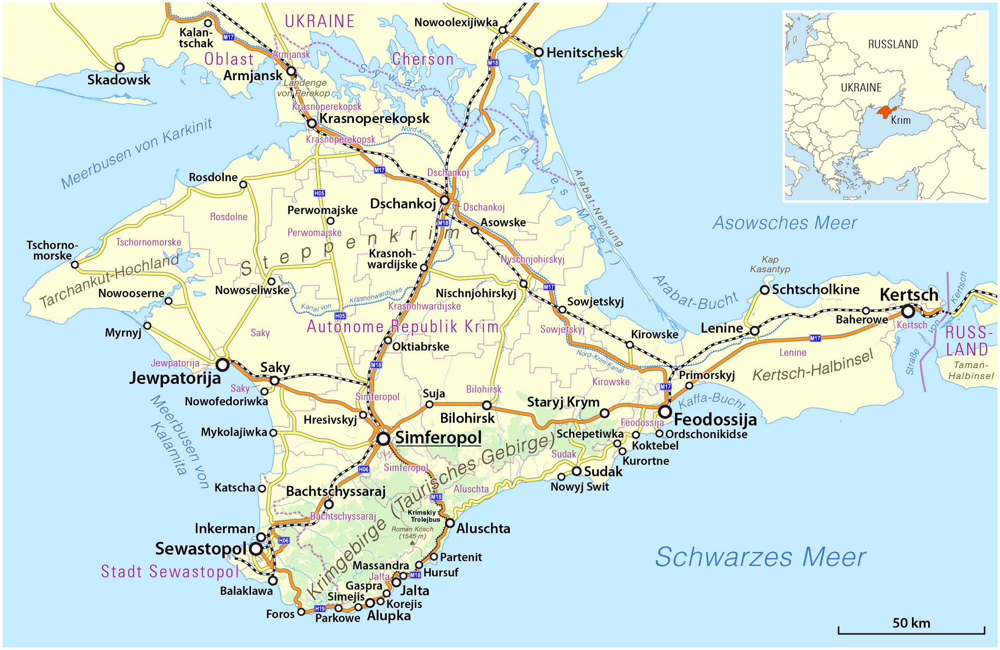
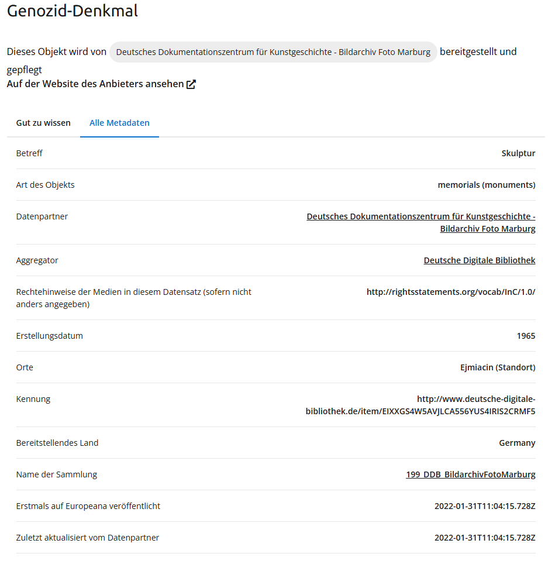
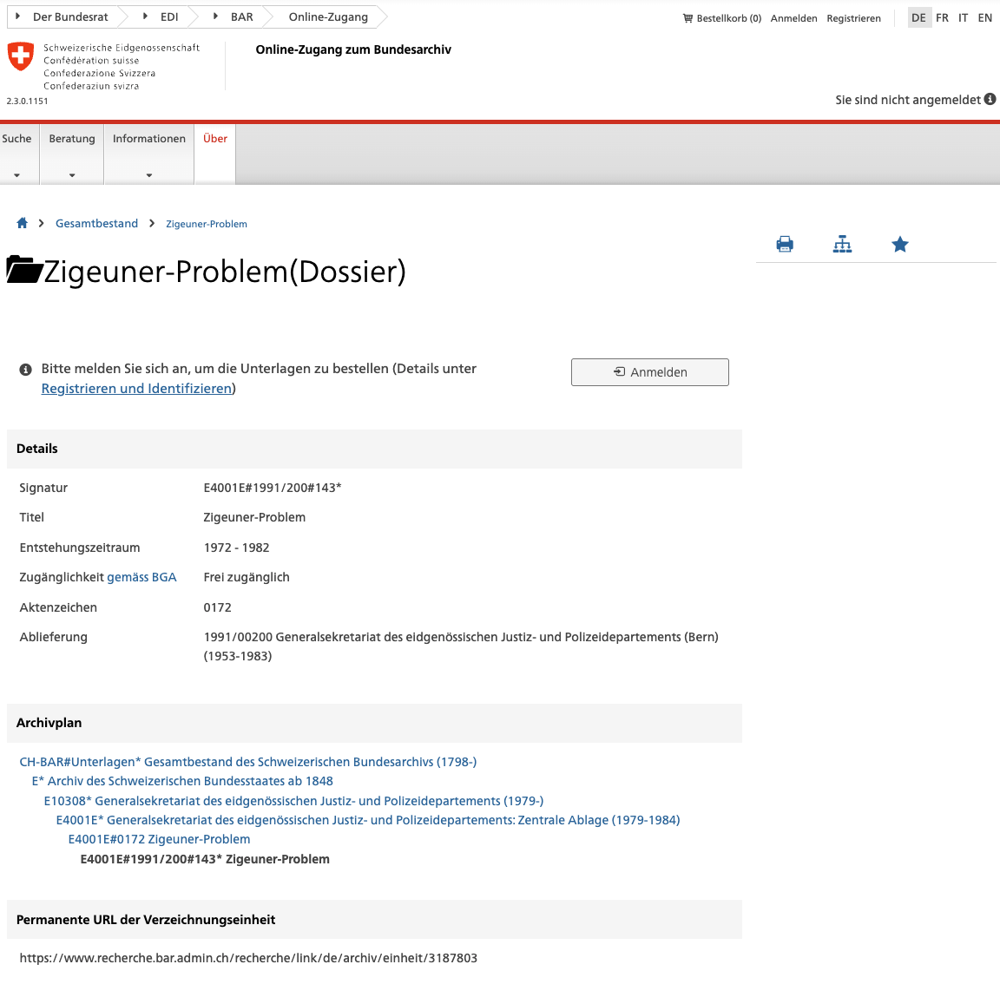

::: {.callout-warning title="Automatic translation"}
This is an automatically translated version of the original German handbook "Diskriminierungssensible Metadatenpraxis: Ein Handbuch zur ethischen Auszeichnung historischer Quellen und Forschungsdaten." The translation may contain inaccuracies or misinterpretations. For the most accurate and up-to-date information, please refer to the original German version available at [https://moritz-maehr.quarto.pub/diskriminierungssensible-metadatenpraxis/](https://moritz-maehr.quarto.pub/diskriminierungssensible-metadatenpraxis/).
:::

::: {.callout-caution title="Preview version"}
This is a preliminary version of the manual, which is continuously being developed. Feedback, corrections, and suggestions are welcome via email or [GitHub](https://github.com/maehr/diskriminierungsfreie-metadaten/discussions/34). The current published version is available at [https://maehr.github.io/diskriminierungsfreie-metadaten/](https://maehr.github.io/diskriminierungsfreie-metadaten/).
:::

::: {.callout-warning}
This document contains images from historical sources that contain discriminatory language, images, or representations. They are expressions of prejudice, stereotypes, or violence against certain groups in the past.
:::

# Foreword to the second edition

*Discrimination-Sensitive Metadata Practice: A Handbook for the Ethical Tagging of Historical Sources and Research Data* is now available in a revised second edition. This handbook is now divided into two parts: The theoretical part offers conceptual and theoretical considerations on language, classification, representation, and power. The practical part contains instructions, checklists, and examples for creating and maintaining metadata. Readers can thus choose to begin with the conceptual framework or with direct application. Both parts refer to each other and can be used in conjunction with one another.

The first version of the handbook was created in 2023 as part of the research project [Stadt.Geschichte.Basel](https://stadtgeschichtebasel.ch/) as an aid for tagging objects on the [research data platform](https://forschung.stadtgeschichtebasel.ch/) and was published on June 3, 2024. However, discussions, workshops, and feedback from the community made it clear that the original claim to provide guidance on non-discriminatory metadata was not feasible. In the second edition, we have corrected this claim: the focus is now on providing guidance on how to deal with power relations and contexts in a discrimination-sensitive manner.

At the same time, we have significantly expanded the practical section and clearly separated it from the theoretical section. Stadt.Geschichte.Basel remains an important case study, but is no longer the focus of the handbook. Our target audience is historical research projects throughout the German-speaking world: from university publishing projects to digitally accessible collections from GLAM institutions.

We invite all readers to join us in further developing this "living document" and enriching it with feedback, additions, or case studies.

Basel, September 8, 2025

Moritz Mähr & Noëlle Sarah Schnegg

# Introduction

This handbook is a practical guide to the discrimination-sensitive labeling of metadata for historical sources and research data. It is aimed at historians, archivists, librarians, and data curators at universities and GLAM institutions (galleries, libraries, archives, museums). The handbook addresses both beginners and experienced professionals and provides best practices.

Why metadata? In an increasingly digitally mediated world, metadata makes historical collections discoverable, accessible, interoperable, and reusable. Freely accessible, machine-readable metadata enables integration into search engines, data portals, and virtual research environments. This is changing the way historians research, interpret, and understand sources.

{fig-alt="Screenshot of a website showing a 1959 poster campaigning against women's suffrage in Switzerland. The poster shows the black silhouette of a woman being harassed by several gray hands bearing the inscription 'Party'. Next to it is information about the collection, date, author, and technique." width="1801" height="964" .img-fluid }

A look at German-language archives shows that in many places,  principles are already being applied to metadata. However, metadata practices that are sensitive to discrimination are still largely absent. Contextualizing descriptions that explicitly name forms of discrimination and place them in their respective historical contexts are often lacking. In the online catalog of the "Plakatsammlung der Schule für Gestaltung" (School of Design Poster Collection), the description of the poster ["Frauenstimmrecht, Nein" (Women's Suffrage, No)](https://www.recherche-plakatsammlungbasel.ch/objects/48228/) is limited to factual information: "Federal referendum, February 1, 1959." There are no references to the historical, political, and, in particular, sexist context.

With this handbook, we are committed to promoting discrimination-sensitive metadata practices. We recognize that discrimination is deeply embedded in social and institutional structures and cannot be avoided solely through the careful choice of terms.

Discrimination sensitivity means remaining attentive to changes in norms, the diversity of experiences of discrimination, and the unfinished nature of decolonization processes. It requires us to critically question and reflect on our own positioning and existing power relations.

In this handbook, we deliberately use a broad definition of discrimination in order to cover as many use cases as possible. We understand discrimination to mean serious forms of disadvantage. Disadvantage becomes discrimination when it is directly related to actual or attributed membership of a particular group or characteristic. These group affiliations or characteristics include social status, biological and social gender and gender identity, ethnic origin, discriminatory external attributions, religious affiliation, worldview and political convictions, language, disability or chronic illness, genetic disposition, age, sexual orientation, body weight, and lifestyle (e.g., travelers). Discrimination occurs on an ongoing basis because social values and norms stigmatize certain groups.

The volume is divided into two parts: In the first part, we define the key theoretical and technical terms and link social and information science perspectives. We cover normativity, forms of discrimination, bias, and oppression, as well as the basics of research and metadata, metadata standards, and //.

In the second part, we discuss the discrimination-sensitive handling of metadata throughout the entire research data lifecycle[@higgins2008]:

1. **Planning and design:** Basic conceptual decisions, selection of standards, roles, ethical and legal aspects, focus on consent and protection of vulnerable groups.  
2. **Data collection and source criticism:** Data generation and collection, use of open formats and standardized terminology for interoperability, and contextualization of sources.  
3. **Data processing and enrichment:** Data preparation, metadata enrichment, documentation, early standardization.  
4. **Storage and management:** Structured, secure storage, access control, maintenance, versioning, discrimination-sensitive access regulations.  
5. **Publication and access:** Making data accessible via repositories, persistent identifiers, licenses, / principles.  
6. **Reuse and recycling:** Searchability, interoperability, contextual information to avoid misinterpretation.  
7. **Archiving and deletion:** Selection of archiving standards and storage locations, legal and ethical requirements.

```{mermaid}
%%| label: fig-metadata-1
%%| fig-cap: "Representation of the data lifecycle according to the Curation Lifecycle Model (DCC), adapted into seven linear phases from planning to archiving or deletion."
%%| fig-alt: "Linear model of the data lifecycle with seven phases: planning, data collection, processing, storage, publication, reuse, archiving/deletion."
flowchart TD
    A[1 Planning and design] --> B[2 Data collection and source criticism]
    B --> C[3 Data processing and enrichment]
    C --> D[4 Storage and management]
    D --> E[5 Publication and access]
    E --> F[6 Reuse and recycling]
    F --> G[7 Archiving and deletion]
    G -.-> B 
```

The aim of this handbook is to provide assistance in the form of concrete examples, methods, and strategies that will enable readers to recognize discrimination in metadata practice and make decisions based on their own research context and available resources. In addition, we draw on concrete examples from German-language historical research practice to highlight recurring pitfalls. The following decision-making aid serves as a guide to the handbook:

```{mermaid}
%%| label: fig-metadata-2
%%| fig-cap: "Decision aid for navigating the manual. The starting question 'What do I want to do?' branches into four paths—create new metadata; improve access/presentation; reuse existing metadata; clarify terms/standards—with references to related phases, practice sections, and checklists."
%%| fig-alt: "A light purple flowchart. In the center is a diamond-shaped start box with the text 'What do I want to do?'. From there, four lines lead to four topic boxes, from left to right: First, 'Recreate metadata'. Below that, two levels: 'Phases 1 to 3: Planning, Collection, Processing' and below that 'Practice Paragraphs 1 to 3'. Second, 'Improve Access and Presentation'. Below that, 'Phase 5: Publication and Access' and below that 'Practice Paragraph 5'. Third, 'Reuse Existing Metadata'. Below that, 'Phase 6: Reuse and recycling' and below that, 'Practice Paragraph 6'. Fourth, 'Clarify terms and standards'. Below that, 'Theory and glossary' and below that, 'Key terms, bias, FAIR, and CARE'. The boxes are aligned horizontally, with the connections running from the center outwards and then vertically downwards."
flowchart LR
  Q{"What do I want to do?"}

  Q --> NEW["Recreate metadata"]
  Q --> ACCESS["Improve access/presentation"]
  Q --> REUSE["Reuse existing metadata"]
  Q --> SUBJECT["Clarify terms/standards"]

  NEW --> P13["Phase 1–3: Planning • Collection • Processing"]
  P13 --> R13["Practice §1–3"]

  ACCESS --> P5["Phase 5: Publication &amp; Access"]
  P5 --> R5["Practice §5"]

  REUSE --> P6["Phase 6: Reuse &amp; Repurposing"]
  P6 --> R6["Practice §6"]

  SUBJECT --> THEO["Theory & Glossary"]
  THEO --> R0["Key terms • Bias • FAIR/CARE"]
```

The authors bring different professional and personal backgrounds to the handbook. Moritz Mähr (white cis man) has a doctorate in history. Noëlle Schnegg (white cis woman) is studying history and Middle Eastern studies. Both grew up in Switzerland and enjoy privileged social conditions, although their individual experiences, for example with regard to sexism, differ. This disclosure serves the purpose of transparency and classification of the perspectives in the handbook.

We are guided by the Contributor Covenant and are committed to clearly labeling discriminatory content and contextualizing it. Problematic content is reproduced exclusively for necessary analytical purposes.

As a living document, this handbook thrives on the community. Anti-discrimination work is a never-ending social process, which is why this handbook will never be complete. Rather, it requires continuous critical reflection, revision, and adaptation. Suggestions for improvement can be submitted via [email](https://maehr.github.io/diskriminierungsfreie-metadaten/index.html) or as a comment on [GitHub](https://github.com/maehr/diskriminierungsfreie-metadaten/discussions/34).

# Acknowledgements

We would like to thank all individuals and institutions who contributed to the development of the first edition in 2024 and to the ongoing revision of this handbook. Their comments, criticism, and practical perspectives have sharpened the terminology, examples,  mapping, versioning, and guidelines on  and  principles.

Special thanks go to Levyn Bürki for his substantial contributions to the restructuring and further development of the handbook. His collaboration from September 2024 to June 2025 included key conceptual decisions and the significant development of essential content.

The authors Eric Decker, Céline Hug, Lucie Kolb, Jonas Lendenmann, Noah Regenass, and Stephanie Willi would like to thank you for your careful reading and constructive feedback on the first edition in 2024. We would also like to thank Esther Ernst-Mombelli ( editorial team, University Library of Basel), Marc Bayard ( editorial team, University Library of Bern), Philipp Messner (SfG Basel poster collection), Elias Zimmermann (University of Zurich/Geneva), Karin Lackner (University Library of Graz), and Roberta Flora Spano (ETH Library Zurich, Collections and Archives).

The handbook benefited from discussions in the following forums and specialist communities: the "FAIR and CARE" roundtable at the DARIAH-CH Study Days (November 22, 2024, FHNW) with contributions from Iolanda Pensa, Elena Chestnova, Lucie Kolb, and Linda Ludwig; the workshop "Big demands on small text fields – Ethical questions about metadata from historical sources" at the Herder Institute (November 21–22, 2024, Marburg), where Noëlle Schnegg and Levyn Bürki presented experiences from the handbook project; the panel "The invisible demands of digital history" at the 7th Swiss History Days (July 8–11, 2025, University of Lucerne) with a keynote speech by Noëlle Schnegg and contributions from memory institutions such as the Federal Archives, ETH Library, histify, Personenportal SH, SAMARA, National Library, Wirtschaftsarchiv, SSRQ, swisstopo, and Transcriptiones; the invitation to the 9th Library Congress (June 24–27, 2025, Vienna); and the panel "Discrimination-sensitive metadata for historical collections" at the Digital Humanities Conference 2025 (July 16, 2025, Universidade NOVA de Lisboa) with contributions from Levyn Bürki, Joris Burla, Peggy Große, Mario Kliewer, Jonas Lendenmann, Lisa Quade, Moritz Mähr, Noëlle Schnegg, and Elias Zimmermann. For the invitation to the SODa Forum "The Handbook for Creating Non-Discriminatory Metadata from the Perspective of University Collections" (September 11, 2025), to the workshop "Relativize or Limit? Dealing with Dark Heritage in Collections and Archives" (November 13 and 14; Dresden) and the workshop "Metadata in the Humanities" (December 4 and 5, Zurich). We would like to thank the organizers; the feedback received there will be incorporated into the ongoing revision.

The handbook is a "living document." We invite the communities of digital humanities, memory institutions, and research to contribute further comments, practical examples, and corrections. The authors are responsible for any remaining ambiguities and errors.

# Theory: Key Terms and Concepts

The development and application of discrimination-sensitive metadata practices requires a common understanding of key terms and concepts. This chapter defines and contextualizes the theoretical and technical key terms that form the framework of this handbook. The focus is on terms such as **normativity**, **discrimination**, **bias**, and **oppression**, which are discussed from the perspectives of the humanities and cultural studies as well as information science, library science, and archival science. In addition to these critical basic concepts, technical terms such as **metadata standard**, **authority data**, and **data value standard** are also introduced in order to bridge the gap between content reflection and technical implementation.

This chapter defines the terms in such a way that they are both analytically sound and practically operationalizable. The selection and definition of the terms is based on international human rights standards [@humanrightsCH_FormenDiskriminierung] and interdisciplinary approaches such as data feminism, data justice, and critical data studies [@mehrabi2021;@loukissas2019;@dignazio2020]. This chapter thus forms the conceptual and terminological basis for all further analyses and recommendations in the handbook.

## Discrimination in and through data {#sec-discrimination-in-and-through-data}

### Data is not neutral (normativity) {#sec-data-is-not-neutral-normativity}

{fig-alt='Screenshot of a Wikidata page with the entry Crimea (Q7835). Visible are the title "Crimea," a short description of the peninsula as a disputed territory between Ukraine and Russia, and language information (English, German, Alemannic, French) with various labels and synonyms. Below this is the section "Statements" with the note "instance of: peninsula."' width="1393" height="1999" .img-fluid }

At first glance, data and metadata appear to be objective representations of reality, but they are always embedded in historically grown power relations and normative orders. The example of Crimea in Wikidata [Q7835](https://www.wikidata.org/wiki/Q7835) and the accompanying map of the peninsula clearly illustrate how seemingly neutral representations in metadata inherently take a position and reflect political conflicts.

{fig-alt="Map of Crimea with cities, roads, railway lines, and landscape features marked. Simferopol, Sevastopol, Yalta, Feodosia, Kerch, and Yevpatoria are shown, as well as mountains, coastlines, and neighboring regions of Ukraine and Russia." width="1929" height="1249" .img-fluid }

The [map](https://commons.wikimedia.org/wiki/File:Karte_der_Krim.png) presents Crimea as the "Autonomous Republic of Crimea," thus explicitly showing a perspective based on international law and favorable to Ukraine: The designation and color coding of Crimea as part of Ukraine ("oblast," "Autonomous Republic") emphasizes its de jure status under Ukrainian law and international human rights standards. Key locations such as Sevastopol and Kerch are listed with their Ukrainian transcription. The border with Russia is clearly marked as a state border. In the detailed view (top right), Crimea is clearly assigned to Ukraine, which means that its controversial status under international law as part of Russia is not visualized in an equivalent manner.

This cartographic example is paradigmatic of the normative assumptions that also underlie digitally coded data structures such as Wikidata. Crimea is listed there as part of both Ukraine ("de jure") and Russia ("de facto"), but many linked objects such as cities or administrative units do not consistently reflect this ambiguity or only represent the Ukrainian perspective. The map operates with a clear framing in favor of Ukrainian sovereignty and largely ignores alternative classification options, such as the designation "Republic of Crimea" as part of Russia.

This illustrates that any form of data and metadata modeling—whether visual, textual, or structural—is based on normative decisions that often remain invisible. The selection of names, the visibility of borders, or the hierarchization of sovereignty claims reflect and stabilize existing power asymmetries and act as an "invisible hand of classification" [@bowker1999]. Users are given the impression of technical neutrality, even though both the map and digital databases materialize political negotiation processes and interests.

Discrimination-sensitive metadata practice therefore starts at the interface between technology and society: it requires the consistent disclosure and reflection of one's own classification schemes, decision-making logic, and data structures. In practice, this means transparent documentation of modeling decisions (schema, version, scope), parallel fields for multiple perspectives (*de jure*/*de facto*, self-designations and external designations), verifiable source and provenance information, and the explicit, machine-readable marking of conflicts and uncertainties in the metadata (status, time period, spatial validity). The description through metadata and its representation in digital databases are deliberately designed, traceable practices that never merely "map" but have a normative effect.

### Direct discrimination {#sec-direct-discrimination}

The definition of discrimination is provided in the introduction (CROSS-REFERENCE section "Definition of discrimination"). In this chapter, we operationalize direct discrimination for metadata practice: A rule, decision, or action is directly discriminatory if it treats individuals unequally on the basis of a protected characteristic and this unequal treatment is not covered by a legitimate, proportionate purpose. The focus is on mechanisms, indicators, and countermeasures.

**Examples**

* **Access restrictions in archives**

  * *Mechanism:* Normative exclusion rules based on gender, religion, or social status.  
  * *Effect:* Systematic erasure of voices from historical tradition.  
  * *Indicators:* Explicit access regulations, lack of usage logs for excluded groups.  
  * *Countermeasures:* Retrospective documentation of exclusions, prioritization of gaps in access, inclusion-oriented usage regulations.  
* **State registers**

  * *Mechanism:* Categorization according to "race," "tribe," "religion" for hierarchical purposes.  
  * *Effect:* Unequal treatment by administration and law.  
  * *Indicators:* Categories with sanctions or performance-related effects.  
  * *Countermeasures:* Historicization and contextualization of problematic categories, protective labels, restrictive conditions for reuse.  
* **Professional roles in official documents**

  * *Mechanism:* Women are only recorded in relation to others ("the blacksmith's wife") rather than as independent actors.  
  * *Effect:* Economic activity is rendered invisible.  
  * *Indicators:* Low proportion of independent occupational information for women.  
  * *Countermeasures:* Subsequent normalization, alternative name and role models, maintaining variants as equivalent identifiers.

### Indirect discrimination {#sec-indirect-discrimination}

Indirect discrimination occurs when formally neutral criteria, methods, or regulations for collecting, selecting, describing, or interpreting historical data systematically disadvantage certain groups. This applies, for example, to under-documented groups or practices that are further marginalized by established routine processes.

**Examples**

* **Alphabetical name registers**

  * *Mechanism:* Ordered by family name with references to heads of households; widows listed under their husband's name.  
  * *Effect:* Systematic untraceability of women, children, and people from cultures without family names.  
  * *Indicators:* High proportion of "see" references instead of separate entries.  
  * *Countermeasures:* Secondary register by first name/role, relational links, name variants as primary keys.  
* **Linguistic documentation**

  * *Mechanism:* Dominance of official languages (Latin, French, High German) in the tradition.  
  * *Effect:* Low visibility of minority languages and practices.  
  * *Indicators:* Proportion of language varieties not recorded or indexed.  
  * *Countermeasures:* Multilingual indexing, community-based translations,  labels (Simple Knowledge Organization System) per language variety.  
* **Digital full-text search**

  * *Mechanism:* Selection and digitization bias; / favors standardized prints.  
  * *Effect:* Underrepresentation of women, workers, manuscripts.  
  * *Indicators:* / by script/medium; recall differences in corpora.  
  * *Countermeasures:* Stratified digitization, targeted , compensatory ranking, .  
* **Census categories**

  * *Mechanism:* Only heads of households are recorded.  
  * *Effect:* Statistical invisibility of women, children, and other household members.  
  * *Indicators:* Lack of individual data records for non-heads of households.  
  * *Countermeasures:* Reconstruction of households, metadata on survey designs, methodological weighting in analyses.

### Structural discrimination {#sec-structural-discrimination}

Structural discrimination refers to disadvantages that are embedded in established practices of collection, documentation, preservation, and access. Systems of archiving, cataloging, and curating often reproduce patriarchal, colonial, and heteronormative perspectives. These have an impact on selection processes, the language of cataloging, and institutional routines. Numerous digital infrastructures orient language, usability, and standards primarily toward Western research traditions, thereby marginalizing indigenous and non-Western perspectives.

**Examples**

**Examples**

* **Eurocentric standard data and controlled vocabularies**

  * *Mechanism:* Norm data privilege Western taxonomies; indigenous concepts are "mapped."  
  * *Effect:* Semantic asymmetries, misclassification, poorer .  
  * *Indicators:* High proportion of vague keywords; low multilingualism in `skos:prefLabel/altLabel`.  
  * *Countermeasures:* Community-curated vocabulary, multilingualism, precise `skos:exactMatch/closeMatch`, documented provenance.  
* **Binary person and gender models in metadata standards**

  * *Mechanism:* Mandatory fields enforce binary genders, patronymic main forms.  
  * *Effect:* Invisibility of non-binary identities and independent roles.  
  * *Indicators:* Proportion of data records without fields for self-designation; normalization requirement in standard data.  
  * *Countermeasures:* Controlled-open fields (`genderIdentity`, `role`), variants as equivalent identifiers, version-controlled decision logs.  
* **Digital  bias: selection, / and ranking**

  * *Mechanism:* Canon-centered selection; training data for dominant scripts/languages; index weights favor well-recognized text.  
  * *Effect:* Higher error rates and poorer findability for minority languages and handwriting.  
  * *Indicators:* / by script/variety; recall differences; coverage per segment.  
  * *Countermeasures:* Stratified selection plans, published error balances,  for underrepresented scripts, re-ranking, CLIR.  
* **Canon- and metric-driven implicit prioritization**

  * *Mechanism:* Allocation of funds based on usage and citations.  
  * *Effect:* Visibility spiral favoring elites and centers.  
  * *Indicators:* Budget and page numbers per group/region; "requests vs. untapped resources."  
  * *Countermeasures:* Equity buckets, social impact KPIs, cooperative digitization, transparent trade-offs.

### Institutional discrimination {#sec-institutional-discrimination}

Institutional discrimination occurs when internal rules and routines of a specific memory institution systematically disadvantage certain groups. It is often intertwined with structural discrimination.

**Examples**

* **Prioritizing digitization according to canon**

  * *Mechanism:* Selection criteria favor collections that are in high demand.  
  * *Effect:* Sources from marginalized groups remain analog.  
  * *Indicators:* Disparities between request volume and degree of cataloging per community.  
  * *Countermeasures:* Quotas for underrepresented holdings, participatory selection processes.  
* **Cataloging guidelines with normative categories**

  * *Mechanism:* mandatory fields such as "male/female"; limited selection of colonial-influenced keywords.  
  * *Effect:* Misclassification, reproduction of discriminatory vocabulary.  
  * *Indicators:* Proportion of problematic mandatory fields, correction histories.  
  * *Countermeasures:* Revision of guidelines, optional fields, governance for vocabulary changes.  
* **Licensing and fee policy**

  * *Mechanism:* High reproduction costs, restrictive licenses.  
  * *Effect:* Difficult reuse for researchers without strong institutional ties, especially in countries and regions with fewer resources.  
  * *Indicators:* Proportion of open access objects; fees per type of use.  
  * *Countermeasures:* OA-first policy, tiered fees, -compatible access models.  
* **Metadata standards without multilingualism**

  * *Mechanism:* deliberate admission of only dominant official languages or standardized transcriptions.  
  * *Effect:* Invisibility of names, toponyms, and concepts in minority languages.  
  * *Indicators:* Language coverage in fields and indexes.  
  * *Countermeasures:* Multilingual fields, local name forms as equal labels, search support for variants.

### Statistical discrimination

Statistical discrimination refers to the disadvantage of individuals when decisions based on incomplete information are made on the basis of group-related average values.

**Key elements**

* *Information asymmetry:* Less information is available about individuals than about groups. Decisions are based on group statistics.  
* *Group attribution:* Probabilities or averages are transferred to individuals.  
* *Effect:* Disadvantage for individuals who do not fit the group profile.

**Examples**

* **Automatic gender mapping in standard data**

  * *Mechanism:* Imputation (i.e., estimation of missing values) of `gender` from name statistics or language models.  
  * *Effect:* Systematic misclassification of non-Western, historical, or trans names.  
  * *Indicators:* Clustering of assignments close to the classification threshold; disproportionate corrections based on region of origin.  
  * *Countermeasures:* Abstention rule in case of uncertainty; separate fields for self-reported data and sources; calibrated thresholds; active post-annotation.  
* ** by productivity**

  * *Mechanism:* Merging of frequent names into the most productive standard data set.  
  * *Effect:* False merges delete less visible persons; citations and works are misdirected.  
  * *Indicators:* implausible jumps in degree and citation distributions; clusters with high name similarity and heterogeneous provenance.  
  * *Countermeasures:* Conservative blocking rules (preliminary filters in record linkage procedures to limit the comparison set); time- and location-bound hard constraints; targeted review of small or minorized clusters; complete provenance storage.  
* **Historical geocoding with modern gazetteers**

  * *Mechanism:* Ambiguous toponyms are mapped to today's majority locations. Gazetteers are structured place name databases that usually prioritize current location information.  
  * *Effect:* Displacement of historical minority settlements; incorrect contexts in maps.  
  * *Indicators:* High proportion of default assignments without year; dominance of large places with short place names.  
  * *Countermeasures:* Time-sliced gazetteers (i.e., separated by historical epochs); uncertainty geometries; "unresolved" instead of forced assignment; explicit source reference in the dataset.  
* **Digitization selection based on citation metrics**

  * *Mechanism:* Selection via global impact score as a proxy for "value."  
  * *Effect:* Peripheral voices remain analog; self-reinforcing visibility of established canons.  
  * *Indicators:* Skewed distributions in favor of canonized authors and locations; low diversity at the margins of the sample.  
  * *Countermeasures:* Stratified sampling plans; equity buckets (specifically defined selection categories to ensure diversity); disclosure of the selection function; simulation and comparison of alternative selection rules.  

### Specific discrimination in historical sources and research data {#sec-specific-discrimination-in-historical-sources-and-research-data}

Discrimination can occur in several forms when working with historical sources and research data<!-- [@A4BLiP2019] -->:

1. **Producing or reproducing discriminatory statements about marginalized groups**, whether through one's own wording or through the overly simplistic dissemination of research data.  
2. **Systematically excluding or underrepresenting marginalized groups in decision-making processes** or perpetuating such conditions.  
3. **Actively making marginalized groups invisible in archives or historiography** or allowing this invisibility to continue without reflection.  
4. **Accepting the vulnerability of marginalized groups when presenting data**, for example without  or sensitivity notices.  
5. **Making access to data, archives, and results difficult**, for example through inadequate finding aids, inaccessible language, or technical barriers.

## Bias {#sec-bias}

**Bias** refers to a distortion—a systematic deviation from an objective representation. Technically, bias in research data can arise from an unbalanced selection of data, stereotypical terminology, or algorithmic assumptions. In terms of content, bias manifests itself in various forms, such as in the selection of what is considered worth telling, in the way historical events are described, or in the moral or interpretative assessments made by historians. This bias is not just an error, but results from the fundamental fact that every historical representation is selective and perspective-based. In metadata creation, bias is often found in the descriptive texts. For example, women in historical sources are often reduced to their physical appearance, while men are often mentioned first in terms of their professional activities. This reduction of women to their physical appearance is part of a long tradition of objectifying female bodies. When metadata is revised, not only is the bias critically reflected upon, but the error is also presented as a reproduction of gender stereotypes, making discriminatory structures visible and allowing them to be gradually dismantled. This is where the concept of **oppression** comes in. It goes beyond the critique of bias by interpreting it as an expression of structural power relations and placing it in a larger social context.

### Distortion and errors in data (data bias) {#sec-distortion-and-errors-in-data-data-bias}

#### **Measurement Bias** {#sec-measurement-bias}

Bias resulting from incorrect, incomplete, or inadequate measurement of variables.

*Example 1:* In digital editions of historical texts, "significance" is often determined by the frequency of certain terms, but faulty  recognition—for example, when the historical "ſ" is not recognized as "s"—or inconsistent tagging can easily lead to systematic distortions.

*Example 2:* Recording gender in historical censuses: "Occupation: head of household" is often coded as "male" in digital databases, which systematically excludes female heads of households.

#### **Omitted variable bias** {#sec-omitted-variable-bias}

Occurs when relevant variables are missing from the model, leading to biased results.

*Example:* A digital network analysis of historical correspondence omits informal communication channels (e.g., personal meetings, oral tradition), leading to distorted interpretations of communication networks.

#### **Representation bias** {#sec-representation-bias}

Bias caused by non-representative samples, for example, geographical or demographic underrepresentation in the data set.

*Example:* Digitized newspaper archives usually only cover certain (often middle-class or urban) press; workers' newspapers, marginalized groups, or non-German-language publications are missing and become invisible in research.

#### **Aggregation bias** {#sec-aggregation-bias}

Incorrect generalization of group results to individuals or subgroups.

**Simpson’s Paradox**: Aggregated trends can be misleading because correlations at the subgroup level are reversed.

**Simpson's paradox**: Aggregated trends can be misleading because correlations at the subgroup level are reversed.

*Example:* A method appears to be more successful overall, but is less successful in all subgroups; aggregation obscures this.

**Modifiable Areal Unit Problem (MAUP)**: Results depend on the spatial aggregation chosen.

*Example:* Summarizing different social structures (e.g., all "workers" in the 19th century) obscures regional differences—such as between textile workers in the Ruhr region and agricultural workers in East Prussia.

#### **Sampling bias** {#sec-sampling-bias}

Bias caused by non-random selection of samples leads to a lack of generalizability.

*Example:* Oral history projects that work exclusively with eyewitnesses who actively contact researchers tend to capture more politically engaged or educated actors.

#### **Longitudinal Data Fallacy** {#sec-longitudinal-data-fallacy}

Fallacious conclusion resulting from mixing cohorts in cross-sectional data instead of considering actual temporal development.

*Example:* Analysis of Wikidata entries on historical figures over decades without taking into account that recording rules or community practices change over time.

#### **Historical bias** {#sec-historical-bias}

Bias that already exists in social reality and is reflected in the data, even with a perfect sample.

*Example:* Digital repositories that reflect historical demographics mirror patriarchal structures: the low number of "women in leadership positions" is not a data error, but a social reality.

#### **Population bias** {#sec-population-bias}

Differences between users of the platform and the target population, for example due to demographics.

*Example:* Wikidata entries on historians are disproportionately contributed by male, Western contributors, which is reflected in their visibility and categorization.

### Bias in and through algorithms {#sec-bias-in-and-through-algorithms}

#### **Algorithmic bias** {#sec-algorithmic-bias}

Bias that arises from algorithmic design decisions, independent of bias in the data (for example, through the choice of optimization function).

*Example:*  of philosophical texts yields "topics" that are the result of word lists and stop word definitions, but are interpreted by non-experts as content-significant topoi.

#### **Evaluation bias** {#sec-evaluation-bias}

Distortion caused by inappropriate or unbalanced benchmarks in model evaluation.

*Example:* Training and test sets for  models in the field of history mainly use sources from the 20th century. Models therefore perform poorly on medieval or early modern texts.

### User interaction bias {#sec-user-interaction-bias}

#### **Presentation bias** {#sec-presentation-bias}

Imbalance caused by visual, typographical, or layout-related highlights. Interface decisions direct attention and interpretive frameworks before content quality is evaluated.

*Example:* Sources that are accessible without restrictions are highlighted in color in the archive catalog. This means they are clicked on more often and displace less accessible sources at an above-average rate.

#### **Ranking bias** {#sec-ranking-bias}

Systematic distortion caused by sorting logic that rewards clicks, citation counts, or metadata richness. Higher positions attract more attention, which reinforces the original ranking regardless of relevance.

*Example:* Museum portal sorted by "Most viewed." Colonial-era exhibits with early social media reach dominate, while newly cataloged objects from the Global South receive little visibility.

#### **Popularity bias** {#sec-popularitätsfehler-popularity-bias}

More popular objects are shown more frequently, thereby reinforcing their popularity, regardless of quality.

*Example:* In crowdsourcing projects on old manuscripts, a few particularly active users dominate, so that their readings are adopted disproportionately often.

#### **Emergent bias** {#sec-emergent-bias}

Bias that only arises through long-term interaction with users or social change.

*Example:* A digital edition project on medieval documents is originally conceived as a research infrastructure for editorial philology. Over time, however, genealogical communities begin to use the data for family research. This shifts demand toward name and place indexing. The infrastructure operators adapt their metadata structures and search functions to these user groups, which in turn systematically marginalizes in-depth philological information (e.g., variant criticism).

#### **Self-selection bias** {#sec-selbstselektionsverzerrung-self-selection-bias}

Bias caused by self-selecting participants, for example in surveys.

Bias caused by self-selecting participants, for example in surveys.

*Example:* Digitization projects for private archives tend to be initiated by families with high cultural capital, while marginalized families are less likely to participate.

#### **Social bias** {#sec-social-bias}

Individual decisions are distorted by social influences.

*Example:* In collaborative transcription projects, new users orient themselves toward the reading habits of experienced transcribers and adopt their mistakes.

#### **Behavioral bias** {#sec-behavioral-bias}

Different behavior of users depending on the platform, context, or time.

*Example:* Historians conduct more systematic research, while laypeople often search for family names or spectacular events. This influences access figures.

#### **Temporal bias** {#sec-temporal-bias}

Bias resulting from temporal changes in behavior or population.

*Example:* The frequency of search terms in archives fluctuates with debates (e.g., "pandemic" in 2020/21), which distorts long-term analyses.

#### **Content production bias** {#sec-content-production-bias}

Bias based on differences in the structure, lexicon, semantics, and syntax of user-generated content.

*Example:* Digital forums on the history of science are dominated by English; other languages are underrepresented.

## Oppression in Data

Oppression is not merely a single act of discrimination, but rather the interplay of practices, discourses, and institutions that systematically restrict the scope of action of entire groups. In feminist power theory, oppression is understood as **structural "power-over"**: a permanent, non-random constellation in which institutions, norms, and symbolic orders restrict the options of certain groups while privileging others [@young_justice_1990]. Oppression has **material** (physical, economic), **symbolic** (stigmatization, invisibility), and **epistemic** (determination of what counts as knowledge) effects.

Historical data and metadata practices can reproduce oppression on at least three levels: ontological, epistemic, and infrastructural. These forms have a cumulative effect: each individual wire strut, for example a controlled vocabulary, seems harmless at first. But when they interact, they create a cage that systematically restricts the freedom of movement of certain groups [@frye_politics_1983].

### Ontological violence

*Mechanism of action:* Enforces categories that contradict the self-description of those affected or reduces them to deficient characteristics [@bowker1999].

*Examples:*

* Binary `gndo:gender` values ("male"/"female") erase non-binary identities.  
* Colonial ethnonyms in standard data ("Hottentot") perpetuate racist classifications.

### Epistemic violence

*Mechanism of action:* Makes knowledge impossible by excluding certain perspectives or labeling them as "noise" [@spivak_subaltern_1988].

*Examples:*

* Aggregation metadata that files letters from servants as "miscellaneous."  
* Diplomatic correspondence, on the other hand, is indexed in fine granularity.

### Infrastructural violence

*

*Mechanism of action:* Entrenches disadvantages through technical standards that are difficult to change (lock-in) [@rodgers_oneill_infrastructural_2012].

*Examples:*

* Default fields in collection software without multilingual support enforce English keywords and displace indigenous terms.  
* Unchangeable field lengths cause traditional names to be truncated.

## Data about data

### What is research data? {#sec-what-is-research-data}

Research data refers to all digital representations of physical and virtual objects that researchers use and produce during their research and that can be represented as digital data. This includes sources, transcriptions or reproductions, excerpts, time series, tables, diagrams, maps, models, images, videos, interviews, articles, secondary literature, software, source code, , research protocols, data sets, etc.

In historical research projects, a large proportion of the research data often comes from the holdings of memory institutions such as archives, libraries, and museums, or is available in published form in books or articles. In many cases, these institutions ensure the long-term archiving of the sources. In such cases, the DOI or signature can be used to refer directly to the objects (and their metadata). In most cases, however, additional metadata is collected or existing metadata is corrected in research projects. This may include source annotations, expanded descriptions, corrected information, etc. In these cases, it is advisable to create a new, as complete as possible metadata record and make it available on a suitable platform with a reference to the original. Redundancy is desirable for research data and increases its availability and findability.

In the context of research, data is often derived from and compiled from historical sources. This includes text data (e.g., research protocols), time series (possibly presented as diagrams or tables), or georeferenced maps and network representations (e.g., based on excavation data or correspondence).

Since much textual research data is only available on paper or in unstructured digital form, extracting structured data from these materials is often very time-consuming (scanning, cleaning, annotating, etc.). In addition to the data relevant to the research, the associated process information and supporting data (software, algorithms, protocols, etc.) must also be documented, archived, and made accessible. This information is essential to ensure the traceability and reproducibility of the research results.

### What is metadata? {#sec-what-is-metadata}

Metadata contains structured information about objects, in particular about their content, context, and structure. It enables or facilitates their identification, retrieval, organization, management, contextualization, and use. Metadata should be structured in such a way that it models the most important attributes of the object type described. It is stored either independently of or together with the data assigned to it.

{fig-alt='Poster with red background: Three men in colorful robes and turbans are doing handicrafts—one is weaving, one is holding jewelry, and one is working with clay pots. Below is the large text "KNIE" and the smaller text "Völkerschau".' width="1393" height="1999" .img-fluid }

To illustrate concepts related to metadata, we refer to the metadata of the example [*Knie Völkerschau*](https://www.europeana.eu/de/item/92023/images_billed_2010_okt_billeder_object488811). We chose it because it exemplifies problematic, colonial-influenced representations in 20th-century popular entertainment culture and has rich metadata.

| Field ( / Europeana) | Value |
| :---- | :---- |
| **dc:title** | Knie's Human Zoo |
| **dc:description** | Lithograph, multicolor print: dimensions: 500 x 350 mm multicolor drawing of three craftsmen at work |
| **dc:date** | 1969? |
| **dc:type** | Image, two-dimensional image material Still image, poster |
| **dc:subject** | Knie Circus Craftsmen |
| **dc:identifier** | [http://www.kb.dk/images/billed/2010/okt/billeder/object488811/en/](http://www.kb.dk/images/billed/2010/okt/billeder/object488811/en/) |
| **dc:rights** | The image may be protected by copyright law \[CC BY-NC-ND 4.0\](<http://creativecommons.org/licenses/by-nc-nd/4.0/>) |
| **edm:isShownBy** | [http://kb-images.kb.dk/DAMJP2/DAM/Samlingsbilleder/0000/488/811/PL000012/full/full/0/native.jpg](http://kb-images.kb.dk/DAMJP2/DAM/Samlingsbilleder/0000/488/811/PL000012/full/full/0/native.jpg) |
| **edm:isShownAt** | [http://www.kb.dk/images/billed/2010/okt/billeder/object488811/en/](http://www.kb.dk/images/billed/2010/okt/billeder/object488811/en/) |
| **edm:provider** | DK-National Aggregation Service |
| **edm:dataProvider** | The Royal Library, National Library, and Copenhagen University Library |
| **edm:country** | Denmark |
| **edm:language** | da (Danish) |
| **edm:preview** | <https://api.europeana.eu/thumbnail/v2/url.json?uri=http%3A%2F%2Fkb-images.kb.dk%2FDAMJP2%2FDAM%2FSamlingsbilleder%2F0000%2F488%2F811%2FPL000012%2Ffull%2Ffull%2F0%2Fnative.jpg\&amp;type=IMAGE> |
| **Europeana ID** | 92023/images\_billed\_2010\_okt\_billeder\_object488811 |
| **Europeana Landing Page** | <https://www.europeana.eu/en/item/92023/images_billed_2010_okt_billeder_object488811> |
| ** Manifest** | <https://iiif.europeana.eu/presentation/92023/images_billed_2010_okt_billeder_object488811/manifest> |
|

: "Metadata table for: *Knie Völkerschau*"

The metadata for the poster *Knie Völkerschau* clearly shows that metadata can contain both **intrinsic** (inherent to the object itself) and **extrinsic** (attributed to the object) **information**. For example, `dc:description` refers to intrinsic properties such as format, material, and design of the print, while fields such as `dc:subject` or `edm:provider` document extrinsic classifications and institutional attributions [@forschungsdateninfo_metadaten_2024].

In addition, the metadata in the example can be assigned to different **functional categories**:

* **Bibliographic metadata**: Title (`dc:title`), identifier (`dc:identifier`, *Europeana ID*), rights (`dc:rights`).  
* **Administrative metadata**: Information on data providers, aggregation services, and access URLs (`edm:provider`, `edm:isShownAt`).  
* **Subject-specific content metadata**: thematic keywords (`dc:subject`) or the description of the craftsman scenes depicted (`dc:description`).

In the context of digitization, it is also important to mention **paradata** or **process metadata**, which are implicitly included in the Europeana dataset even if they are not explicitly listed. This includes, for example, camera settings or color profiles that were generated during the creation of the digitized material [@FORRT_Paradata_2025].

The example also illustrates the difference between **physical objects** and their **digital representations**:

* The physical poster itself has properties such as size, material, and condition.  
* The digitized version is available as a JPEG file with a specific resolution (`edm:isShownBy`, `edm:preview`).
* The digitization process generates additional information, such as perspective, image section, and color reproduction, which are crucial for precise contextualization.

### Metadata standards {#sec-metadatenstandards}

There are various **standards and procedures** for structuring metadata, most of which are developed and maintained by a specialist community. They serve to ensure **quality, consistency, and interoperability**, but also bring with them challenges such as **pressure to standardize, possible omissions**, and **loss of semantics**. Seven levels or types of standards can be distinguished, which we also illustrate using the example above.

#### **1\. Data type standard *(field or attribute level)*** {#sec-1-datatypestandard-field--or--attributelevel}

Specifies **the format in which individual values** must be encoded or displayed – for example, numbers, dates, character strings, Booleans (truth values such as true or false, or 1 and 0).

The example *Knie Völkerschau* shows how individual values are formally typed:

* `dc:title` is a simple text string in the original language→ `xsd:string@de`  
* `dc:date` contains the uncertain year value `"1969?"`, typed as `xsd:string`, but could also be `xsd:gYear` in standardized cases  
* `edm:language` uses  639-1 codes (`"da"` for Danish)  
* `dc:identifier` or `edm:isShownBy` are URIs → `anyURI`

#### **2\. Value standard *(Permitted values for fields)*** {#sec-2-value-standard-permitted-values-for-fields}

Contains standardized, controlled terms or references. These are used for **comparability, search, and aggregation**.

The example *Knie Völkerschau* uses both controlled and free values:

* `dc:type` contains `"Still image"`, `"Poster"` – compliant with the **** or ** Type Vocabulary**  
* `edm:country` is `"Denmark"` → corresponds to ** 3166-1 Alpha-2**  
* `dc:rights` refers to the **CC license** [`http://creativecommons.org/licenses/by-nc-nd/4.0/`](http://creativecommons.org/licenses/by-nc-nd/4.0/)  
* `dc:subject` ("Knie", "Cirkus", "Håndværker") could be mapped to a controlled vocabulary source such as **** or **Wikidata**

#### **3\. Content standard *(Semantic meaning of fields)*** {#sec-3-content-standard-semantic-meaning-of-fields}

Defines **which information should be entered in which fields** and what they **mean semantically**. The following question can be asked: "How do I fill in the field?"

The fields in the example *Knie Völkerschau* are filled in according to the ** element set ()** and the ****:

* `dc:title` contains the title of the poster ("Knie Völkerschau")  
* `dc:description` describes the motif, technique, and dimensions of the lithograph  
* `dc:subject` names thematic keywords  
* `dc:rights` provides information about copyright conditions  
* `edm:isShownBy` refers to the directly embedded digital copy

#### **4\. Structure standard / schema *(data modeling)*** {#sec-4-structure-standard-schema-data-modeling}

Defines **the permitted fields and their relationships**, often in hierarchical or relational structures. A schema can be specified in terms of both content and form.

Often, no clear distinction is made between structure standard and schema. While the structure standard describes the general arrangement and meaning of the fields, a schema specifies how these are implemented, such as which fields are mandatory or how often they may occur. A schema can be understood as a blueprint based on a higher-level, abstract model.

The data structure of the example *Knie Völkerschau* corresponds to the ****:

* `ProvidedCHO` (Cultural Heritage Object) contains, for example, `dc:title`, `dc:date`, `dc:type`  
* `Aggregation` linked to `edm:isShownBy`, `edm:preview`, `edm:provider`  
* `Proxy` allows multilingualism, for example in `dc:description` (da) and `dc:title` (de)

#### **5\. Format standard *(machine-readable serialization &amp; encoding)*** {#sec-5-formatstandard-machine-readable-serialization-encoding}

Defines **how the structured metadata set is technically stored or transmitted**. It is the concrete **encoding and serialization** of the metadata structure as read by the computer. The focus is on simple and efficient readability for machines, not for humans.

**Note:**  or  are **both structure and format standards**, depending on whether their **logical modeling** or **serialization** is emphasized.

In the case of *Knie Völkerschau*, the metadata is available in the following formats:

* Europeana API delivers metadata in **** (for example via `/record/v2/...json`)  
* Exportable as **/** or **Turtle**  
* URIs are **HTTP-resolvable**, encoded in **UTF-8**

#### **6\. Presentation standard *(visualization, representation for humans)*** {#sec-6-presentation-standard-visualization-representation-for-humans}

Defines the **design and presentation of metadata for end users**, for example in web interfaces, catalog systems, or PDFs. These standards concern **layout, labels, order**, but not the machine-readable structure.

The Europeana interface displays the metadata of the object in a clear, multilingual view:

* `dc:title` is displayed as **Title**  
* `dc:rights` appears with CC icons and a linked license  
* `edm:preview` shows a **thumbnail**, while `edm:isShownBy` opens the high-resolution image  
* Keywords (from `dc:subject`) are made available as **filter facets**

#### **7\. Interoperability and exchange standards *(system networking)*** {#sec-7-interoperability--and-exchange-standards-system-networking}

Enable **exchange, aggregation, and mapping** between different standards, data models, or platforms. As with format standards, the focus is on machine readability.

The example *Knie Völkerschau* is fully embedded in an interoperable framework:

* The machine-readable interface  collects information from local repositories and transmits it to an aggregator (e.g., Europeana). The source information can be embedded in the `edm:dataProvider` field.  
*  manifest available for DeepZoom or image annotation  
* Links to licenses, locations, concepts via URI  principles)  
* Mappings are possible in both directions: from  to  and vice versa, from  to  and vice versa, and from  to EDM and vice versa.

#### **One field, seven levels**

| Metadata (field) | ① Data type | ② Value standard | ③ Content standard | ④ Structure/schema | ⑤ Format | ⑥ Presentation | ⑦ Interoperability |
| :---- | :---- | :---- | :---- | :---- | :---- | :---- | :---- |
| `dc:title` | `xsd:string@en` | Free text | **: Title** | ,  | , / | UI label: *Title* | Europeana API,  |
| `dc:description` | `xsd:string@da` | Free text, Getty  terms if applicable | **: Description** |  | JSON | Accordion field, tooltip | ,  |
| `dc:date` | `xsd:gYear` or `xsd:string` |  8601, "1969?" (uncertain) | **: Date** |  Timespan,  | /,  | Formatted timestamp | `edm:hasMet` \+  Timeline |
| `dc:type` | URI / `xsd:string@da` | ** URI**, `poster`, `Still image` | **: Type** | ,  \+ Europeana Vocabularies |  | Facet: "Media type" | Linked Open Data /  |
| `dc:subject` | `xsd:string@da` | **** / controlled keywords | **: Subject** |  |  | Keyword list | , Wikidata, Linked Data |
| `dc:identifier` | `anyURI` | HTTP URL | **: Identifier** | ,  Aggregation |  | as clickable link | persistent URI (PURL/DOI) |
| `dc:rights` | URI \+ `xsd:string` | **CC URI**, `RightsStatements.org` | **: Rights** | ,  Rights | ,  | CC logo, text link | Interoperable licensing system |
| `edm:isShownBy` | `anyURI` |  Image Service URI | **: isShownBy** |  Aggregation |  | Image Embed |  Image API |
| `edm:isShownAt` | `anyURI` | Original source link | **: isShownAt** |  Aggregation |  | "Go to source" button | , Europeana Portal |
| `edm:preview` |  Thumbnail URI | -compliant | **: preview** |  Aggregation |  | Thumbnail image |  Presentation API |
| `edm:dataProvider` | URI \+ Name (String) | Europeana Org-ID | **: dataProvider** |  |  | Link to institution | Europeana Registry / LOD |
| `edm:language` |  639-1 code | `da`, `en`, `de`, ... | **: language** |  |  | Flag symbol \+ Language name | Multilingual indexing |
| `edm:country` |  3166-1 Alpha-2 | `DK` → *Denmark* | **: country** |  | / | Display country of origin | Europeana faceting |
: "Metadata table for: *Knie Völkerschau* with seven levels"

In the practical section of this manual, we focus in particular on schemas, content and value standards, referring primarily to the  Metadata Initiative (DCMI). A comprehensive overview of other widely used standards is provided by @sgg2023, for example.

## FAIR, CARE, and LOUD: Overview and objectives

This chapter brings together three complementary orientations of research data practice. **** addresses findability, accessibility, interoperability, and reusability as technical and organizational guidelines [@wilkinson2016;@gofairinitiative]. **** focuses on collective benefit, control sovereignty, responsibility, and ethics, especially with regard to indigenous data [@GIDA_CARE_2025;@carroll2021]. **** shifts the focus from mere provision to actual usability in humanities workflows. The goal is a readable, practical set of principles for historical research and metadata work.

### Definitions: open, public, open data

"**Open**" refers to legally and technically defined reusability. Openness is achieved through licensing, standards, and documentation. "**Public**" means actual visibility without access restrictions. Openness is possible without public visibility, for example, with access upon request with an open license and clear metadata; conversely, publicly visible data cannot be open if the license or terms of use prevent reuse. "**Open data**" is a normative term for data that is available to everyone, typically under free culture licenses such as [CC0](https://creativecommons.org/publicdomain/zero/1.0/), [CC BY](https://creativecommons.org/licenses/by/4.0/), or [CC BY-SA](https://creativecommons.org/licenses/by-sa/4.0/). Open data lowers barriers to access and promotes collaboration; however, it is not an end in itself. Sensitive sources, personal metadata, and contexts worthy of protection require graduated access, transparent conditions, and careful consideration. For memory institutions, the [OpenGLAM principles](https://openglam.org/principles/), the [5-star model for open data](https://5stardata.info/de/), and the [open data policy guidelines](https://sunlightfoundation.com/opendataguidelines/) provide additional guidance; A [fact sheet from the IPI](https://www.ige.ch/en/protecting-your-ip/copyright/using-a-work/public-domain) provides information on the public domain regime in Switzerland.

### FAIR: Reusability as a guideline

**** stands for Findable, Accessible, Interoperable, and Reusable.

**** stands for Findable, Accessible, Interoperable, and Reusable. The principles were formulated in 2016 as guidelines for sustainable and machine-readable data practices:

* **Findable:** Data and individuals are assigned persistent identifiers (e.g., DOI, ORCID). Metadata is structured, searchable, and descriptive; the minimum requirements are a stable location and a citation recommendation.  
* **Accessible:** Access and conditions are documented. Even if data is not public, metadata remains freely accessible and the path to access is traceable.  
* **Interoperable:** Formats and schemas follow standards; controlled vocabularies, standard data, and  enable linking and machine processing.  
* **Reusable:** License texts, provenance, versioning, quality information, and methodological contexts enable critical review and reuse.  does not require complete public disclosure, but rather clear conditions for sustainable reuse.

::: {.callout-note title="Practical example: Stadt.Geschichte.Basel"}

*Stadt.Geschichte.Basel publishes and documents research data using the [Open Research Data Template](https://github.com/maehr/open-research-data-template) in order to implement open and  principles in an operational manner. DOIs via Zenodo ensure citability and findability; GitHub and GitHub Pages provide a repository and readable documentation. Clear licensing (e.g., CC BY 4.0 for data, AGPL 3.0 for code), standardized folder and file structures, and automation increase interoperability. README, CHANGELOG, and CITATION.cff, versioning, and issue templates promote transparency and reusability.*
:::

### Data ethics and CARE

Conventional data practices often neglect contexts of origin, power relations, and consequences. **** stands for Collective Benefit, Authority to Control, Responsibility, Ethics, and closes this gap by aligning data practices with collective rights and obligations:

* **Collective benefit** requires that data practices serve the collective benefit of the communities concerned and not just external research interests.  
* **Control over data** ensures that stakeholders have sovereignty over the entire data lifecycle. One example is *Traditional Knowledge (TK) Labels* from [Local Contexts](https://localcontexts.org/), which make terms of use visible.  
* **Responsibility** emphasizes the responsibility of researchers and institutions to minimize risks, ensure transparency, and be accountable.  
* **Ethics** requires an approach that goes beyond legal compliance and aims for respect, cultural sensitivity, and harm avoidance.

The principles were drafted in 2018 as part of International Data Week and developed between 2019 and 2020 by the Global Indigenous Data Alliance [@GIDA_CARE_2025;@carroll2021]. Memory institutions inevitably act as gatekeepers in this context; governance models should explicitly reflect decision-making rights. In Canada, the [OCAP® principles](https://fnigc.ca/ocap-training/) summarize ownership, control, access, and possession as a concrete form of indigenous data sovereignty.

### LOUD: Usage-oriented expansion

**** stands for Linked, Open, Usable Data and bridges the gap between abstract data models and research practice:

* **Linked** requires unique references and semantic links so that data sets can circulate in a connected manner within knowledge networks.  
* **Open** stands for legally and technically barrier-free provision, including open formats and interfaces.  
* **Usable** emphasizes documented provenance, understandable access, easy exports and APIs, and quality assurance so that researchers can work without special tools.  
* **Data** puts content at the center and calls for reusable provision instead of static visualizations.

 operationalizes  in terms of use and remains compatible with  because terms of use and rights are modeled and communicated.

### Decide, document, implement {#sec-decide-document-implement}

For openly licensed data and broad reuse,  and  are paramount; for sensitive collections,  and, where applicable, OCAP® determine the access and governance models. In aggregation and networking projects, interoperability and linking are important, supplemented by clear rules of use. In any case, the following applies: define responsibilities, conditions, and limits in writing, assign identifiers and metadata consistently, standardize formats and vocabularies, version changes, and explicitly address ethical requirements.

# Practice: Discrimination-sensitive handling of metadata {#sec-practice:-discrimination-sensitive-handling-of-metadata}

Metadata is much more than a neutral description of research data or cultural objects—it fundamentally shapes how content is found, understood, and interpreted. In digital archives, repositories, and research projects, metadata determines which stories are told and which remain hidden. In doing so, it often unconsciously reproduces historical power structures, discriminatory terms, or exclusionary categorizations.

A discrimination-sensitive approach to metadata means consciously reflecting on its impact and shaping it responsibly. It is about making marginalized voices visible, using respectful language, and documenting transparent decision-making processes. At the same time, historical contexts must be preserved and problematic content must not be glossed over, but clearly named and contextualized.

The practical section is based on the DCC Curation Lifecycle according to Higgins [-@higgins2008] and guides readers through all phases of metadata creation – from initial planning to long-term archiving. The seven main chapters each address specific challenges and offer concrete recommendations for action, checklists, and practical examples. Both the established  principles (Findable, Accessible, Interoperable, Reusable) and the  principles (Collective Benefit, Authority to Control, Responsibility, Ethics), which are particularly important for culturally sensitive content, are taken into account.

The phases are iterative – decisions have a feedback effect on earlier steps, and new findings often require adjustments to the approach. The goal is to achieve robust traceability, improved findability, and appropriate contextualization of sensitive content that meets both scientific standards and ethical requirements.

## 1\. Planning and design {#sec-1-planning-and-design}

### 1.1 Clarify objectives {#sec-11-clarify-objectives}

**Why am I describing this?** The origin, collection conditions, and transfer of metadata must be traceable. In addition, metadata must be findable in archives and repositories. Its creation, acquisition, and reception should be clearly contextualized so that it can be properly understood and classified, because the quality of metadata controls interoperability and sustainability.

**For whom am I describing?** In order to define the target groups, information needs and work contexts must be identified. Users who may experience discrimination must also be taken into account (especially when publishing).

**What am I describing?** To do this, the scope of the research data to be collected, the available resources, and priorities must be determined. This also involves determining how uniform the metadata should be. A pilot study with randomly selected sources can be conducted to realistically estimate the effort, depth, and gaps involved.

::: {.callout-important title="Checklist: Setting objectives"}

* [ ] Objectives, target groups, usage scenarios documented  
* [ ] Priorities and minimum standards defined  
* [ ] Pilot corpus recorded and effort measured  
* [ ] Sensitive content anticipated and marked

:::

::: {.callout-note title="Practical example: Stadt.Geschichte.Basel"}

Early clarification of object types, target groups, and contexts was crucial. The scheme was deliberately kept flexible and was adapted iteratively. In addition to technical details, contextual information was also necessary. Discriminatory content was embedded in its historical, social, and political context. Missing authors required additional research. Linked reference works (e.g., Basler Stadtbuch) were helpful in this regard. However, an overview of discriminatory topics only emerged after many annotations [@Maehr_SGB_digital_2022].
:::

### 1.2 Ethical and legal framework {#sec-12-ethical-and-legal-framework}

Early clarification is crucial: copyright and ancillary copyright, data protection and personal rights, third-party rights, and the protection of vulnerable groups must be taken into account. The basis for this is a rights inventory that documents the origin, author, rights chains, and personal references for each object [@weitzmann_klimpel_2016].

The handling of personal data requires a clear legal basis (consent, contract, legal basis, legitimate interest) and, if necessary, protective measures such as anonymization, access levels, or  [@sec-5-publication-and-access].

License information and rights statements (e.g., CC licenses, RightsStatements.org) must be documented in a machine-readable format for publication. Internal review and escalation procedures ensure traceability and legal certainty. Legal expertise should be consulted in complex cases.

::: {.callout-important title="Checklist for ethical and legal framework conditions"}

* [ ] Legal situation documented and clarified for each content type  
* [ ] Consents and restrictions recorded  
* [ ] Personal references and protective measures checked  
* [ ] License/rights statement defined  
* [ ] Review and escalation procedures defined

:::

### 1.3 Define standards and infrastructure {#sec-13-define-standards-and-infrastructure}

As a starting point, established schemas such as the  Metadata Element Set (), MODS, or Schema.org should be examined. Their widespread use in the professional community and their compatibility with existing systems ensure interoperability and sustainability. Depending on the project, it may be useful to extend or combine schemas, such as  or  at the collection level and , MODS,  or  at the object level [@Schopper_2024_Einfuehrung_Metadaten].

In addition, early planning of standard data, controlled vocabularies, technical platforms, and data flows is crucial. When defining metadata fields, it is advisable to first collect all relevant information (e.g., time stamps, geocoordinates, license information, version history). Whether information is recorded in separate fields or in comment fields depends on automatability, standardization, and aggregation requirements.

Another important aspect of this step is **sensitivity** to implicit assumptions associated with metadata schemas and . Every classification makes certain statements about the world and is therefore never neutral. Through their organizational structures, metadata schemas often suggest universality and objectivity, but they obscure contradictions, inclusions, and exclusions. Examples of this are the implicit assumption of a nuclear family model in standardized survey forms or the Western-influenced notions of ownership and authorship, which are reflected in the Dublin Core elements "creator*"* and "rights," for example.

When defining metadata fields, the question often arises as to whether certain information should be recorded in separate fields or in a general comment field. The decision depends on criteria such as automatability, frequency of use, standardization, requirements by aggregators, and the desired flexibility. In practice, the modeling of fields is usually iterative and parallel to source annotation. It may happen that originally planned fields have to be discarded or adapted because it turns out that they are only relevant for some of the objects.

Finally, it is important to document all decisions and considerations in the schema selection and field definition process in a comprehensible manner. This not only ensures internal consistency, but also guarantees subsequent traceability by other researchers and projects.

Another key point in the selection and planning of infrastructures is the trade-off between proprietary solutions and open, open-source systems. Proprietary software and commercial platforms can offer short-term advantages in terms of user-friendliness, support, and market penetration. At the same time, they carry the risk of vendor lock-in: data and  are tied to a specific system, making long-term migration, interoperability, and cost control difficult. Especially in the case of research data, this contradicts the principles of sustainability, openness, and /.

::: {.callout-important title="Checklist: Standards and Infrastructure"}

* [ ] Central schema \+ extensions documented  
* [ ] Standard data/vocabularies selected  
* [ ] Platform, export formats, and persistent identifiers (DOI, etc.) defined

:::

::: {.callout-note title="Practical example: Stadt.Geschichte.Basel"}

The Stadt.Geschichte.Basel project developed a flexible metadata model that clearly separates different objects and media. Time data is recorded according to the  standard so that even uncertain or ambiguous data can be documented precisely [@SGB_Datendokumentation_2025]. A mix of established open source tools (Omeka, QGIS, R, Python, etc.) and commercial platforms (GitHub, ArcGIS) is used for the work. The data is checked, enriched, and made available for reuse before publication. For long-term preservation, it is archived in DaSCH and on Zenodo. Accompanying training courses, data stewards, and integration into teaching and internships ensure sustainable use. Guidelines such as , open access, and digital sustainability shape the infrastructure. Proprietary services are secured by open standards and repositories. In addition, there are clear regulations on data protection and accessibility. The documentation is updated regularly [@Maehr_SGB_digital_2022].
:::

## 2\. Data collection and source criticism {#sec-2-datensammlung-und-quellenkritik}

### 2.1 Primary indexing vs. reuse {#sec-21-primary-indexing-vs.-reuse}

In this phase, the actual research data is generated or collected. This can be done through empirical surveys, measurements, archival work, or data transfers from other sources. The use of structured survey instruments, open formats, and standardized terminology contributes to future interoperability.*

In practice, a combination of primary indexing and reuse often takes place. It can therefore be advantageous to check with memory institutions and portals. For example, Europeana often already has metadata available that can be transferred in whole or in part. Ideally, these data sets are already compatible (or interoperable) with each other and can be transferred smoothly and with little loss. In reality, however, merging, enriching, thinning out, and correcting existing metadata records usually requires a series of decisions, considerations, and adjustments. Furthermore, with regard to discrimination-sensitive metadata practices, it should be noted that archives always provide a selective insight into history, which should always be borne in mind when using them. Recourse to existing metadata therefore always carries the risk of unconsciously reproducing potentially discriminatory content.

{fig-alt='Screenshot of a metadata entry in Europeana for the object "Genocide Memorial" with information such as "Subject," "Data Partner," and "Copyright Notice."' width="949" height="964" .img-fluid }

Some metadata is already available for the object ["Genocide Memorial"](https://www.europeana.eu/de/item/199/item_EIXXGS4W5AVJLCA556YUS4IRIS2CRMF5?page=2) from Europeana. The **subject** (sculpture) and **object type** (memorials/monuments) are recorded. The German Documentation Center for Art History \- Bildarchiv Foto Marburg is listed as the **data partner**, while the **German Digital Library** acts as the aggregator and compiled the metadata. Further details concern the **creation date** (1965), the **location** (Ejmiacin), the **collection** (199 DDB BildarchivFotoMarburg), and the **rights information** according to rightsstatements.org.

The example clearly shows that although the metadata contains formal metadata, essential aspects of discrimination-sensitive metadata practice are missing. The description thus remains at a technical, superficial level without mentioning the historical context, i.e., the genocide of the Armenians. Nor is the perspective of those affected expressed anywhere: neither are recognized self-designations used, nor are there any references to resources of the Armenian community. Instead, the focus is exclusively on the institutions involved as data partners. In addition, the metadata is limited to German and English; however, multilingualism, including the Armenian language, would be essential to make cultural contexts visible. Finally, the copyright notice only addresses the reuse of the photo, but not the cultural sensitivity of the monument itself. In contrast, a discrimination-sensitive metadata practice should go beyond purely formal recording by choosing more precise names, adding historical classifications in a description field, enabling multilingualism, and, above all, incorporating the perspectives and voices of the communities concerned. All of this would have to be taken into account and re-recorded during creation.

When merging metadata, the final step should be to make all **gaps, inconsistencies, and potential information losses** transparent. It is also important to **document the decisions made in a comprehensible manner** so that the process can be verified and continued by others. This includes documenting **contaminated archive material** (discrimination, gaps, biases, or ethical conflicts) and identifying it in the new metadata or paradata.

{fig-alt='Website of the Swiss Federal Archives with information on the file "Gypsy Problem". The reference number, title, period of origin (1972–1982), accessibility ("freely accessible"), file number (0172), provenance (General Secretariat of the FDJP, 1953–1983) and the archive plan with links are displayed.' width="1152" height="1134" .img-fluid }

The dossier ["Gypsy Problem"](https://www.recherche.bar.admin.ch/recherche/#/en/archive/unit/3187803) in the Swiss Federal Archives clearly shows how even archive titles can reproduce discrimination. This stigmatizing external designation originated in the administrative practices of the time and should be retained for today's users to ensure authenticity, but at the same time it should be clearly marked and contextualized as a discriminatory term in the metadata or paradata. Specifically, for example, the metadata could include a reference to the persecution of Sinti and Roma as well as alternative search terms or self-designations.

::: {.callout-tip title="Critical questions about existing metadata"}

* What is archived and how is it structured?  
* Which elements are explicitly recorded and how are they presented?  
* What is the logic behind the organization of the collection?  
* Where are there gaps, biases, and uncertainties in the metadata and collection?  
* What is the context of the collection's creation and institution?  
* What questions need to be asked of the institution?
:::

::: {.callout-important title="Reuse Checklist"}

* [ ] Reuse sources evaluated and cited  
* [ ] Adoptions, deletions, corrections logged  
* [ ] Bias findings and gaps made visible

:::

### 2.2 Contextualization of sources {#sec-22-contextualization-of-sources}

If, as in the examples of the "genocide memorial" or the "gypsy problem," contextualization is lacking, this step must include an analysis of the context in which the source was created and used. With regard to the discrimination-sensitive handling of historical sources, it is important to note that discriminatory ideologies have changed over time. A well-founded analysis of the historical tradition allows us to reconstruct the impact of these ideologies at the time the object was created and thus to reflect on them critically. The central question here is "Under what circumstances and with what intention was the source written?" [@WerkzeugkastenGeschichte_2016].

In addition, the eight W questions help with contextualization: Who? When? Where? Which source? Why? To whom? How/who transmitted it? What does it testify to, what does it remain silent about?

By working through the W questions, the social and political contexts (**context of origin**) can be understood. Forms of discrimination such as racism are closely linked to social, political, scientific, institutional, economic, and cultural structures and are equally relevant in terms of the creation, reception, and reproduction of the source.

In addition to the context of origin, the **context of use of the source** must also be determined and critically reflected upon. Important questions here are how the object or source is currently made available. In what archival context (classification system, keywords, subject area) can it be found? What is the scope and condition of the metadata to be described?   Who were the archivists in charge and what is known about their working contexts? It is also important to take a look at the reception. How is the source interpreted and classified there? And what social, scientific, and political contexts were effective in this process?

::: {.callout-important title="Contextualization Checklist"}

* [ ] Context of origin and use described  
* [ ] Relevant actors and power relations named  
* [ ] Reception and conflicts of interpretation referenced

:::

## 3\. Data processing and enrichment {#sec-3-data-processing-and-enrichment}

### 3.1 Implementing technical standards {#sec-31-implementing-technical-standards}

The central basis for sustainable and traceable data processing is the definition of field structures, data types, formats, and cardinalities. These elements should be modeled in an iterative process that is closely linked to ongoing annotation. In addition, meta fields should be provided that provide information about the source, reliability, precision, processing status, publication status, versioning, license, and citation suggestions. For sensitive content, visibility and access controls (flags) should be planned to enable differentiated control between internal processing and external publication.

The automation of processing steps requires atomically structured fields. Free text entries that occur only in rare cases, on the other hand, should be bundled centrally as far as possible to avoid redundancies and validation problems.

** are not neutral.** Every specification of data models, schemas, and control structures implies assumptions about worldviews, social categories, and legal frameworks. Examples of this are the binary gender model, rigid name fields without cultural differentiation, or the copyright logic prevalent in Western standards, which is reflected in fields such as `creator` or `rights`. Such modeling is never self-evident, but must be transparently documented as conscious decisions. Precise recording of these considerations is therefore mandatory in order to ensure the traceability and critical verifiability of the data architecture.

Define field structure, data types, formats, and cardinalities. Model iteratively and annotate in parallel. Provide supplementary fields for source location, reliability, precision, processing status, publication status, version, license, and citation suggestion. Plan visibility flags for sensitive content. Automation requires atomic fields; bundle rare, freely formulated information centrally if necessary.

 are not neutral Schemas make assumptions about the world and people.

Examples: binary gender model, rigid name fields, Western copyright logic in creator/rights. Documentation of all considerations is mandatory.

::: {.callout-important title="Technical Standards Checklist"}

* [ ] Field catalog with definitions created  
* [ ] Machine-readable data types and validation set  
* [ ] Visibility and sensitivity logic modeled

:::

### 3.2 Description and Keyword Assignment {#sec-32-description-and-keyword-assignment}

After selecting the metadata standards (CROSS-REFERENCE Metadata standards), the fields must be filled in. For this purpose, a series of so-called **controlled vocabularies** or **standard data sets** (also known as standard files) can be used for each field. A distinction can be made here between standard data sets (such as the ) and controlled vocabularies and specific keyword indexes (such as thematic indexes such as GenderOpen). **Gazetteers** are also often used for place directories.  also provides clear data value standards with several dozen entries in the form of the [**DCIM Metadata Terms**](https://www.dublincore.org/specifications/dublin-core/dcmi-terms/) **(DCTERMS)**. These should not be confused with the  *schema* .

For discrimination-sensitive metadata practices, it is important to critically examine the content of standard data and vocabularies. For example, the limitations of  should be noted: many terms are missing, and binary logic often underlies the data. However, supplementary requests can be submitted via local  editorial offices in order to close discriminatory gaps or change problematic entries. One example is the term *gender*, which was officially included in  in 2024.

In addition, multilingualism should be systematically taken into account, not as an afterthought, but as a fundamental system issue. Terms are always culturally coded and cannot be easily translated into other languages, as the example *Race ≠ Rasse* illustrates. When using mappings and , it is also advisable to work with equivalence classes, but to critically examine their definitions. Contradictions or exclusions must be made visible and, if necessary, addressed in requests to the responsible editorial offices.

A distinction can be made between **intrinsic and extrinsic keywords**. The question here is whether the terms used originate from the source itself (intrinsic) or whether they are external attributions or contextual information (extrinsic). However, schemas such as Dublin Core allow intrinsic and extrinsic keywords to be assigned to the same element (e.g., `dc:subject`) without explicitly marking them as such, with extrinsic being more common. In extrinsic keywording and in object and image descriptions, it is not only relevant which terms are chosen, but also who has a say in the matter. These decisions should be documented.

::: {.callout-important title="Description checklist"}

* [ ] Vocabularies and authority files defined for each field  
* [ ] Rules for intrinsic/extrinsic defined  
* [ ] Uncertainty formalized and made visible

:::

::: {.callout-tip title="Gaps, contradictions, uncertainties, and common mistakes"}

* **Gaps:** Explicitly indicate missing personal identities. Do not make assumptions about nationality, gender, etc.  
* **Contradictions:** Record differing dates or locations in parallel and document the source.  
* **Uncertainty:** Formally mark vague information (e.g.,  "\~1905").
* **Common mistakes:**  
  * Sexualizing nudity and sexuality without context  
  * Essentializing people through markers of discrimination  
  * Uncritically adopting colonial names; instead, use synonyms and alternative names
:::

::: {.callout-tip title="Free text description and conscious terminology choices"}

* Respectful, care-oriented language instead of supposed neutrality  
* Active and precise wording ("X killed Y" instead of passive forms)  
* Name power relations when relevant to the context  
* No heroic portrayals of those who created the inventory  
* Clearly name problematic events: lynching, rape, murder  
* Consider language specifics (e.g., "race" ≠ "Rasse")  
* Contextualize terms ("dwarf" vs. "person of short stature")  
* Use person-first phrasing ("person with ...")  
* Respect self-designations (e.g., "crip" only as a self-description)  
* Retain problematic  or  headings, but add a note
:::

### 3.3 AI support and automation {#sec-33-ai-support-and-automation}

The integration of large language models (LLMs) into metadata creation is fundamentally changing the work of memory institutions and research projects. The key factor is not efficiency, but the controlled management of risks such as bias, hallucinations, and lack of transparency. AI-generated content must be clearly labeled, supplemented by risk and bias assessments, and a documented basis for decision-making (impact assessment). Transparency and traceability of models, prompts, and versions are essential.

::: {.callout-note title="Artificial intelligence in automatic keyword assignment at the DNB"}

The German National Library has been using AI for automatic keyword indexing since 2012. While large amounts of data can be efficiently indexed, limitations become apparent in the "long tail" and with complex topics. In the case of a social science series, automation had to be discontinued due to high error rates [@junger2021].

LLMs reproduce cultural and historical influences, reinforce stereotypes, and obscure uncertainties through hallucinations. Without editorial control, there is a risk of erroneous or speculative content becoming entrenched in catalogs.
:::

::: {.callout-note title="Multimodal AI for automatic alt text at Stadt.Geschichte.Basel"}

AI models generate automatic alt text in the project, thereby improving accessibility. However, without systematic quality control, there remains a risk of inconsistent or discriminatory descriptions [@mahr2025].

"Human-in-the-loop" is no guarantee of safety: experts need time, training, and clear . Defined roles (e.g., curation, technology, ethics board), traceable version histories, and escalation procedures are necessary, as is targeted training in bias detection and prompt design.
:::

::: {.callout-note title="Bias detection in metadata with the DE-BIAS tool"}

The European DE-BIAS project developed tools for the automated detection of discriminatory or historically loaded terms in metadata from cultural heritage institutions. At its core is an AI-powered web tool that analyzes collection data, flags problematic expressions, and offers contextualized alternative suggestions based on a controlled, multilingual vocabulary (currently available in five languages).  
DE-BIAS is particularly relevant for memory institutions that maintain historical metadata collections whose terms may originate from colonial, racist, or sexist discourse. Transparent annotation and export functions allow correction runs to be planned efficiently. However, it should be noted that machine recognition is no substitute for critical analysis, as demonstrated by the relatively low recognition rate of DE-BIAS.

Concrete application scenarios must be defined (e.g., automatic transcription, translations, suggestions for keywords), and it must be clarified when human expertise is required (e.g., contextualization or evaluation of controversial content). In addition, explainable AI (xAI) approaches and metrics such as fairness, precision, and recall can help to systematically evaluate quality.
:::

::: {.callout-important title="AI deployment checklist"}

* [ ] AI application areas, models, training/prompt contexts documented  
* [ ] Quality control levels, approvals, traceability defined  
* [ ] AI components in fields marked  
* [ ] Risk and bias assessments performed and documented  
* [ ] Data protection, copyright, and / principles checked  
* [ ] Control thresholds (e.g., confidence scores) for human review defined  
* [ ] Roles, escalation procedures, and responsibilities defined  
* [ ] Models, prompts, and updates versioned and published  
* [ ] Employees trained and continuously sensitized

:::

## 4\. Storage and management {#sec-4-storage-and-management}

### 4.1 Repositories and platforms {#sec-41-repositories-and-platforms}

This phase focuses on the permanent, secure, and structured storage of research data. To this end, storage systems, access rights, and backup strategies are defined. Technical standards and specifications for data security as well as discrimination-sensitive access regulations are relevant here. The ongoing maintenance and versioning of data are equally important in order to ensure transparency and traceability.

The selection of suitable platforms should be based on criteria such as durability, persistent identifiers (PIDs), and export paths. Zenodo, DaSCH, SWISSUbase, or institutional repositories with a long-term orientation are particularly suitable. Accessibility must also be taken into account. A [data dictionary](https://library.ucmerced.edu/data-dictionaries) must be provided. It should contain field definitions, data types, permissible values, examples, and annotation rules. Access levels and sensitive fields must be set up as a technical requirement.

Open publication infrastructures such as Zenodo offer smaller teams and projects without institutional affiliation in particular a low-threshold way to ensure the long-term preservation and visibility of research data. At the same time, graduated access controls or context-specific licenses enable the protection of sensitive data without concealing its existence or research context.

### 4.2 Versioning and historization {#sec-42-versioning-and-historization}

Metadata should not be deleted, but rather documented as it evolves. Each change must be accompanied by information on *who, when, and why*. Previous research statuses should be retained as references to ensure transparency regarding the history of your own institution and research. To do this, it is important to use suitable  in the software you use. For smaller projects, versioned releases in Zenodo or GitLab are a good option; the use of *semantic versioning* can also be useful here. An example of structured documentation can be found at @Europeana_EDM_Documentation.

The choice of versioning mode depends on the complexity and degree of collaboration. For very small and short-lived artifacts, consistent file naming is sufficient, supplemented by a central **change log** that lists changes, reasons, and affected files. For small teams with ongoing collaboration, platforms such as Nextcloud or ownCloud provide automatic file versions; however, the reasons for the decision should also be recorded in the **change log**, as file version histories rarely provide meaningful provenance information. For collaborative projects with branching, peer review, and high reproducibility requirements, the use of **Git** is preferable.

::: {.callout-important title="Checklist for storage and management"}

* [ ] Repository and persistent identifiers (PIDs) selected  
* [ ] Data dictionary published  
* [ ] Versioning strategy defined and technically anchored

:::

## 5\. Publication and access {#sec-5-publication-and-access}

In the publication phase, the research data is made available to third parties, provided this is legally and ethically justifiable. This is usually done via repositories, combined with the assignment of persistent identifiers such as DOIs, the selection of suitable licenses, and the provision of comprehensive metadata. The aim is to enable openness and reusability in the sense of *open data* and the  principles, while at the same time taking into account the  principles, which may require restrictions.

### 5.1 Defining the target audience {#sec-51-defining-the-target-audience}

Metadata serve as finding aids and context carriers. In the context of publication, the location, communication strategies, and mechanisms for long-term control must be clarified. This also includes defining access levels, planning for different target groups and their entry paths, and determining the degree of contextualization at the inventory, dossier, and object levels.

The permanently viable end state should be defined at the start of the project. This facilitates transfer, versioning, and citability by memory institutions. Such backward planning reduces operational risks and facilitates handover [@Endings_Principles_2023].

Addressability and persistence require the assignment of canonical, parameterless URLs for all entities. Editions should be published in versions, relocations must be secured by redirects, and citation recommendations must be made visible.

::: {.callout-important title="Checklist Target Group"}

* [ ] Target groups, entry paths, and access levels defined  
* [ ] Static end state with backward planning defined  
* [ ] Canonical, parameterless URLs or DOIs assigned  
* [ ] Editions versioned, redirects provided for in case of moves  
* [ ] Citation recommendations visibly integrated

:::

### 5.2 Handling sensitive and discriminatory content {#sec-52-handling-sensitive-and-discriminatory-content}

Sensitive data such as information about individuals, cultural assets, or locations requires special protection. Similarly, discriminatory content (cross-reference Discrimination in and through data) must be clearly identified, presented in context, and not glossed over. Trigger and content notes offer a way to moderate access while ensuring transparency.

In the case of sensitive data, geodata on archaeological sites, personal images of living or identifiable people, and contact details of processors can be problematic. In the case of discriminatory content, the effect should always be examined and the reproduction of harmful views avoided.

Consent is often not available, especially for historical images. This requires careful consideration of the publication method and, if necessary, alternatives such as pixelation, context layers, or restricted access.

Decisions regarding visibility, trigger warnings, and alternative display methods must be documented for each edition. Interventions in data or media should be reversible, and changes must be documented with reasons in the change log.

::: {.callout-important title="Checklist for sensitive and discriminatory content"}

* [ ] Sensitive data identified and protective measures taken  
* [ ] Discriminatory content identified and contextualized  
* [ ] Trigger and content notes formulated  
* [ ] Consent issues considered and alternatives examined  
* [ ] Governance rules documented and changes logged in a traceable manner

:::

### 5.3 Technical strategies {#sec-53-technical-strategies}

The target vision for a publication is a static website, implemented with HTML5, CSS, and minimal JavaScript. It should not require a database or proprietary third-party services. Redundancy is deliberately accepted in order to increase resilience, while static search solutions are preferred.

The build and validation process is under version control. Sources, scripts, and configurations must be versioned in a traceable manner. Each build strictly validates inputs and outputs; errors stop the process. Changes deterministically lead to a new build. Quality assurance includes schema tests, link checks, validations of HTML, CSS, and , as well as checksums.

Visibility control takes place before export or in derivation steps, for example by removing sensitive fields on the server side, providing masked image variants, alternative entry paths with content notes, or staged editions with clear labeling. The reference output itself remains static.

Open, lossless, and reusable formats should be used unless there are protection reasons that prevent this. These include PDF/A-1/-2 for formatted text, /HTML/MD/TXT for structured text, plain TXT for plain text, TIFF or DNG for images, SVG for vectors, and  for tables. UTF-8 without BOM is recommended as the character encoding throughout.

A `README.md` in the root directory explains the purpose, scope, structure, roles, naming rules, licenses, rights and restrictions, versioning, and release scheme. In addition, the data model, controlled vocabularies, and permissible values must be stored as static reference documents.

Export interfaces must be secured by API keys and rate limits, and they should only contain approved fields. For reproduction purposes, a data supplement is included in the package and versioned. If platform functions such as  are required, these remain restricted to the upstream production layer; the end product is always displayed statically. Users must have the option to activate sensitive content through a conscious opt-in with clear instructions.

::: {.callout-important title="Checklist of technical strategies"}

* [ ] Static website defined without server-side dependencies  
* [ ] Build and validation process implemented under version control  
* [ ] Visibility control implemented in export or derivation steps  
* [ ] Open, lossless formats with UTF-8 encoding used  
* [ ] README and reference documents provided and versioned  
* [ ] API exports secured and reproducible data supplement integrated  
* [ ] Opt-in mechanism available for sensitive content

:::

### 5.4 Transparent documentation {#sec-54-transparent-documentation}

The documentation remains publicly accessible and makes decision-making processes, co-determination, conflicts, gaps, and versions visible. The documentation of the history of the city of Basel serves as an example. Instead of a "rolling release," each edition should be fixed, bear a build date and version designation, and contain a citation recommendation. Persistent URIs must remain stable, and relocations must be secured by redirects. Each edition is archived as a fixed package that includes web artifacts, data copies, documentation, checksums, license files, and optionally a `CITATION.cff` file.

Open principles are explicitly highlighted on the project page. This includes a link to the Endings Principles as well as the publication of compliance checklists and diagnostic tools that document quality assurance and readiness for completion.

::: {.callout-important title="Documentation Checklist"}

* [ ] Publication documentation online and publicly accessible  
* [ ] Editions published with date, version, and citation recommendation  
* [ ] Persistent URIs stable, moves secured with redirects  
* [ ] Each edition archived as a package with checksums, data, and documentation

:::

## 6\. Reuse and recycling {#sec-6-reuse-and-recycling}

Once published, data enters a new life cycle. It can be researched, cited, combined, and used for new questions by the scientific community, memory institutions, or civil society actors. Clear guiding principles must be formulated to ensure that reuse does not lead to the uncontrolled reproduction of discrimination or misinterpretations. The  principles form the basis for this, but must be supplemented in line with the  principles. It should be noted that reuse is never neutral: it creates new contexts and meanings. An explicit governance framework that defines responsibilities and boundaries reduces the risk of harmful reuse scenarios.

### 6.1 Extend interoperability {#sec-61-extend-interoperability}

To ensure that data remains permanently connectable, its structural and semantic interoperability must be guaranteed. In practical terms, this means that data must not only be available in open formats, but also accessible via clearly described interfaces. In addition to simple exports in standardized formats (e.g.,  or ), linked data approaches using  or  can expand access. Exchange protocols such as  or  facilitate access by third-party institutions. Persistent identifiers—such as DOIs for data sets or ORCID IDs for authors—ensure traceability. Mappings between standards (e.g., , , or ) should be versioned and documented to make the transformation transparent.

### 6.2 Citation and provenance {#sec-62-citation-and-provenance}

Clear citation guidelines are necessary for reuse. In addition to providing DOIs or other identifiers, it is recommended to provide machine-readable citation information, for example in a `CITATION.cff` file. Provenance information must not only document the origin of the data, but also highlight uncertainties—for example, by providing time stamps in the  format or confidence values for automated processes. This makes it possible to trace the transformations that a dataset has undergone.

### 6.3 Terms of use and licenses {#sec-63-terms-of-use-and-licenses}

A transparent licensing policy is essential. In addition to the standard Creative Commons licenses, -oriented restrictions should be provided for culturally sensitive content. Traditional Knowledge Labels (TK labels), which make cultural rights and restrictions visible, are a good option here. Particularly in the case of historical or discriminatory content, consideration must be given to which forms of reuse should be excluded or restricted without hindering scientific discourse.

### 6.4 Machine-readable access {#sec-64-machine-readable-access}

The provision of interfaces (APIs) or static data packages facilitates reuse. Clear rules of use, fair use limitations, and versioned snapshots are important to ensure consistency. Users must be able to recognize whether they are working with a stable version or a continuously changing data set.

### 6.5 Feedback and correction loops {#sec-65-feedback-and-correction-loops}

Reuse should not be understood as a one-sided process. Feedback from users must be systematically collected, reviewed, and documented. Issue trackers, feedback forms, or moderated mailing lists can serve as channels for this. A documented change policy (changelog, deprecation policy) increases transparency. Communities affected by discriminatory content in particular should be involved in the revision and co-curation process.

::: {.callout-important title="Checklist for reuse and recycling"}

* [ ] Linked data exports, PIDs, and  available  
* [ ] Citation and licensing guidelines published  
* [ ] API or dumps accessible in versioned form  
* [ ] Feedback process established, usage documented

:::

## 7\. Archiving and deletion {#sec-7-archiving-and-deletion}

Once the research data cycle has been completed, the data is either permanently archived or, where legally or ethically required, deleted. Both processes require institutionalized strategies that are based on international standards, comply with legal frameworks, and establish transparent governance. The OAIS reference model provides a framework for organizing long-term digital archiving, while guidelines such as the NDSA Preservation Levels formulate specific thresholds and requirements.

### 7.1 Long-term archiving in concrete terms {#sec-71-long-term-archiving-in-concrete-terms}

Sustainable long-term archiving relies on open, standardized packaging and documentation formats. Container formats such as BagIt or RO-Crate allow data packages to be bundled with metadata, checksums, and contextual information. Standards such as  or  ensure the traceability of provenance and changes. Technically, integrity checks with checksums (e.g., SHA-256) and redundancy strategies (e.g., the 3-2-1 rule: three copies, two media types, one off-site location) are central. In addition to formats such as PDF/A, TIFF,  or , migrations to new standards must also be planned in order to ensure long-term readability. In addition, build information, software environments or container images must be documented if data can only be reproduced with specific tools.

### 7.2 Deletion, return, and takedown {#sec-72-deletion-return-and-takedown}

Not all data can or may be stored indefinitely. Legal deletion periods, data protection claims, or data subjects' rights of return require controlled procedures. Deletions should not be carried out silently, but should remain visible through so-called tombstone pages that indicate the former existence of the data record. Where possible, deletion should be replaced by selective editing (e.g., anonymization or restriction of individual fields) in order to preserve contextual integrity. A formal deletion audit and traceable change logs ensure transparency. For sensitive cultural data, it may also be necessary to return it to the communities concerned (repatriation).

### 7.3 Access and protection {#sec-73-access-and-protection}

Archived data must remain protected and accessible in a responsible manner in the future. Access levels and embargo regulations control who can view data and under what conditions. Encryption during storage and transmission is mandatory, as is secure key management. Audit logs make access traceable, while contingency plans ensure that data is retained even in the event of system failures or institutional changes.

::: {.callout-important title="Archiving and deletion checklist"}

* [ ] Archive packages created with documented provenance and checksums  
* [ ] Deletion and return processes defined legally and organizationally  
* [ ] Tombstones and change logs published  
* [ ] Access controls, encryption, and logs active  
* [ ] Redundancy and contingency plans established, costs calculated for the long term

:::

## Guiding principles

### 1\. Transparency as an infrastructure principle

Each workflow (: steps of data collection, processing, and analysis) receives a publicly accessible decision and change log. The following are documented: survey design, selection rationale, error rates, mapping rules, and rejected alternatives (versioned).

Structured accompanying documents are standard for data sets and models: *datasheets* and *model cards* (profiles for data/models). They contain group-specific quality metrics, known gaps, and usage restrictions. These documents are citable and anchored in repositories with persistent identifiers.

### 2\. Variant and multilingual capability in the metadata model

Concepts and names are modeled as multilingual, relational entities (e.g., ):

* `prefLabel` \= preferred label  
* `altLabel` \= alternative name  
* `hiddenLabel` \= hidden spellings  
* `exactMatch/closeMatch` \= exact or close matches  
* Provenance \= documented origin

Identities and roles are assigned controlled-open fields instead of binary mandatory information. Self-designations and spelling variants are considered equivalent, queryable identifiers. Uncertainties are noted in separate fields with standardized, machine-readable qualifiers.

### 3\. Participatory curation and governance

Curation is carried out jointly with the communities concerned. This includes:

* Procedures for objection, correction, and takedown  
* Clear responsibilities and appropriate remuneration  
* Agreements on knowledge sovereignty (/)

Graduated access models (differentiated rights assignment) and protection labels are used for sensitive holdings. All decisions are temporary and subject to review.

### 4\. Compensatory technology along the entire process chain

Selection follows stratified plans with equity buckets to systematically include underrepresented groups.

* **Digitization and recognition:** targeted fine-tuning for poorly performing segments; error balances are published by script, language, medium, and group.  
* ** systems:** Use of , cross-lingual IR (multilingual information retrieval), and re-ranking to reduce recall differences between groups. Ranking decisions are explained.

### 5\. Analytical robustness as standard practice

Studies commit to:

* Predefined assumptions  
* Sensitivity analyses (response to small changes)  
* Testing alternative operationalizations  
* Weighting of known survey and selection errors

Missing data are treated transparently, e.g., through multiple imputation with diagnosis of MAR/MNAR assumptions (missing at random/missing not at random). For causal statements, counterfactual scenarios, instrumental variables, or natural experiments must be examined. All limitations must be openly declared.

### 6\. Equity metrics and monitoring

Success is measured using equity-oriented indicators:

* Group-specific recall/precision (hit rate/completeness and accuracy)  
* Error rate parity (comparability of error rates)  
* Exposure shares in ranking (visibility in hit lists)  
* Processing times for corrections  
* Community satisfaction

These metrics are incorporated into continuous audits. Deviations trigger defined correction paths. Public issue tracking enables external review and follow-up.

### 7\. Reproducibility and digital sustainability

 are:

* containerized (standardized, portable software environments)  
* Versioned on the data and model side  
* accessible in open, long-term formats and interfaces

Dependencies are minimized. Computing resources are balanced and, where possible, replaced by minimal computing (resource-saving processes). Long-term archiving and reusability are design criteria from the outset.

### Summary

A cyclical approach guides our actions:

1. **Planning** (goals, risks, metrics)  
2. **Implementation** (start annotation with a diverse selection of examples)  
3. **Review** (audits, robustness, community feedback)  
4. **Adapt** (revise governance decisions, mark remaining objects)

In this way, discrimination is not only identified, but also reduced in verifiable steps. At the same time, the traceability and integrity of the research is strengthened.

## Methodological limitations of discrimination-sensitive practice {#sec-methodological-limitations-of-discrimination-sensitive-practice}

Historical data is selective in its creation, transmission, and digitization. Retro-digitized collections are shaped by the norms of the time in which they were created, the criteria for archival selection, and the technical decisions of today's digitization processes. It is not possible to completely overcome these preconceptions; the only realistic approach is to make them visible and highlight their potential and actual consequences. This shifts the focus from supposed neutrality to explicit reflexivity: provenance information, selection criteria, and cataloging decisions are systematically documented, versioned, and taken into account in analyses.

Measurability remains limited because key variables are only accessible via proxy variables. / errors, normalizations, and category cuts create distortions that do not affect languages, scripts, and groups homogeneously. Operationalizations should therefore be linked to error models that quantify uncertainties; for example, confidence intervals for / and group-specific recall/precision. Fairness concepts are also competing: parity in hit rates, equality in error rates, and utility maximization often cannot be achieved simultaneously. Such conflicting goals must be openly identified and accounted for as governance decisions.

The various forms of bias, whether direct, indirect, structural, or institutional, do not act in isolation but are intertwined. Decisions in the digitization process, such as stratified selection, thus directly influence subsequent search results and their interpretation. In addition, there are classic representativeness problems: corpus boundaries, transmission and selection biases, and temporal shifts ("dataset shift") reduce the transferability of findings. Causal conclusions from such observational data are therefore only reliable under strong additional assumptions. Potential confounding factors such as confounding, selection or measurement errors should be treated as central hypotheses – not as an afterthought.

Finally, legal, ethical, and ecological boundaries must also be considered. Re-identification risks increase with linkability;  principles and knowledge sovereignty clash with radically open reuse. Digital sustainability requires format-poor, long-lasting solutions and an energy and storage economy that weighs scientific benefits against ecological costs. The minimum methodological standard is therefore "interpretative modesty": results are presented as conditional, contextualized, and replicable.

# Literature

::: {#refs}
:::

# Appendix

## Checklist {#sec-checklist}

1. Planning and design  
   1.1 Clarify objectives  
      * [ ] Document objectives, target groups, and usage scenarios  
      * [ ] Priorities and minimum standards defined  
      * [ ] Pilot corpus recorded and effort measured  
      * [ ] Sensitive content anticipated and marked  

   1.2 Ethical and legal framework conditions  
      * [ ] Legal situation documented and clarified for each content type  
      * [ ] Consents and restrictions recorded  
      * [ ] Personal reference and protective measures checked  
      * [ ] License/rights statement defined  
      * [ ] Review and escalation procedures defined  

   1.3 Define standards and infrastructure  
      * [ ] Central schema + extensions documented  
      * [ ] Standard data/vocabularies selected  
      * [ ] Platform, export formats, and persistent identifiers (DOI, etc.) defined  

2. Data collection and source criticism  
   2.1 Primary indexing vs. reuse  
      * [ ] Reuse sources evaluated and cited  
      * [ ] Transfers, deletions, corrections logged  
      * [ ] Bias findings and gaps made visible  

   2.2 Contextualization of sources  
      * [ ] Context of origin and use described  
      * [ ] Relevant actors and power relations named  
      * [ ] Reception and conflicts of interpretation referenced  

3. Data processing and enrichment  
   3.1 Implement technical standards  
      * [ ] Field catalog with definitions created  
      * [ ] Machine-readable data types and validation set  
      * [ ] Visibility and sensitivity logic modeled  

   3.2 Description and indexing  
      * [ ] Vocabularies and standard files defined for each field  
      * [ ] Rules for intrinsic/extrinsic defined  
      * [ ] Uncertainty formalized and made visible  

   3.3 AI support and automation  
      * [ ] AI application areas, models, training/prompt contexts documented  
      * [ ] Levels of quality control, approvals, traceability defined  
      * [ ] AI components in fields marked  
      * [ ] Risk and bias assessments performed and documented  
      * [ ] Data protection, copyright, and / principles checked  
      * [ ] Control thresholds (e.g., confidence scores) for human review defined  
      * [ ] Roles, escalation procedures, and responsibilities defined  
      * [ ] Models, prompts, and updates versioned and published  
      * [ ] Employees trained and continuously sensitized  

4. Storage and management  
   * [ ] Repository and persistent identifiers (PIDs) selected  
   * [ ] Data dictionary published  
   * [ ] Versioning strategy defined and technically anchored  

5. Publication and access  
   5.1 Define target group  
      * [ ] Target groups, entry paths, and access levels defined  
      * [ ] Static end state with backward planning defined  
      * [ ] Assign canonical, parameterless URLs or DOIs  
      * [ ] Editions versioned, redirects provided for in case of moves  
      * [ ] Citation recommendations visibly integrated  

   5.2 Handling sensitive and discriminatory content  
      * [ ] Sensitive data identified and protective measures taken  
      * [ ] Discriminatory content identified and contextualized  
      * [ ] Trigger and content notes formulated  
      * [ ] Consent issues considered and alternatives examined  
      * [ ] Governance rules documented and changes logged in a comprehensible manner  

   5.3 Technical strategies  
      * [ ] Defined static website without server-side dependencies  
      * [ ] Build and validation process implemented under version control  
      * [ ] Visibility control implemented in export or derivation steps  
      * [ ] Open, lossless formats with UTF-8 encoding used  
      * [ ] README and reference documents provided and versioned  
      * [ ] API exports secured and reproducible data supplement integrated  
      * [ ] Opt-in mechanism available for sensitive content  

   5.4 Transparent documentation  
      * [ ] Publication documentation available online and accessible to the public  
      * [ ] Editions published with date, version, and citation recommendation  
      * [ ] Persistent URIs stable, moves secured with redirects  
      * [ ] Each edition archived as a package with checksums, data, and documentation  

6. Reuse and recycling  
   * [ ] Linked data exports, PIDs, and  available  
   * [ ] Citation and licensing guidelines published  
   * [ ] API or dumps accessible in versioned form  
   * [ ] Feedback process established, usage documented  

7. Archiving and deletion  
   * [ ] Archive packages created with documented provenance and checksums  
   * [ ] Deletion and return processes defined legally and organizationally  
   * [ ] Tombstones and change logs published  
   * [ ] Access controls, encryption, and logs active  
   * [ ] Redundancy and emergency plans established, costs calculated for the long term  

## Glossary {#sec-glossary}



## Manuals and guides  {#sec-manuals-and-guides}

This decision tree helps you navigate the chapters and links to external resources.

```{mermaid}
%%| label: fig-metadata-3
%%| fig-cap: "Guidance for further questions beyond the topics covered in this handbook."
%%| fig-alt: "Flowchart for orientation on subject-specific questions in archival and metadata research. The central question 'I have a subject-specific question' branches into three areas: Metadata, Research or Institutional Contexts, and Specific Forms of Discrimination. Under 'Metadata' appear Authority Data (Breslau 2019), Open Data / Commons (Hahn 2016), Law & Licenses (Weitzmann & Klimpel 2016), and Cartographic Collections (Gasser & Hötea 2024). Under 'Research or Institutional Contexts' are Art Museums (Knaus 2019), University Archives (Bruckmann 2024), and Colonial Contexts (Bruckmann 2024). Under 'Specific Forms of Discrimination' are Nazi Provenance (Baresel-Brand 2019), Slavery Archives (Ahrndt 2021), and Racism (A4BLiP 2020)."
flowchart LR
    Question["I have a subject-specific question"]

    Question --> SpecMeta["Metadata"]
    Question --> SpecResearch["Research or Institutional Contexts"]
    Question --> SpecDisc["Specific Forms of Discrimination"]

    %% Specific questions about metadata
    SpecMeta --> AuthorityData["Authority Data"]
    SpecMeta --> OpenData["Open Data / Commons"]
    SpecMeta --> Law["Law & Licenses"]
    SpecMeta --> Maps["Cartographic Collections"]

    AuthorityData --> Breslau["Breslau (2019)"]
    OpenData --> Hahn["Hahn (2016)"]
    Law --> Weitzmann["Weitzmann & Klimpel (2016)"]
    Maps --> Gasser["Gasser & Hötea (2024)"]

    %% Specific research or institutional contexts
    SpecResearch --> Art["Art Museums"]
    SpecResearch --> UnivArchives["University Archives"]
    SpecResearch --> Colonial["Colonial Contexts"]

    Art --> Knaus["Knaus (2019)"]
    UnivArchives --> Bruckmann["Bruckmann (2024)"]
    Colonial --> Bruckmann2["Bruckmann (2024)"]

    %% Specific forms of discrimination
    SpecDisc --> NSProvenance["Nazi Provenance"]
    SpecDisc --> Slavery["Slavery Archives"]
    SpecDisc --> Racism["Racism"]

    NSProvenance --> Baresel["Baresel-Brand (2019)"]
    Slavery --> Ahrndt["Ahrndt (2021)"]
    Racism --> A4BLiP2020["A4BLiP (2020)"]
```

<!-- ## Glossaries {#glossaries}

(from ETH handbook) 

* [Language creates reality](https://www.uni-hamburg.de/gleichstellung/download/antirassistische-sprache.pdf)  
* [Words matter. An unfinished Guide to Word Choices in the Cultural Sector](https://www.materialculture.nl/en/publications/words-matter)  
* [Diversum Association Dictionary](https://www.verein-diversum.ch/worterbuch)  
* [Glossary notoracism](https://www.notoracism.ch/glossar)  
* ... -->
